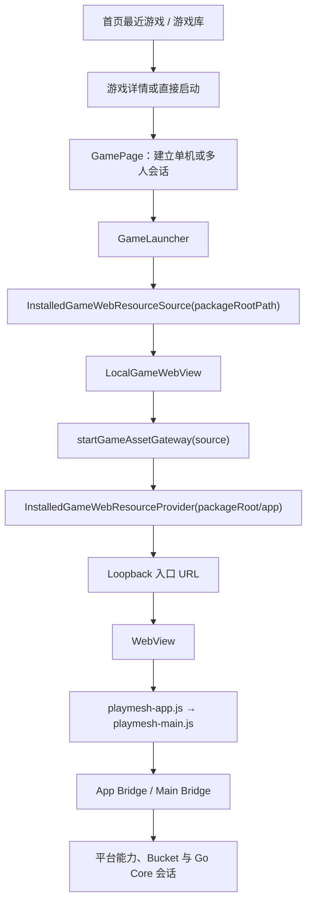
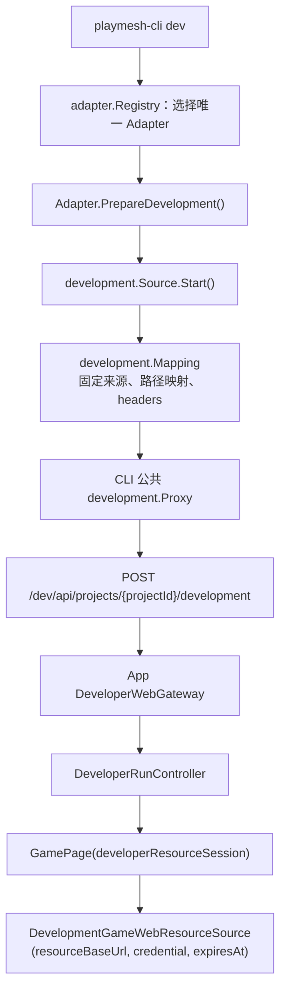
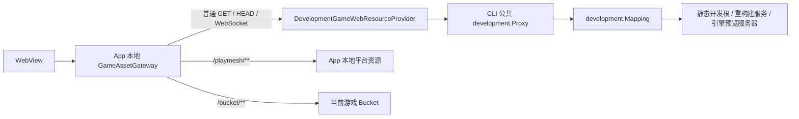
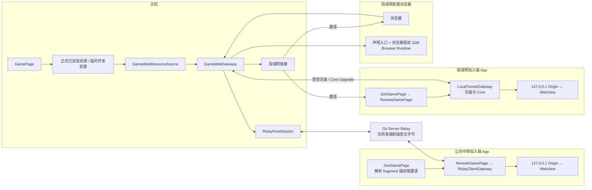

# 技术架构

## 总体架构

```text
Flutter App
  ├─ 首页 / 游戏库 / 游戏详情 / 游戏页 / 设置 / 控制端
  ├─ 已安装游戏包扫描、校验、安装、数据与缓存
  ├─ GamePage -> GameLauncher -> ResourceSource -> ResourceProvider
  ├─ GameAssetGateway / GameWebGateway
  └─ HTML Game Runtime（WebView）
       ├─ PlaymeshBridge
       │    -> GameRuntimeBridge / StandaloneGameRuntimeBridge
       │    -> GoCoreSessionClient（仅联机）
       │    -> Go Core
       └─ PlaymeshAppBridge
            -> AppWebViewBridge
            -> Native Capability Adapters

Go Core
  ├─ 动态 HTTP / Session WebSocket / Binary WebSocket
  └─ 会话成员、身份凭证和消息路由；不管理游戏包，不执行游戏规则

Developer Gateway
  └─ 独立端口上的项目、开发会话、日志和工作区控制面

Go Server（可选外部服务）
  ├─ Catalog 游戏包分发
  └─ 公共中转的配对和端到端密文字节复制
```

## 当前实现边界

第一至第六阶段已经完成并作为历史事实归档；第六阶段之后改用版本日志维护。当前正式
App 为 `4.1.0+27`，当前工作树目标为 Playmesh App `4.2.0+28`、Game SDK `4.1.0`、
App Bridge SDK `3.3.0` 与 Developer API / OpenAPI `4.2.0`；完整组件矩阵和发布状态见
`docs/version/README.md`、`docs/version/4.1.0.md` 与 `docs/version/NEXT.md`，本地实现
基线见 `docs/implementation/playmesh-3.0.0-local-implementation.md`。历史阶段版本不能
继续作为当前项目、SDK 或 Catalog 的生成基线。
LAN 发现与 App SDK 已完成开发和自动化验证；Android、Windows、macOS、Linux 的跨设备
实机验收仍未完成，不能据此标记为已发布。iOS 自动发现/发布明确为 `unsupported`，扫码、
手工邀请和分享链接仍可使用。

```text
已经完成：
Flutter 页面、游戏详情、跨平台本地 WebView、运行时刷新与屏幕方向边界
Go Core 生命周期、动态端口、HTTP/WS 会话、Authority 路由、Android AAR 和 Windows 内置进程
Game SDK、`main.json` 校验、统一游戏目录扫描和浏览器控制器分享入口
开发者模式独立固定端口、持久 token 与工作区路径、项目创建与编辑、项目级本地历史、运行入口、SSE 日志和机器可读文档
Go Developer CLI、统一项目适配器、开发资源代理、正式构建运行、同源 SDK/类型同步与外部 IDE 日志跟随

第五阶段已完成：
可配置 game/controller/authority 入口、轻量权威状态同步、联机延迟、统一游戏包导入/导出、工作区文件管理、正式版响应式 App 与全平台游戏/控制器全屏

第六阶段已完成：
可选且不阻塞运行的全屏、Android 外部文件与导出链路、无需预装游戏的 App 加入、Game SDK/App Bridge 双层边界、App/浏览器持久身份、单 ID 连接约束、离线成员与重连事件、移动工作区和界面切换性能收口

当前发布能力：
统一发布脚本接受 `android`、`windows` 和 `all` 目标，分别生成 Android 通用 APK 和 Windows x64 便携 ZIP。脚本在构建前生成 SDK、重新构建目标平台 Go Core、校验包内入口并输出 SHA-256。
```

`go-core/` 已提供可启动、可停止的 HTTP 服务。宿主必须使用 `0.0.0.0:0` 请求系统分配空闲端口，并在启动成功后把实际端口上报给 Flutter；Flutter 本机连接时使用回环地址，分享时使用当前设备全部可用的局域网 IPv4 地址。页面不得猜测、缓存固定端口或自行拼接 Core 地址。

网页开发者通道不复用或重绑 Core 端口。Flutter App 另行启动 `DeveloperWebGateway`，按当前产品决策绑定 `0.0.0.0`，默认端口为 `16666`；用户从首页进入“制作游戏”后，可在同一个开发者模式开关上配置端口和 token，再按需要展开“源代码开发”或“可视化开发”。“制作游戏”页只发布当前设备解析到的局域网 IPv4 链接。Developer API status 同时返回当前请求地址、解析到的局域网 IPv4、回环地址和当前 App View 可用性，Agent 提示词只能从这些本机 HTTP Base URL 中选择一个嵌入接口清单，避免把持久开发者 token 指向任意外部地址。端口被占用时返回明确错误，不得通过重启 Core 解决。Android 开启开发者模式后由 Foreground Service 持有同一个 FlutterEngine、CPU WakeLock 和 Wi-Fi Lock，Activity 进入后台或设备锁屏不停止 Gateway；需要可见 Activity/View 的操作由统一元数据声明并在不可用时返回 `409 app_view_unavailable`。关闭开发者模式或 App 进程退出时只关闭开发者 Gateway，不中断现有 Core 会话。

Developer CLI 是 Gateway 的客户端，不是第二个游戏运行时。CLI 2.0 只识别根
`playmesh-cli.json`，并通过唯一 `adapter.Registry` 把 JavaScript、TypeScript、
Cocos Creator 3.x 的检测、初始化、开发资源准备、正式构建和集成更新接入公共命令；
未来 Godot 等引擎也必须注册到同一个 CLI 组合根，不得另建适配器实例表。
发布包固定隔离在 `playmesh/package/`，SDK 与类型固定在 `playmesh/sdk/`；只有前者的
必需 `main.json`、可选 `capabilities.json`、可选安全根 `icon.png` 与必需 `app/`
进入上传。

App 的游戏 Web 资源只有两种状态：正式已安装资源和临时开发资源，也不按
JavaScript、Cocos、Godot 等引擎划分 App 资源类型。两种状态在
`GameWebResourceSource` / `GameWebResourceProvider` 接口处汇合，后续复用相同的
`GamePage`、WebView、SDK、Bridge、权限、存储和多人 Authority 链路。

### 正式已安装游戏调用链

正式运行只读取 App 游戏库中已经校验并原子安装的包：



`GameAssetGateway` 负责同一个 WebView 的本地资源边界：普通路径从已安装包物理 `app/`
读取，`/playmesh/**` 从平台公共资源读取，`/bucket/**` 从当前游戏的受控存储读取。
首页快捷启动和游戏库详情启动只在 UI 入口不同，进入 `GamePage` 后不再分叉。

### 外部 CLI 开发调用链

开发资源接入是公共、引擎无关的接口。完整控制面为：



开发页面启动后的资源面为：



`development.Source` 只定义 `Start/Stop` 生命周期；
`development.Mapping` 只提供固定 HTTP 来源、请求路径映射和附加 headers。
JavaScript/TypeScript 可以提供 CLI 启动的静态或重构建资源源，Cocos 可以提供已有
预览服务器，未来 Godot 也只能实现同一来源/路径/headers/生命周期边界。CLI 公共代理
只消费 mapping，不读取适配器 ID，也不包含 Cocos、语言或引擎分支；App 只接收
`resourceBaseUrl + credential + expiresAt`，同样不知道资源来自哪个引擎。新增 Godot
等引擎时只增加 CLI `adapter.Adapter` 实现及其唯一注册项，App 代码、
`GameWebResourceSource` 类型和注册关系均不修改，也不新增引擎专用代理。

项目尚未安装时，`dev` 只上传包含必需清单、可选能力声明、可选 `icon.png` 和必需
入口占位文件的最小基础包；普通开发资源仍走临时开发链路。`run` 则终止对应开发会话，
由适配器完成正式构建、完整上传、原子安装并以正式已安装资源启动，输出 `runId` 后
返回；`logs` 只读当前项目日志。公开 `create/push/sdk` 命令已经删除，分别由
`init/run/update` 取代。旧 CLI 工程和明文目标配置不迁移；JavaScript 发布包只能在
空目录用 `get` 恢复，TypeScript/Cocos 必须从源码版本库恢复。

### 分享与传输是正交维度

资源状态与传输方式相互独立。主机从当前 `GameWebResourceSource` 建立分享网关，
正式已安装资源和临时开发资源都使用相同的主机/加入端链路：



“主机/加入端”“浏览器/App”“局域网/公共中转”描述的是会话角色、客户端形态和传输
路径，不会增加资源源类型。Go Server 只转发加密字节，不读取游戏资源、SDK 消息或
引擎类型；选择共享方式也不会把临时开发资源转换为正式安装包。

加入端只有 `RemoteGamePage` 一条正式运行路径：游戏 HTML、Game SDK 和资源始终
来自 Authority 的 `GameWebGateway`，加入端不从自己的已安装游戏包启动第二份
Game SDK。`playmesh-app.js` 无特权客户端同样由 Authority 网关的受保护
`/playmesh/**` 命名空间提供，游戏包不能覆盖；真正持有 App 身份、权限、平台 UI、
设备与媒体能力的 `AppWebViewBridge` 和 `PlaymeshAppBridge` channel 只存在于加入端
本机。局域网与 Relay 的回环网关只转发受控页面和 Core 流量，不提供让远端页面指定
本地文件、SDK URL 或宿主凭据的入口。

CLI 二进制统一命名为 `playmesh-cli`（Windows 使用 `.exe`）。桌面平台构建将它作为 App 运行包的一部分：Windows/Linux 由 CMake 追踪 Go 源并安装到 bundle 根目录，macOS 由 Xcode Build Phase 放入 `Contents/MacOS/`；位置均与桌面 Go Core 的运行目录同级。Android/iOS 不编译或携带 CLI。

## Go Core 与游戏权威边界

Go Core 是通用中转服务器，不是游戏服务器。它只负责连接、会话成员、角色凭证、消息转发，以及消息大小、连接频率、会话带宽和基础序列检查。Go Core 不生成游戏题目，不验证游戏答案，不计算分数，不推进回合，也不决定胜负。

每个联机会话都必须登记独立的 `authorityClientId`。Authority Client 运行游戏自己的权威逻辑，负责验证动作、生成题目、推进状态和结算分数；Go Core 只路由。`players` 只表示实际参与游戏的玩家，是否包含创建者由显示模式决定：

- `single_screen_multiplayer`：创建会话的 App 主机是公共显示端与 Authority Client，不属于 `players`，不占人数名额，也不能以主屏身份提交玩家动作。所有玩家只能通过 `entries.controller` 声明并解析到物理 `app/` 的控制器页面加入。
- `multi_screen`：创建会话的 App 游戏运行端固定为 Authority Client，并可同时作为 Player 出现在 `players` 中、计入人数；它是否恰好位于玩家数组首位没有 Authority 语义，后续任何加入者都只是普通 Player。

游戏包可以按需在 `app/static/js/service/` 中组织 Authority 逻辑；该目录是推荐约定，不是运行时强制要求。无论采用什么目录结构，权威逻辑都必须由游戏自己实现，不能下沉到 Go Core。

MVP 不自动转移 Authority。Authority Client 断开时，游戏必须暂停或结束当前对局，并向所有客户端报告明确原因；后续迁移必须单独定义状态快照、任期号、冲突处理和恢复协议。

## 游戏权威服务入口

多人游戏必须在 `main.json.authority.entry` 显式声明权威服务入口；只有物理目录和
文件名可以由游戏选择，例如 `static/js/service.js` 或
`static/js/service/index.js`，解析后的物理文件分别位于 `app/` 下。单机游戏可以
省略 `authority`。该文件由 Authority Runtime 加载，不由 Go Core 解析执行。游戏
SDK 向它提供统一的上下文：

```ts
type AuthorityContext = {
  sessionId: string;
  authorityClientId: string;
  players: PlayerSession[]; // 由 SDK 注入的当前房间成员快照
  now(): number;
};

type AuthorityService = {
  onService(action: PlayerAction, context: AuthorityContext): AuthorityResult;
};

type AuthorityResult =
  | { targetPlayerIds: string[]; payload: unknown }
  | { targetPlayerIds: []; payload?: never };
```

权威处理端的启动和调用链固定如下：

```text
创建者启动游戏
  -> App 创建会话并写入 authorityClientId
  -> 根据 displayMode 决定创建者是否同时加入 players
  -> entries.game（清单显式声明；默认模板写入 index.html）预先引入 service 入口
  -> 初始化脚本调用 SDK 判断当前客户端是否为 Authority Client
  -> 只有 Authority Client 初始化 service 监听
  -> Go Core 转发玩家 action
  -> SDK 调用 playmesh.main.authority.onService()
  -> service 返回 targetPlayerIds 和 payload
  -> Go Core 定向转发或不发送
```

权威处理端与玩家页面可以共用主机 WebView 的 JS 进程，但必须使用独立模块、独立状态和 Authority SDK。后续如需更强隔离，再替换为 Worker、独立进程或受限脚本运行时，不能改变游戏侧的 Authority SDK 契约。service 代码本身仍不能操作玩家页面全局对象。

默认模板必须在 `app/index.html` 的初始化脚本中预先完成角色判断和权威处理注册。开发者不需要手写这段接入逻辑，只修改标记为 TODO 的业务代码：

```js
import { createAuthorityService } from "./static/js/service/index.js";

async function bootstrap() {
  // TODO：初始化主屏玩家界面和本地展示状态
  playmesh.main.game.onMessage((message) => {
    // TODO：根据权威消息更新主屏画面、动画和排行榜
  });

  if (playmesh.main.session.isAuthority()) {
    const service = createAuthorityService();
    playmesh.main.authority.onService((action, context) => {
      // TODO：实现题目、验证、计分、回合和状态分发
      return service.handle(action, context);
    });
  }
}

bootstrap();
```

实际 SDK 应提供稳定的角色判断 API，例如 `playmesh.main.session.isAuthority()`，以及 `playmesh.main.authority.onService()`、`playmesh.main.game.submitAction()` 和 `playmesh.main.game.onMessage()`。游戏代码不应自行猜测房主、连接顺序或读取底层 WS 字段。

## 游戏生命周期 API

SDK 不需要提供单独的启动回调。WebView 执行 `main.json.entries.game` 或
`entries.controller` 指向页面的脚本本身就是游戏启动入口。`entries.game` 对所有游戏
显式必填；`entries.controller` 对 `single_screen_multiplayer` 显式必填。默认模板会
把它们分别写为 `index.html` 与 `controller/index.html`，但运行时不为缺失字段回退。
模板页面负责完成 SDK 初始化和处理器注册。

SDK 必须提供由 App 主动触发的生命周期通知：

```ts
playmesh.main.lifecycle.onPause(handler);
playmesh.main.lifecycle.onResume(handler);
playmesh.main.lifecycle.onExit(async (context) => {
  // TODO：保存数据、清理资源并完成退出前操作
});
```

`onExit` 在 App 销毁 WebView、退出游戏或切换到游戏库前触发。SDK 应允许异步处理，但必须设置有限超时、保证最多执行一次并允许重复调用时安全返回；超时后 App 可以继续退出，不能因为游戏代码卡住而阻塞整个应用。游戏不得只依赖 `onExit` 保存关键数据，应在关键状态变化后及时写入 SDK 存储或游戏包允许的用户数据目录，因为系统强制结束、崩溃和断电可能不会触发退出回调。

`app/controller/index.html` 的默认模板也应自动注册 `playmesh.main.game.onMessage()`，并提供输入提交 TODO。开发者只填写控制器 UI 和动作数据，不需要理解消息来自哪条 WS 或如何寻找目标玩家。

权威服务只能通过上下文获得以下信息：当前会话 ID、Authority Client ID、发送者玩家 ID、当前玩家成员快照、动作序列号、服务时间和必要的游戏持久化状态。它不能获得原始 WebSocket、Flutter 对象、文件系统路径、任意网络访问或其他游戏包内容。

所有玩家的游戏动作先经过 SDK 和 Go Core 的会话层校验，再由 SDK 路由到权威端的 `playmesh.main.authority.onService`。Go Core 向 SDK 注入可信的 `senderPlayerId` 和当前房间成员快照。权威服务只需要返回目标玩家 ID 列表和消息，或返回空目标列表表示不发送，不需要理解 Go Core 的路由细节。回复一个玩家时列表只有一个 ID，回复多个玩家时列表包含多个 ID，广播时由 SDK 提供当前在线玩家 ID 列表或提供等价的 `broadcast` 辅助方法。

只有权威服务可以发布 `authoritativeState` 或 `authoritativeEvent`；Go Core 只根据目标列表转发或丢弃，不理解其业务内容。SDK 应自动注入 `sessionId`、发送者 `playerId`、连接标识、序列号和接收时间，游戏服务不能信任客户端自行填写的身份字段。底层 `conn` 只用于 Go Core 内部路由和诊断，不注入游戏代码。

因此 AI 生成联机游戏时只需要理解三个业务入口：玩家用 `playmesh.main.game.submitAction(action)` 发送动作，用 `playmesh.main.game.onMessage(handler)` 接收已路由给自己的业务消息；权威端用 `playmesh.main.authority.onService(handler)` 接收所有动作并返回目标玩家列表。SDK 自动处理 WS、身份注入、目标路由和消息分发。底层 `onWs` 和分发函数只能作为 SDK 内部或高级诊断接口，不进入默认模板和 AI 生成提示词。

必须区分两种“分发”：

- **协议分发**：权威处理端通过返回 `targetPlayerIds` 表达目标玩家，SDK/Go Core 根据目标列表将消息送给指定玩家或丢弃；开发者可以指定目标列表，但不能接管连接级分发。
- **业务处理**：当前页面收到消息后如何更新 UI 或本地展示，由开发者在 `playmesh.main.game.onMessage(handler)` 中完成。

普通玩家端只需要 `playmesh.main.game.onMessage(handler)`。权威端必须使用 `playmesh.main.authority.onService(handler)` 返回目标列表和业务载荷；SDK 后续可以提供 `playmesh.main.game.on(eventType, handler)` 作为普通玩家端 `onMessage` 的语义化辅助，但它只是本地业务订阅，不改变底层路由模型。

多人运行时由 SDK 管理两条职责不同的物理 WebSocket。Session WS 始终存在，负责 JSON 会话、动作和状态同步；Binary WS 只在首次调用 `playmesh.main.binary` 时创建：

```text
Session WS
  - JSON 会话、玩家事件、`playmesh.main.game`、`playmesh.main.sync` 与存储 RPC

Binary WS（按需）
  - 一条连接复用多个逻辑 Channel
  - 原始 Uint8Array 帧，不经过 JSON/Base64
  - 单目标、目标数组或当前 Channel 在线成员广播
  - 多目标 payload 只上行一次，由 Core 扇出
  - Channel 可选择 Authority 审核或直接 relay
```

两条连接都由 SDK、App 中转和 Go Core 统一管控并共享会话身份。游戏代码不获得 URL、token 或原始 WebSocket。Authority 创建 Channel 后自动加入，并可使用固定目标 ID `"authority"` 接收数据，也可主动向普通玩家推送。游戏可以定向发送给一个或多个玩家；省略目标时，Core 按请求到达时的 Channel 在线成员广播并排除发送者。Authority 审核上下文始终提供目标数组，一帧只审核一次。Authority 游戏退出或主 Session 断开时，Core 回收该游戏创建的全部 Channel。

该链路会增加一次 SDK/权威服务的函数调用，但权威服务在创建者本机的游戏运行时中执行，不会为每个动作增加一次远程网络往返。对于答题、提交、跳过等低频可靠动作，额外开销可以接受；对于传感器和动画状态，必须使用 SDK 的限频、合并和可丢弃状态通道，不能把每个原始 tick 都作为可靠权威事件广播。

推荐消息分类：

- `action`：答题、跳过、开始、准备等用户意图，可靠、有序，进入权威服务。
- `state`：玩家位置、钓鱼动画、传感器采样等当前状态，可合并、限频、丢弃旧值。
- `event`：得分、捕获、回合结束等需要被观察的结果，由权威服务产生，可靠且带版本号。

这里的“连接标识”只用于当前连接的路由和诊断，不应作为永久身份或业务主键暴露给游戏逻辑。断线重连后连接标识可以变化，但 `playerId` 和会话权限必须由 App/SDK 重新确认。

## 游戏页布局原则

游戏库只负责展示游戏并提供明确的“查看详情”操作。游戏详情页以紧凑信息区展示名称、发布者、最后上传时间、版本、简介、人数、模式、主画面/控制器方向、SDK 版本和运行入口，并提供唯一的“开始游戏”操作；点击后进入独立的游戏页，不在游戏库或详情页内嵌 WebView。清单中的时间保存为 Unix 毫秒时间戳，展示时转换为当前设备时区。

主机入口必须通过 `GameLaunchArguments.enterFullscreenOnLaunch` 显式声明是否请求启动全屏。游戏库详情与首页快速游戏固定传 `true`；开发者工作区、CLI `run` 与 CLI `dev` 共用开发启动入口，Android/iOS 手持端传 `true`，Windows、macOS 与 Linux 桌面端传 `false` 并保持窗口化。控制器/加入端由独立的 `RemoteGamePage` 按当前终端策略进入全屏，不再通过 `GamePage` 的本地控制器角色分支启动。全屏请求不阻塞游戏运行时和会话初始化；App/WebView 通过原生宿主处理全屏和方向，普通浏览器由 Game SDK 无提示层地尽力调用 Fullscreen API 与 Screen Orientation API，被浏览器拒绝时继续游玩，并保留 SDK 悬浮工具栏的全屏按钮供用户手势重试。离开游戏页时恢复进入前的全屏状态和系统默认方向；窗口化开发页若经 SDK 临时进入全屏，退出时也会清理该状态。

Android 主 Activity 声明接收 `ACTION_VIEW` 和 `ACTION_SEND`。原生层取得系统授予的 `content://` 读取权限后，将文件复制到应用缓存并通过 `playmesh/open_file` MethodChannel 交给 Flutter：压缩包复用 Playmesh 游戏包导入校验；单个 HTML 使用独立 WebView 执行，不注入 SDK、Bridge、存储或联机能力。游戏 WebView、扫码远程 WebView 和独立 HTML WebView 的右上角悬浮工具均提供进入与退出全屏按钮。

游戏页使用全屏 WebView，让游戏内容占据整个可用区域。主机与 App 扫码加入页复用可拖动、可展开/收纳的窄悬浮工具区；扫码加入不显示分享入口，例如：

- 返回上一页（包括游戏详情或开发者工作区）
- 刷新游戏并重建 WebView
- 打开联机信息
- 主机获取/复制二维码和链接（一级入口）
- 打开游戏设置

工具区默认收纳，展开后显示图标命令，并允许拖到不影响游戏内容的位置；只保留返回，不再提供与返回语义重复的独立“退出游戏”按钮。二级菜单、游戏信息和运行日志显式使用固定高对比度配色，不继承游戏颜色；不应使用固定的大型工具栏占据游戏区域。按钮必须保持稳定尺寸，并提供无障碍语义和悬停/长按提示。FPS 默认显示在左上角，工具区提供开关；未收到游戏帧上报时显示 `-- FPS`。

FPS 和联机延迟属于当前客户端，由 App SDK 统计并通过
`playmesh.app.performance.*` 公开；展示层同样由 `playmesh-app.js` 在当前游戏网页
内创建，不由 Flutter 原生层绘制。App WebView 和普通浏览器复用同一套居中菜单、
信息、日志与性能覆盖层；普通浏览器额外显示可拖动入口。Game SDK 不保留
`playmesh.main.performance`，也不创建浏览器性能 panel；性能浮层唯一由 App SDK
创建和维护。

FPS 由当前客户端 App SDK 统计游戏主动上报的真实渲染帧：DOM/CSS 游戏可以在自己的视觉更新循环上报，Canvas/WebGL 游戏应在实际 `draw`/present 完成后调用 `playmesh.app.performance.reportFrame()`。App SDK 提供 `getFps()` 和 `onFps()`；平台不得额外启动独立的 `requestAnimationFrame` 并把显示器刷新回调次数冒充游戏 FPS。App SDK 性能层负责网页内显示，游戏代码不负责创建 FPS 或延迟组件。

## 推荐技术栈

| 层级 | 技术 | 用途 |
|---|---|---|
| App UI | Flutter | 跨平台界面与页面流转 |
| 状态管理 | Riverpod | 房间、玩家、连接、设备状态 |
| 路由 | go_router | 首页、房间、游戏、设置导航 |
| 本地核心 | Go | HTTP、WebSocket、房间与协议 |
| Flutter/Native 桥接 | Pigeon 或 Platform Channel | 类型安全调用原生能力 |
| Android 原生 | Kotlin | 手柄、摄像头、权限、传感器 |
| iOS 原生 | Swift | GameController、摄像头、本地网络权限 |
| 游戏容器 | webview_flutter + webview_flutter_windows | 移动端/Apple 平台 WebView 与 Windows WebView2 |
| Game SDK | TypeScript | HTML 游戏访问房间、输入、生命周期 |
| 游戏包 | ZIP + `main.json` | 安装、校验、加载 |

## 模块划分

```text
lib/
  main.dart
  app.dart
  core/
    bridge/
    network/
    protocol/
    storage/
  features/
    home/
    room/
    game/
    controller/
    settings/
  widgets/
```

当前实现使用以下较小结构：

```text
lib/
  main.dart
  app.dart
  models/
    user_profile.dart
    game_summary.dart
    local_game_entry.dart
  features/
    home/
      home_page.dart
    profile/
      profile_page.dart
    games/
      game_library_page.dart
      game_detail_page.dart
    game/
      game_page.dart
      game_launcher.dart
      local_game_web_view.dart
      windows_local_game_web_view_io.dart
      game_orientation_controller.dart
    settings/
      settings_page.dart
  core/
    lifecycle/
    network/
    protocol/
    services/
```

后续只有在联机会话或原生能力形成真实复用时，再增加 `core/bridge`、Repository 或更深层次。

## Go Core 生命周期与地址上报

```text
SettingsPage
  -> GoCoreRuntime.start()
  -> GoCoreHost.start(127.0.0.1:0)
  -> Go Core 监听系统分配端口
  -> Android: gomobile Start() 返回实际地址
     Windows: core.started 结构化日志上报实际地址
  -> GoCoreClient 使用上报地址请求 GET /health
```

- Android 将 `playmesh_core.aar` 打进 App，通过 MethodChannel 调用 gomobile 导出的生命周期 API。
- Windows 将 `playmesh-core.exe` 安装到 Runner 同目录，由 Flutter 启动并读取 `core.started` 日志。
- 实际地址只在当前 Core 生命周期内有效；Core 重启后必须重新获取。
- 页面和游戏代码不得知道固定端口，HTML 游戏也不得直接访问 Core 地址。

未来仓库可以扩展为：

```text
playmesh/
  apps/
    launcher_flutter/
  core/
    lan_core_go/
  packages/
    game_sdk/
    protocol_schema/
```

## WebView 原则

WebView 只负责运行游戏页面，不直接暴露原生能力。

HTML 游戏只接触：

```ts
window.playmesh.ready
window.playmesh.main
window.playmesh.main.gameInfo
window.playmesh.main.session
window.playmesh.main.player
window.playmesh.main.game
window.playmesh.main.sync
window.playmesh.main.authority
window.playmesh.main.binary
window.playmesh.main.lifecycle
window.playmesh.main.storage
window.playmesh.app
window.playmesh.app.performance
```

面向游戏开发者的唯一全局对象是 `window.playmesh`，其根级公开成员严格只有
`ready`、`main` 与 `app`。`window.playmeshApp` 不存在，公开的 `playmesh.main`
与 `playmesh.app` 不包含任何 `__*` 内部桥接成员；两个 SDK 之间的内部协作通过
不可枚举的私有 `Symbol` runtime 完成。

`playmesh-main.js` 是所有平台一致的公共 Game SDK，负责 `playmesh.main.*` 下的游戏声明、会话、玩家、消息、生命周期和 Authority 主机存储。`playmesh-app.js` 是当前终端 SDK，负责 `playmesh.app.*` 下的 Windows/Android/浏览器环境、App 身份、本机性能、本机设备能力、权限、输入、Console 日志和平台覆盖层。两者都由平台成对注入；`main.ready` 内部先等待 `app.ready`，根 `playmesh.ready` 只复用 `main.ready` 初始化链并返回 `{main, app}`。不提供旧根级游戏 API 或旧 `playmesh.js` 文件兼容。普通浏览器的 App 原生能力不可用，但网页覆盖层仍由 App SDK 渲染，Game SDK 不创建性能 panel。App SDK 只能引用 Game SDK 公共数据用于展示，不能从 bootstrap 或页面配置复制游戏状态。当前完整接口见 `docs/game/sdk-v1.md`。

App SDK 的 Escape/Menu/Back 自动菜单触发默认绑定；
`playmesh.app.ui.disableSystemMenuTriggers()` 只能在 `app.ready` 后无参数、单向且幂等地
解绑当前文档的自动监听，不影响 `showGameSidebar()`、关闭覆盖层或原生返回关闭已显示
菜单。配置刷新不能重新绑定，WebView 文档刷新则按新文档恢复默认行为。

禁止 HTML 游戏直接接触：

- 原生相机对象
- 任意文件系统
- App token
- MethodChannel
- 任意局域网端口
- 系统剪贴板和通讯录

## 游戏包结构

本节描述平台侧架构和安装实现。面向游戏作者的当前规范统一维护在 `docs/game/README.md`、`docs/game/package-format.md` 和 `docs/game/sdk-v1.md`。

游戏包暂定结构如下：

```text
game-package/
  main.json                   必须，游戏定义文件
  capabilities.json           可选，游戏需要的平台能力声明
  app/                        游戏发布资源映射目录
    index.html                默认模板游戏页面，可由 entries.game 改为 app/ 内其他 HTML
    controller/
      index.html              默认模板控制器页面，可由 entries.controller 改为 app/ 内其他 HTML
    static/
      js/
        player/               可选，玩家端共享逻辑
        shared/               可选，纯数据模型和常量
        service/              权威处理端逻辑
      css/
      image/
  data/                       安装后生成，不参与静态映射
```

### 新建联机项目的默认代码框架

创建项目时，App/开发者通道必须根据项目是否支持多人生成默认代码框架。联机项目不能只生成空的 `app/index.html`，必须同时生成玩家运行层、权威处理层和共享数据层：

```text
game-package/
  main.json                         已填写 entries、authority.entry 和 displayModes
  app/index.html                    主游戏画面模板
  app/controller/index.html         控制器画面模板
  app/static/js/player/index.js     玩家端 SDK 初始化和状态订阅模板
  app/static/js/service/index.js    权威 onAction 模板
  app/static/js/shared/types.js     动作、状态和事件的共享结构模板
  data/                             SDK 持久化目录，不打入发布包
```

默认框架必须已经完成以下工作：

- 通过 SDK 建立 WS 连接，不在游戏代码中出现 WS 地址、连接创建和心跳代码。
- 自动获得当前玩家身份、`authorityClientId`、当前房间成员快照和连接状态；大屏公共显示端的 `playmesh.main.player.getCurrent()` 返回 `null`。
- 将玩家页面调用的 `submitAction(action)` 自动路由到权威处理端的 `onAction(action, context)`。
- 将权威处理端返回的 `targetPlayerIds` 和 `payload` 自动定向转发或广播。
- 将权威状态和事件自动分发给 `app/index.html`、`app/controller/index.html` 或其他玩家页面。
- 提供开始、暂停、恢复、玩家加入、玩家离开和权威断开等生命周期钩子。

AI 生成代码时只需要修改模板中的游戏规则区域和 UI 区域。模板必须用中文注释标识“玩家运行层可修改区域”“权威处理层可修改区域”和“禁止修改的 SDK 接入区域”，减少 AI 对底层调用链的推断。

约定：

- `entries.game` 是相对于物理 `app/` 的游戏页面入口，所有游戏都必须显式声明并存在
  对应文件；默认模板写入 `index.html`。
- `entries.controller` 是相对于物理 `app/` 的控制器页面入口；
  `single_screen_multiplayer` 必须显式声明并存在对应文件，默认模板写入
  `controller/index.html`；普通模式不加载它。
- `app/static/` 存放 JS、CSS、图片等静态资源。游戏页面可以引用这些资源，但资源服务不等于能力授权。
- `app/static/js/player/` 可存放主页面和控制器页面共用的玩家端表现或输入逻辑，但不能保存权威状态。
- `app/static/js/shared/` 可存放类型、常量、序列化结构和无副作用的纯函数；不能包含 WebSocket、DOM、房间状态写入或权威结算。
- `app/static/js/service/` 存放权威处理端逻辑，例如题目生成、动作验证和状态结算；这是推荐目录，不是平台强制目录，实际 JavaScript 文件由 `authority.entry` 声明。
- 权威处理端必须由 `app/index.html` 预先引入，但不能当作普通玩家逻辑执行。初始化脚本必须通过 SDK 判断当前客户端是否为 `authorityClientId`，只有 Authority Client 才注册 service；`app/controller/index.html` 不引入或初始化权威服务。

### 玩家运行层与权威处理层

两类代码必须保持边界：

| 层 | 入口/位置 | 允许职责 | 禁止职责 |
|---|---|---|---|
| 玩家运行层 | `app/index.html`、`app/controller/index.html`、`app/static/js/player/` | 展示画面、采集输入、调用 `submitAction`、订阅权威状态 | 计算最终分数、决定胜负、伪造其他玩家身份、直接访问 WS |
| 权威处理层 | `app/static/js/service/` 或声明的 service 入口，由 `app/index.html` 条件初始化 | 接收所有玩家动作、验证规则、生成题目、更新权威状态、返回目标列表 | 操作 DOM、读取页面控件、创建 WS、依赖某个玩家页面的临时变量 |
| 共享数据层 | `app/static/js/shared/` | 类型、常量、纯计算、协议载荷定义 | 保存会话状态、发送消息、执行玩家权限判断 |

App 主机运行 `app/index.html` 与权威处理层，但二者是两个代码层。大屏模式下 `app/index.html` 只是公共显示页面，不是玩家页面；普通多屏模式下它可同时承载主机玩家 UI。两种模式都只能按 `playmesh.main.session.isAuthority()` 决定是否启动权威监听，不得从玩家顺序推断。
- 当前游戏的外层物理 `app/` 固定映射为运行时 `/`；用户首段 `app` 不做特殊处理，物理 `app/app/**` 正常映射为 `/app/**`，而 `/app/**` 不会别名到外层 `app/**`。平台公共资源目录 `playmesh-library/public/` 固定映射为 `/playmesh/...`；`data/data` 中由 SDK 上传的文件映射为 `/bucket/{bucket}/{file}`。只有 `playmesh`、`bucket` 是平台保留首段，物理 `app/` 不得包含其大小写变体的同名一级目录。资源服务必须拒绝编码、反斜杠、空段和 `..` 绕过、目录枚举及越界，且不能暴露 `data/json`、其他游戏包、用户文件或 App 私有文件。Game SDK 使用 `/playmesh/sdk/v1/playmesh-main.js`，App SDK 使用 `/playmesh/sdk/v1/playmesh-app.js`；未来平台入口也只能放入 `/playmesh/**`。

## 游戏包存储和安装

推荐采用“压缩包导入，安装时解压，运行时读取解压目录”的方案。游戏库不要求开发者或用户额外注册游戏，App 通过扫描统一的游戏库目录自动发现和加载游戏：

```text
导入 .zip/.lpgame
  -> 临时目录接收
  -> 校验压缩包、路径和大小
  -> 根目录存在 main.json：按标准包校验
  -> 根目录缺少 main.json：检查 HTML 并进入网页包配置
  -> 普通网页包把内容迁移到 app/，改写已知顶层根资源路径并生成 main.json
  -> 在临时安装目录复用标准包校验 main.json 和必需入口
  -> 计算内容哈希并生成版本记录
  -> 原子移动为已安装只读目录
  -> 预览和 WebView 从已安装目录读取
```

普通网页包转换是本地游戏库导入的应用服务，不放宽标准包、在线下载、Catalog 或
Developer API 的输入规则。检查阶段只返回标准包、普通网页包或非网页包三种结果；
UI 仅收集游戏名称、主屏方向、游戏模式、显示模式和 HTML 入口。转换服务负责剥离
统一公共外层目录、把原内容完整迁入 `app/`、生成清单并再次调用标准包校验。

普通网页内容迁入物理 `app/` 后，原有相对路径和 `/assets/main.js` 等根绝对路径
保持原样，因为该目录已经直接挂载为运行时 `/`。转换器不会为外层物理 `app/`
自动添加 `/app` 前缀，但用户内容原有的 `app/` 目录及 `/app/**` 引用保持不变；
外部 URL、协议相对 URL、`/api/save` 等未知业务路由和二进制内容同样不改写。转换结果仍
必须拒绝占用一级 `playmesh/`、`bucket/`，并重新通过标准清单、入口、路径和大小
校验。

存储建议：

```text
playmesh-library/
  packages/
    {gameId}/
      main.json          游戏定义文件
      app/               唯一公开目录，包含页面、控制器和静态资源
        index.html
        controller/      大屏游戏控制器入口
        static/          JS、CSS、图片等游戏公开资源
      data/              游戏自定义持久化数据，不含平台定义的用户层级
      cache/             App 可清理缓存；开发历史位于 developer/local-history/
  public/
    sdk/v1/             构建生成的 Game/App SDK 与类型声明
    avatars/            未来可选的平台公共头像资源
```

不保存原始压缩包。压缩包只作为导入过程中的临时文件，校验和解压完成后即可删除；需要分享时，直接从 `playmesh-library/packages/{gameId}/` 重新生成临时压缩包，分享完成后删除临时文件。`main.json`、入口和静态资源都直接位于该游戏目录中。

`data/` 和 `cache/` 位于 `packages/{gameId}/` 下，但不属于游戏包文件，不能被打包分享。游戏只能通过 SDK 存取自己的持久化数据；`cache/` 由平台管理。

`app/`、`data/` 和 `cache/` 必须保持同级，禁止将运行数据或缓存放入 `app/`。运行时将当前物理 `app/` 映射到 `/`，将平台公共资源映射到 `/playmesh/...`，并仅把 `data/data/{bucket}/{timestamp-file}` 映射到 `/bucket/{bucket}/{timestamp-file}`。`data/json` 与 `cache/` 不参与静态资源映射；`/bucket` 不提供目录列表，也不能跨 Bucket 或穿越到 JSON 数据。

### 游戏数据存储 API

SDK 采用 Bucket 分区模型。每个 Bucket 同时可以保存私有 JSON 值和公开运行时文件：

```ts
const profile = playmesh.main.storage.getBucket("profile");

const coins = await profile.getData<number>("coins");
await profile.setData("coins", (coins ?? 0) + 1);

profile.removeData("temporaryFlag");
await profile.clearData();

const url = await profile.upload(file); // /bucket/profile/{timestamp}.ext
```

普通异步 Bucket 使用安全名称并存放在
`packages/{gameId}/data/json/{bucket}.json`；GDevelop 同步适配可使用 1 至 4096 UTF-8
字节的原始逻辑名称，由存储层写入 `data/json/logical/sha256-{digest}.json` envelope 并校验
精确原名，不能与普通文件路径碰撞。每个完整 Bucket JSON root 上限为 10 MiB。
`setData`、`removeData` 和 `clearData` 默认只修改共享主机内存，不立即写磁盘。
`upload(file)` 把原始文件流写入 `data/data/{bucket}/`，以精确到毫秒的时间戳重命名、保留
1 至 16 位字母数字后缀，并返回同源 `/bucket/...` 地址。

宿主存储服务必须按标准化项目路径共享一个协调器、一个 OS 文件锁、同一 Bucket 内存映射、
修订号和串行写队列。数据发生变化后等待几秒或达到脏数据阈值再写入；同一时间窗口内的
多次修改合并为一次写入。中间实例关闭只释放 lease，最后一个实例关闭才 flush 并释放锁。
游戏不能显式 flush；WebView 重启、退出或会话关闭时，App 必须等待最终落盘完成。

持久化主机固定为开始游戏的 Authority 设备，所有客户端看到同一份主机 Bucket。异步
`getData/setData/removeData/clearData` 和同步 `getDataSync/setDataSync` 都由 Game SDK 通过
同一个同源、已鉴权的私有 JSON 网关访问：GET 读取、PUT 写入、DELETE 删除 key 或清空
Bucket；请求共同使用 SHA-256、requestId 幂等和 revision/CAS，并最多以同一请求重试一次
响应丢失。同步方法只服务无法改变同步上层语义的锁定运行时 seam，使用主线程同步 XHR，
失败直接抛错。

旧 Session WebSocket 存储 RPC、宿主接收器、pending/settle、双读、双写和 fallback 均不
保留；Session WS 只负责会话、动作与状态同步。加入设备不得创建分叉副本，全部 JSON 请求
最终进入上述同一主机协调器。`upload(file)` 是独立原始字节 HTTP POST，只写
`data/data`，不复用 JSON envelope。当前终端的 `playmesh-app.js` 只负责平台环境、身份、
能力、权限、输入、本机日志和覆盖层，不拥有游戏全局数据。

存储范围只自动绑定当前 `gameId` 和当前游戏库。平台不创建、推断或强制 `{userId}`
子目录；如游戏需要多用户存档，应由开发者在 Bucket 名称、key 或 JSON 内容中自行设计。
异步方法和上传仍要求 Bucket 名称匹配
`^[A-Za-z0-9][A-Za-z0-9_-]{0,63}$`；同步方法的宽逻辑名只对自身调用生效，且仅私有
GDevelop 路径可使用 `$playmesh.gdevelop.root.v1`。SDK 与宿主必须分别校验方法对应的
名称/key 规则、完整 JSON root、单文件大小和 JSON 类型；写入采用临时文件加原子替换，
异常时不能破坏已有数据。游戏数据与 `main.json`、游戏包文件、其他游戏数据和 App 用户
资料隔离。

游戏详情页必须提供“清除游戏数据”操作，并明确提示该操作会删除当前游戏的自定义存档。用户确认后只清理 `packages/{gameId}/data/`，不影响游戏本体与开发历史。清除缓存是独立操作，会删除 `cache/` 及其中的开发历史。卸载游戏时直接删除整个 `packages/{gameId}/` 目录，同时删除游戏文件、数据和缓存。

### 游戏库自动扫描

Flutter 没有一个在 Android、iOS、Windows 等平台路径完全相同的公共外部存储目录。平台层必须抽象一个 Playmesh 专用游戏库根目录，并通过统一 API 提供给 Flutter：

- Android：使用 App 专用外部文件目录或 App 数据目录，遵守 Scoped Storage。
- iOS：使用 App 沙盒内的 Application Support/Documents 目录；需要对外分享时交给系统分享面板。
- Windows、macOS、Linux 和其他非移动端：使用当前运行可执行文件同级的 `playmesh-library/`，不得写入 AppData 或其他用户应用支持目录；需要用户查看或导出时调用文件管理器或系统分享能力。

游戏库在以下时机扫描 `playmesh-library/packages/`：

- App 启动完成后。
- App 从后台恢复时。
- 用户执行“重新扫描”时。
- 导入、删除或分享操作完成后。

游戏库页面还提供显式后台刷新。扫描期间继续展示 App 级仓库中的旧缓存，扫描成功后按 `gameId` 去重、稳定排序并原子替换，同时更新缓存 revision 和刷新时间；失败时不清空列表。仓库查询以缓存为数据源，支持后续搜索与 offset/limit 分页，不让页面直接重复扫描文件系统。

扫描器只识别合法的 `{gameId}/main.json`，并要求清单中的 `id` 与目录名一致。发现新目录后自动校验并建立索引；目录缺失、校验失败或版本冲突时记录结构化错误，不阻塞其他游戏显示。游戏库索引属于 App 级仓库或平台索引区，游戏目录和 `main.json` 是实际来源，不能要求游戏包额外注册，也不能在安装目录创建 `.playmesh/` 元数据。

### 本机游戏源与在线游戏库

Playmesh App 可以在独立固定端口启动 `GameCatalogServer`，把当前统一游戏库作为局域网游戏源分享。Catalog Gateway 与动态 Go Core、游戏会话分享网关和 Developer Gateway 分离，默认端口 `16668`。源配置只接受经过 `/apps/info` 校验的 HTTP/HTTPS `publicURL`；读取 Token 可以随 URL 导入，上传密钥只保存在本机私密配置中，分享源时绝不序列化上传密钥。

Catalog API 当前为 `3.0.0`。`GET /apps/list` 对每个 `gameId` 只返回当前最新公开版本，并可携带传输 ZIP 的 `packageSizeBytes`。Go Server 在接收并规范化包时把该大小写入 SQLite，列表不重复访问文件；App 临时局域网源按需压缩，可以省略列表大小并由下载响应的 `Content-Length` 补齐。`GET /apps/download` 必须显式携带 `gameId + version`，同源图标由独立图标 URL 提供。游戏包列表图标只认包根可选 `icon.png`；下载包只包含 `main.json`、可选 `icon.png`、可选 `capabilities.json` 与 `app/`，不分享 `data/`、`cache/`、其他私有文件或内置平台资源。Catalog 3.0 与 App 使用同一根相对入口、入口扩展名和一级保留目录规则；入口首段 `app` 合法并解析到外层物理 `app/` 内的同名子目录，只有 `playmesh`、`bucket` 是保留首段。

在线游戏库属于现有游戏库内部能力，不在首页增加第二个游戏库入口。首页只读取 `enabled && showOnHome` 的源，并保留每个源独立的加载、空、错误和重试状态；搜索并发查询全部启用源，按 `gameId + author.trim()` 聚合发布者相同的结果，空发布者按 sourceId 隔离。聚合结果保留所有原始来源和版本，单个源失败不阻断其他源。源配置支持文本或二维码导入、校验、启用、首页显示、编辑、删除和二维码分享。

下载任务使用 `sourceId + gameId + version` 作为稳定键并进入顺序队列，支持准备、传输、校验安装、停止和删除。弹框在服务端或 App 源准备 ZIP 时显示不定进度；响应开始后展示按 1024 进位的总大小、已下载/总量和当前字节速率。快速升级在安装前必须重新校验游戏 ID、发布者一致且目标语义版本严格更高，避免检查后本地版本变化造成竞态。远程包继续走 `GamePackageTransferService.importPackage` 的完整安全校验和原子安装；成功、失败、停止或 App 退出后清理中转文件。完整契约见 `docs/catalog-api.md`。

### 游戏运行分享与公共中转

游戏运行分享面板在“二维码与链接”弹窗顶部统一提供“局域网 / 服务器 /
房间状态”三个同级页签。页签只切换展示，不切换会话路由；局域网和公共中转可
同时接收玩家并进入同一个 Go Core 会话。

所有 App 加入链路都建立本机 `127.0.0.1:<ephemeral-port>` Origin：

- 局域网 App：页面连接由本地 `LocalTunnelGateway` 透明转发到主机地址；Core
  连接先通过绑定当前分享 Token 的 `/playmesh/core` 受控 Upgrade 选择本局
  Core，随后透明转发原始 TCP 字节。链路不增加加密。
- 公共中转 App：本地网关为每条 TCP 连接建立持续的端到端 AES-256-GCM 加密流，
  Go Server 只负责临时 Host/Client 配对和密文字节复制。
- 普通局域网 HTML 浏览器：无法获得 App 本地网关，继续直接访问 Authority
  暴露的局域网地址。

公共中转使用 Relay 协议 `3.0.0`，复用在线游戏库中已启用的游戏源配置。App 并发读取 `/apps/info`，
筛选声明 `supportsGameRelay: true` 的源，展示本次请求延迟、搜索和分页；
App 自带游戏库分享服务器固定声明不支持中转。完整协议见
`docs/remote-game-relay.md`。

运行中游戏的分享状态由 `GameShareCoordinator` 独占写入。它把“分享通道已建立”与
“UDP multicast 已公开”作为正交状态，并统一持有 Core/standalone 访问授权、
`GameWebGateway`、Relay session、publication lease、generation 和不可变
`GameShareLinkSnapshot`。分享面板、App SDK、开发预览和 Relay 只调用协调器，不再
维护网关、LAN URL、WAN URL、二维码或清理流程的同义状态。App 级
`LanGameDiscoveryService` 独占平台 multicast publication lease 与发现缓存，但不替代
当前房间协调器的公开意图。

游戏启动或开发预览建立了分享网关也不会自动公开。用户打开分享面板或本机房主调用无参
`playmesh.app.lan.setPublished()` 时，协调器先复用/建立分享通道，再申请 UDP multicast
publication lease；并发入口等待同一个 Future，成功后本局幂等。公开失败只把 publication
留在 unpublished，已建立的复制/扫码链接和网关继续可用，后续调用只重试公开。关闭面板
不撤销；退出游戏、页面销毁或进程结束按 publication、Relay、网关、分享授权顺序
best-effort 清理，generation 阻止晚到结果复活。

唯一生产发现链是自定义 IPv4 UDP multicast：`239.255.80.77:53584`、wire v1、每秒公告、
4 秒本地记录 TTL、单包最多 1200 字节。每个有效非 loopback IPv4 物理网卡及支持组播的
虚拟网卡都独立 join/send，不依赖默认路由；接口每秒重整，单接口失败隔离，所有接口失败
才报告不可用。发现地址只取数据报真实 source IP，payload 不允许自报地址。链路不提供
DNS-SD/TXT 兼容、第二发现栈或已知节点单播探测，也不承诺穿透 AP 隔离、VLAN、防火墙、
禁用组播或 VPN 策略。Android、Windows、macOS、Linux 支持；iOS 自动发现/发布不支持。

接收端存在明确的平台 API 限制：Dart `Datagram` 只提供 source，不提供目标地址或入站
interface index；socket 绑定 `anyIPv4:53584` 并加入组播组后，应用层无法证明合法 v1 包的
目标确为组播地址，恶意局域网节点可直接单播投递到该固定端口。生产发送与主动发现仍只有
multicast，不因此增加单播探测；Schema、source IP、revision、TTL 和后续邀请预检继续
执行，但不能把它们描述为“拒绝所有单播注入”或发布者身份证明。

`GameShareLinkSnapshot` 是面板与 App SDK 的唯一链接/二维码来源：LAN 只取网关首次
解析到的非 loopback、非 unspecified 唯一 IPv4，可包含仅用于游戏分享的 `169.254/16`
link-local 地址，不提供 `127.0.0.1`
fallback；WAN 只取当前未关闭 Relay session 的 `joinUri`。LAN 在前、WAN 在后，按完整
URL 去重。共享编码器按精确 URL 生成并缓存同一 PNG bytes，面板直接渲染，SDK 只序列化
为 Data URL，不重新访问网卡、Relay 或二维码实现。

游戏源 Host 只负责访问 Catalog 声明及游戏目录；真正的中转 Origin 由 Go
Server 在 `relay.publicBaseUrl` 中明确返回。主机 App 使用该 Origin 建立隧道并
生成二维码，客户端 App 也从邀请中的同一 Host 前缀连接，不能依据游戏源 Host、
监听地址或请求头猜测。外层 HTTP/HTTPS 和对外域名因此完全由服务器部署配置
决定；HTTPS 表示使用外层 TLS，HTTP 表示不使用，不再声明独立 TLS 策略。
`relay.maxConnectionsPerTunnel` 同样由 Go Server 通过 Server Info 返回。主机
App 以该值作为动态连接池上限，只保留最多 4 条热连接并在配对后补充；活跃连接
结束后槽位自然退出，最终限流仍由 Go Server 执行。

局域网邀请固定为
`http://{authority-host}:{port}/playmesh/join#inviteToken={opaqueToken}`。
落地页从 fragment 读取邀请凭据，以同源 POST 交换短期
`HttpOnly + SameSite=Strict` Cookie，再通过 `location.replace` 进入当前运行模式在
`main.json` 声明的真实游戏或控制器入口。最终页面 URL 保留 manifest 自定义查询
参数，不追加、删除或覆盖任何平台键；这些参数不表示 App 身份、SDK 来源或可信
平台状态。
公共中转邀请固定为
`https://relay.example/j/{tunnelId}#inviteToken={opaqueToken}`。两者都不携带
Core 端口、联机码、游戏 ID、游戏名称或方向。公共邀请的 `inviteToken` 由主机
App 生成并封装 Authority 加入入口、邀请凭据、Join Capability 和端到端密钥，
只放在 fragment；fragment 不随 HTTP 或 Upgrade 请求发送，因此 Go Server 即使
完全不受信任也拿不到邀请凭据与密钥。
TLS 只作为可选外层保护，不代替端点间强制内容加密。

手工链接、扫码、附近对局和 SDK `joinByLink`/`scanQrAndJoin`/发现项 `join()` 都进入
同一 `GameJoinCoordinator`。它复用 `GameInvitationInspector` 对邀请入口执行预检，
校验 `gameId`、拒绝当前主机自己的邀请，并在 Bridge 成功回包后才导航到既有
`RemoteGamePage`；SDK 不创建专用 WebView、Tunnel、Relay 或第二套加入协议。
`/playmesh/join` 的 POST 响应在原 `entry` 外兼容增加 `gameId` 与 `gameName`，不修改
Core 或 Relay wire 版本。

App 附近列表以纯文本展示游戏名、主机昵称、数据报真实 source IP，以及多人在线/最大
人数或“单机”；公告与房间 presence 驱动自动更新，同时保留手动刷新。用户点击后，页面
不得先释放发现 lease 或清空候选，必须等统一预检与短期候选复查结束后再结束浏览生命周期。

App Bridge SDK `3.3.0` 新增 `playmesh.app.lan`。发现结果仍是不含 token 的当前 gameId
`instanceId/gameId/name/host` 投影；内部昵称、人数、单机标记不进入 SDK，也不增加图标
字段或端点。加入动作要求真实用户操作。`getShareLinks()` 则是明确的新 App-only 房主授权：
仅当前本机 Authority/standalone host 可读取统一快照中的完整 bearer URL 与 PNG Data
URL，不新增 capability、确认弹窗或 user activation。普通浏览器、远程加入页和失效
上下文拒绝。游戏取得凭据后能够复制或外传，这是产品授权边界，不得再以“游戏永远不能
读取分享 URL/二维码”描述；平台仍禁止自动记录、持久化或在异常中回显这些值。

### 分享 Authority 最小公开面

游戏运行分享只允许公开：

```text
/{game-resource-path}   当前物理 app/ 下的普通资源
/bucket/**
/playmesh/**
SDK 无法替代的受控底层连接能力，例如当前游戏的 WebSocket Upgrade
```

新增功能必须优先修改 Game SDK 或 App Bridge SDK。只有受浏览器沙箱限制、
无法由 SDK 替代且本质属于连接层的能力，才能增加受控底层入口；不得恢复
`/api/join`、`/api/storage`、`/api/player/nickname`、
`/api/app-capabilities` 或通用 `/v1/sessions/**` HTTP 代理。

权威 `playmesh-main.js`、游戏资源和全局数据始终来自主机。加入方 App 在独立的
`127.0.0.1` 静态入口提供本机 `playmesh-app.js`，普通浏览器由主机网关注入同版
App SDK；两者都只负责当前终端环境、日志与覆盖层，原生身份和能力仅在 App 中可用。
透明传输网关不解析或替换其他 HTTP 资源。

### 统一开发者工作区中新建和编辑游戏

游戏文件管理和编辑统一由开发者工作区提供。桌面浏览器通过局域网地址进入，App 端在开启开发者模式后使用内置 WebView 打开同一个地址和同一套界面，不再实现独立 App 文件编辑器。游戏库中的每个游戏都必须能在工作区中查看、编辑、保存和运行，包括用户导入包和工作区新建的游戏；两者使用同一已安装资源流程。

内置开发者工作区属于 App 界面，不是独立产品。Flutter 页面、工作区 HTML/JS 和平台注入到游戏 WebView 的工具、能力确认、昵称、信息与日志界面，显示文案都以 `assets/playmesh-localization/locales/{locale}/app.json` 为唯一真源。Developer Gateway 或 WebView 宿主只向工作区暴露已经按 App fallback 解析的只读 `locale + messages` 投影，并在 App 语言变化时推送同一结构；工作区更新 `document.documentElement.lang` 和现有 DOM，不维护 `zh-CN`/`en-US` 字典、不写死可见文案，也不保存一份脱离 App 的语言偏好。平台注入游戏 UI 同样只接收 `platform.game.*` 的宿主投影，游戏内容与用户内容不参与平台翻译。

游戏业务语言与平台 UI 投影严格分离。Game SDK 在 `playmesh.ready` 后公开同步只读
`playmesh.app.runtime.getLocale(): string`：App WebView 返回实际显示当前游戏的本机
App locale，远程加入时仍是加入方 App 的语言，绝不读取 Authority 主机语言；普通
浏览器直接返回 `navigator.languages`、`navigator.language` 中第一个合法的系统
locale，读取或解析失败固定回退 `zh`，不受 Playmesh 自身已翻译语言集合限制。
SDK 只返回 locale 字符串，不向游戏暴露
`app.json`、`platform.game.*` 或其他 messages。游戏开发者自行维护业务翻译并按
该 locale 渲染；Playmesh 不自动改写游戏 DOM、资源、标签或用户内容。

工作区不在浏览器持久化最近打开的项目。项目列表与活动运行项目由 App Gateway 返回；网页只在当前页面会话内保留临时选择，再次进入时使用 App 活动项目或列表首项。顶部只保留项目、运行、保存和“更多”，项目级新建、复制、设置、删除聚合在项目下拉菜单，其他低频操作聚合在“更多”下拉菜单；两者都按触发按钮实时定位，不占用代码视口。平台能力自检不是一次性的通过/失败提示：测试窗口必须持续调用统一能力测试接口，逐次回显状态、耗时和实际返回数据，直到用户手动关闭窗口。

复制项目是变更稳定 ID 的正式入口：以当前项目为来源创建新的唯一 ID 和名称，`author` 发布者元数据使用当前 App 用户昵称，只复制发布内容，不复制根目录 `data/`、`cache/`、`.playmesh/`。普通项目设置继续禁止修改 `id`、`author` 和 `lastModifiedAt`。删除项目会删除包、运行数据、缓存和本地历史，正在运行的项目不得删除。

新建游戏时，用户只需要在开发者工作区填写必要信息：

- 游戏名称。
- 支持的 `displayModes`。
- 玩家人数范围。
- 游戏方向。
- `tags` 等清单属性，以及可选的 `capabilities.json` 能力声明。
- 是否启用多人权威处理端，以及权威入口路径。

确认后平台自动生成默认项目骨架，包括 `main.json`、`app/`、控制器入口、玩家运行层、权威处理层和共享数据层。生成的 SDK 接入、角色判断、消息分发和生命周期代码已经存在，用户或 AI 只修改标记的业务区域。
如需自定义列表图标，创建后通过普通文件操作在项目根上传可选 `icon.png`；缺省时
使用平台默认图标，不在 `main.json` 中维护图标字段。

开发者工作区必须提供以下文件操作：

- 新建文件和文件夹。
- 删除文件和文件夹。
- 将本地文件直接上传到指定目录。
- 编辑并保存文件。
- 整文件替换。
- 在指定行插入内容。
- 替换指定行到指定行的内容。
- 以 Git 风格左右双栏查看修改前后的 Diff，并把单个差异块应用到当前工作区后保存。
- 按文件、文件夹或整个工作区查看本地历史；文本文件可以把指定时间操作的变更前或变更后差异块应用到当前工作区，也可以全量恢复所选范围。
- 未保存文本的撤销与重做由 CodeMirror 编辑器负责。

### 统一 Developer Operation 注册表与对话控制台

`developer_web_gateway_io.dart` 只负责网关生命周期、公共请求中间件和控制器注册。每个资源控制器位于 `operations/{module}/`，在同一 Dart 文件声明真实 method/path/Schema/示例/权限/风险/幂等/危险标识并实现处理逻辑；注册表从 controller 的 `definitions` 自动建立路由，不再维护大段条件分派。

运行时路由、OpenAPI、操作目录、Chat 提示词和 Agent 提示词使用同一份 `DeveloperOperationDefinition`。鉴权、安全元数据、标准响应和危险审批响应通过文档中间件注入，不在每个接口重复声明。新增接口只增加资源文件并注册 controller，禁止手写第二份静态 OpenAPI。

除工作区和 `/playmesh/**` 静态资源外，所有开发者接口都必须由 `_DeveloperOperationRegistry.dispatch` 分发，响应带 `X-Playmesh-Operation-ID` 标识。回归测试同时比较完整操作目录与 OpenAPI 的 method/path 集合，并扫描网关入口，禁止出现手写 `/dev/api/**` 旁路；新增接口若绕过统一注册链路必须直接使测试失败。

纯聊天 AI 输出可直接粘贴到对话控制台的 JSON 指令对象或数组；Agent 直接调用相同 HTTP API。基础提示词只附带读项目/文件、创建或替换文件、精确替换或插入、批量变更和校验，其他操作从 `/dev/api/operations` 动态获取。结构化批量变更使用 `file-changes/preview` 和 `file-changes/apply`，以文本锚点、精确匹配数和 `baseRevisions` 保证可验证、原子提交和本地历史一致。

所有 AI 执行适配器都必须附加 `X-Playmesh-AI-Channel`。当操作声明 `dangerous=true` 时，统一执行中间件暂停原请求，SSE 发布 `ai.approval.requested`，前端提供允许一次、按游戏/项目允许、始终允许和拒绝。批准后继续原 handler；拒绝返回 403；30 秒超时返回 408。普通开发者 UI 调用不带 AI 通道头，沿用各自已有的人机确认。

当前运行游戏可注册一个项目级 `DeveloperWebViewJavaScriptExecutor`。`GamePage` 将执行器绑定到 `DeveloperRunController`，移动端 `LocalGameWebView` 使用 `runJavaScriptReturningResult`，Windows 宿主使用 WebView2 `executeScript`；页面开始导航、销毁或退出时立即撤销执行器，避免请求落到旧 WebView。执行前必须同时校验活动状态为 `running`、`activeStatus.projectId` 等于接口路径的 `projectId`、执行器也登记在同一项目 ID 下，禁止跨项目或命中已退到后台的 WebView。`POST /dev/api/projects/{projectId}/webview/javascript` 通过统一注册表调用该执行器并返回结果；它是暴露给 Chat/Agent 的高风险危险操作，AI 请求必须经过同一审批中间件。工作区操作台复用 CodeMirror，显示返回或错误，并只在当前页面会话内存中维护按项目隔离的最近执行历史。

### 开发者本地历史

项目级本地历史固定写入当前游戏包中的 `cache/developer/local-history/`，与 `app/`、`data/` 同级。历史不单独保存每次变更前的重复副本，而是由一份初始 `baseline/` 和按时间操作保存的变更后 `snapshot/` 组成；某次操作的变更前状态由上一操作的变更后快照推导，第一项操作则以初始基线为准。

连续变更按 5 分钟滚动窗口合并为一个时间操作，最多保留 100 个操作。淘汰最旧操作时，先将其变更后快照提升为新基线，确保后续 Diff 仍可还原。保存、上传、新建、删除、结构化批量文件变更和历史恢复都进入同一条项目历史链；手动恢复会创建一个独立且封口的时间操作，不与后续编辑合并。

历史快照排除 `data/` 和 `cache/`，项目树与开发者文件 API 也不允许通过普通路径访问这些内部目录。工作区可按文件、文件夹或项目根查看结构化新增、修改和删除差异；文本文件以历史版本为左栏、当前工作区为右栏，允许应用单个差异块并经带修订号的正式 API 保存，也可用指定操作的变更前或变更后状态全量替换当前范围。二进制、目录、过大或截断内容只支持全量恢复。单文件接口禁止直接恢复平台管理的 `main.json`，但恢复项目根时会连同当次历史中的完整 `main.json` 一并恢复。浏览器工作区、Agent 和 CLI 发布都必须进入同一项目历史链。恢复完成后通过统一 SSE 通道发送 `workspace.restored`，使其他工作区刷新状态。

CodeMirror 负责当前编辑缓冲区尚未保存内容的即时撤销与重做。服务端不提供单文件 `/undo` 接口，也不维护独立的文件撤销栈。

App 游戏库至少支持以下排序和分类：

- 分类：根据 `main.json.tags` 原样展示和筛选，也可以按单机、多人、显示模式等平台字段筛选。
- 最新修改：按游戏文件或编辑记录的最后修改时间排序。
- 最近游玩：按最近一次启动游戏的时间排序。

这些排序和分类由 App 游戏库索引提供，不要求游戏包自行注册。`data/` 存放游戏运行数据，`cache/` 存放编辑历史、预览缓存和索引，其中开发历史固定为 `cache/developer/local-history/`；只有 `data/data` 中由 SDK 上传的文件可通过 `/bucket/...` 访问，`data/json` 和 `cache/` 不能映射到 WebView。

开发者工作区新建项目直接写入 `playmesh-library/packages/{gameId}/`，与后续导入的
正式项目共用扫描、运行、数据、缓存和删除流程，不增加发布到游戏库的中间步骤。

安装过程必须隔离且原子完成：

- 禁止 `../`、绝对路径、链接文件和越界解压。
- 限制压缩包大小、文件数量、单文件大小和解压后总大小，防止压缩炸弹。
- 只允许包内文件，不允许安装脚本、可执行文件或任意原生动态库。
- `main.json` 以及清单声明后解析到物理 `app/` 的游戏、控制器和 Authority 入口必须在
  安装阶段按当前模式校验；不得另外硬编码固定入口。
- 校验失败时删除临时目录，不影响当前已安装内容。
- 安装完成后目录只读，游戏运行过程不能修改自身包内容。
- 新版本安装成功后直接替换为当前版本；开发期不保留旧版本目录、回滚实现或迁移适配层。

## 游戏包分享

游戏包分享是用户安装库的通用能力，支持局域网链接、二维码和文件三类入口。二维码只编码链接，接收端根据客户端类型决定进入 App 原生路由或普通浏览器兼容页。

文件分享必须提供三种系统能力：显示临时导出包文件地址、请求文件管理器打开地址，以及在 Android/iOS 上调用系统原生分享意图。分享对象是从已安装目录临时生成的导出压缩包，不直接暴露内部解压运行目录；分享完成后删除临时压缩包。任何接收方式都必须重新经过压缩包、路径、`main.json`、哈希和权限校验。

### 链接和二维码的本局 token

App 第一次打开本局分享面板时生成随机 token，并将它绑定到当前游戏会话。关闭面板只隐藏二维码和链接，网关与 token 继续有效；浏览器控制器刷新后由 SDK 复用 `localStorage` 中的玩家 ID 和昵称重新加入。再次打开面板复用本局相同链接。

分享面板必须列出全部可用局域网地址。用户点选任一地址时，二维码立即改为编码该地址；当前选中项应有明确状态，不能始终固定使用列表第一项。

以下任一条件发生时，token 必须立即失效：

- 用户离开当前游戏或当前联机会话结束。
- App 关闭、重启或 Go Core 重启。

本局 token 不设置独立的面板可见期；它随当前游戏会话一起销毁。刷新游戏会先通知旧页面退出并完成存储落盘，再重建 WebView 和游戏业务状态，但不会重置 Core 会话；会话 ID、联机码、已连接玩家、分享网关和 token 均保留。只有退出游戏并创建新会话时才生成新 token。

## `main.json` 游戏定义

```json
{
  "id": "com.playmesh.quiz",
  "name": "多人抢答",
  "author": "当前 App 昵称",
  "lastModifiedAt": 1784851200000,
  "remarks": "局域网多人抢答游戏",
  "version": "0.1.0",
  "sdkVersion": "4.0.0",
  "appSdkVersion": "3.3.0",
  "orientation": "landscape",
  "controllerOrientation": "portrait",
  "modes": ["multiplayer"],
  "displayModes": ["single_screen_multiplayer"],
  "players": {
    "min": 1,
    "max": 4
  },
  "entries": {
    "game": "index.html",
    "controller": "controller/index.html"
  },
  "authority": {
    "entry": "static/js/service/index.js"
  },
  "tags": ["example", "multiplayer", "single_screen_multiplayer"]
}
```

需要设备能力时，在与 `main.json` 同级的可选 `capabilities.json` 中声明：

```json
{
  "required": [
    "media.camera",
    "media.microphone",
    "device.vibration"
  ]
}
```

字段规则：

- 游戏列表图标只读取包根可选 `icon.png`；`main.json` 不定义 `icon` 或
  `permissions`。读取额外字段不赋予语义；规范化保存、CLI 重写、导入和导出都只
  写当前已知字段，因此所有普通多余字段都不会进入新产物。受保护平台能力只由同级
  `capabilities.json` 声明。无效或超限 PNG 被忽略并显示默认图标，不得阻断安全
  游戏包的安装或运行。
- `id` 在创建或导入时自动生成，并作为游戏稳定身份；必须为 1–64 个 ASCII 字符，
  首字符是字母或数字，后续只能是字母、数字、点、下划线或连字符。更新版本不能
  随意改变它。`author` 和 `lastModifiedAt` 同样由平台管理：保存或上传项目时使用
  当前 App 昵称和 Unix 毫秒时间戳覆盖，工作区只读展示，项目内容不能自行修改。
  两者缺失时不阻断扫描；缺失发布者在数据层保持空字符串，仅由 App 固定外壳显示
  本地化“未知发布者”，缺失时间由固定外壳显示本地化“无”。任何非空发布者和
  API 返回值均逐字显示，不作为国际化键。
- `players.min` 和 `players.max` 最低为 1，且 `min` 不得大于 `max`。Go Core Session 的
  `players.max` 运行时上限为 32；`max: 1` 表示游戏不需要多人会话。
- `modes` 是单元素数组，必须且只能声明 `solo` 或 `multiplayer`；值为 `multiplayer` 时必须提供 `authority.entry`。
- `orientation` 是必填字段，只允许 `landscape`（横屏）或 `portrait`（竖屏）。单屏多人还必须声明 `controllerOrientation`，其他显示模式禁止声明。App 必须在创建游戏 WebView 前按当前角色应用方向，并在退出游戏后恢复系统方向。
- `sdkVersion` 和 `appSdkVersion` 都是必填字段，声明游戏要求的两套平台 SDK；当前 Game SDK 只允许 `4.1.0`，App SDK 允许 `3.2.0` 或 `3.3.0`。版本使用 `MAJOR.MINOR.PATCH`；CLI 新建和更新项目写入当前版本。运行时通过注册表按兼容区间解析，App SDK `3.2.0` 请求使用向后兼容的 `3.3.0` 运行包；缺失、低于兼容下限、未知值或格式错误值拒绝启动。
- `capabilities.json` 只负责声明游戏必需的平台能力，不混入 `main.json`。`required` 用于主游戏页面，单屏多人可用 `controllerRequired` 独立声明控制器页面需求；能力 ID 按功能命名，不绑定 App 或浏览器实现，平台按运行角色和环境选择适配器。
- 平台能力由 `lib/core/capabilities/` 下的插件注册表统一维护。每个能力拥有独立目录，并在同一插件中定义描述符、`apiVersion`、方法、事件、可用性、实例创建、自检与释放；SDK 弹窗、开发者可视化编辑器、运行时校验和对外能力接口都从该注册表生成。Flutter 不支持运行时目录扫描，新增插件后只需在默认注册入口增加该插件，不再维护平行元数据或测试适配器。
- 当前支持声明 `media.camera`、`media.microphone`、`device.midi`、
  `device.vibration` 和 `sensor.pose6d`。文件缺失或 `required` 为空时不弹确认框；
  非空时主 SDK 在 App 和浏览器每次加载游戏时展示全部所需能力，并等待用户
  “同意并进入”或“拒绝并退出”。当前平台不支持的能力显示“本平台暂不支持”，
  但不会阻止同意后进入。授权结果不持久化，也不写入权威主机。
- 摄像头、麦克风和 MIDI 声明后可以直接使用标准 Web API。App WebView 权限回调由统一能力注册表把资源映射为现有能力 code，校验当前角色声明和插件可用性后，按 code 调用该能力唯一的平台授权执行器；普通浏览器不进入该执行链。`media.microphone@1.1.0` 另提供原生短语音转文字。描述符公开了方法或事件的原生适配能力通过 `playmesh.app.capabilities.create(code, options)` 创建实例，再以 `invoke/on/onError/dispose` 操作。
- `sensor.pose6d@1.0.0` 在 Android ARCore 终端通过通用能力事件提供米制 XYZ 和
  XYZW 四元数。相机画面不进入 JSON Bridge；能力实例只在网页请求时签发不透明源，
  `playmesh.app.media` 再通过注册适配器按需返回 `MediaStream`。公共媒体层不解析
  WebRTC 配置，也不开放媒体 URL、端口或额外信令服务。
- `displayModes` 是单元素数组，必须且只能声明 `multi_screen` 或 `single_screen_multiplayer`。声明 `single_screen_multiplayer` 时，游戏包必须显式提供 `entries.controller`，并使其解析到物理 `app/` 中存在的 HTML 文件；运行时不补默认值。
- `entries.game`、`entries.controller` 的路径部分只允许 `.html`，并可追加非空
  查询串；`authority.entry` 只允许 `.js` 或 `.mjs` 且不允许查询串。三类入口路径
  都相对于外层物理 `app/`，不得带根斜杠、外部 URL、Fragment、反斜杠、百分号
  编码、空段、`.`、`..`，也不得以 `playmesh` 或 `bucket`（大小写不敏感）作为
  第一段。`app` 是合法第一段，例如 `app/index.html?scene=main` 解析到物理
  `app/app/index.html` 和运行时 `/app/index.html?scene=main`。本地仅解析并透传
  查询串；go-server 云分发上传另行递归解码并执行外链主动内容扫描。
- `authority.entry` 声明权威处理端入口路径。支持多人联机的游戏必须提供该入口；单机游戏可以省略。入口必须位于游戏包内，安装时校验目标文件存在且不能越界。
- `authority.entry` 指向的代码只由创建会话的 App 主机 Authority Runtime 加载，不会被普通玩家页面加载，也不会由 Go Core 解析。
- `tags` 是可选的开发者自定义标签数组。平台必须按包内输入原样保存和展示，不翻译、不改名、不强制映射为另一种显示文本；标签只用于分类、筛选、展示和测试识别，不改变游戏权限、联机规则或运行入口。
- 展示层渲染任意自定义标签时必须使用安全文本 API，防止标签内容被当作 HTML/脚本执行，但用户看到的文字必须保持原样。

`main.json` 是机器可读定义，文件名固定为 `main.json`；旧文档中提到的 `manifest.json` 在本项目中统一以 `main.json` 为准。

## SDK 与组件版本策略

后续所有更改都必须评估受影响组件并按需升级版本号，完整规则和当前版本矩阵见 `docs/06-engineering-standards.md`。Game SDK 与 App Bridge SDK 以 `lib/core/game_sdk/features/` 下注册的 Dart feature 为唯一手写源；同一 feature 文件同时保存网页端 TypeScript 片段和对应宿主命令执行器，`sdk_feature_registry.dart` 是唯一注册位置。运行时按 `sdkVersion/appSdkVersion` 从注册表选择兼容发行并直接组装 JS、`.d.ts` 与版本，构建再按注册顺序落盘 `sdk-src/*.ts`、公开 JS、`.d.ts` 和关联契约，并校验网页端发出的命令与当前 bundle 可用的 Dart 执行器集合一致。当前 Game SDK 只接受 `4.1.0`；App Bridge SDK `3.3.0` 是当前 bundle，并声明兼容请求范围 `3.2.0`–`3.3.0`。只有经兼容性评估的加法升级才能扩展范围，破坏性升级必须创建独立发行边界。每个执行器仍自行声明其实际 bundle 的 `supportedVersions`，注册时禁止同一命令和版本出现解析歧义。默认项目骨架生成当前版本，Schema、Manifest、OpenAPI、AI 提示词和校验器同时准确表达支持范围。

规则：

- 公开契约调整后按语义版本规则更新当前 SDK 版本、精确发行定义及全部关联资源；
  执行器 `supportedVersions` 必须覆盖实际当前 bundle，但不能扩大清单允许版本。
- 不兼容调整升级主版本并替换当前发行与受影响执行器；URL 仍保持统一入口，不保留
  历史发行解析。
- 不通过字段别名、静态 SDK、消息适配器、迁移器或双写逻辑伪造兼容。
- 与当前版本不一致的开发数据可以清理，并使用当前模板重新生成。
- 启动前必须检查受支持的 SDK 主版本、权限和协议能力；不允许静默降级或伪造能力。

## 权限边界：静态资源不等于能力授权

需要明确区分三件事：

1. **资源访问**：外部浏览器能否通过 HTTP 根路径读取 `/index.html`、JS、CSS、图片。
2. **网页标准能力**：浏览器自身允许网页使用的 DOM、键盘事件、触摸事件、运动传感器和文件选择。其中不经过宿主敏感权限回调的部分不由 Playmesh 能力声明控制。
3. **Playmesh 平台能力**：由统一能力注册表按当前页面角色声明路由的 WebView 敏感
   权限执行器，以及由 App/Go/Game SDK 提供的多平台适配、玩家身份、会话和输入路由。

App WebView 对摄像头、麦克风和 MIDI SysEx 权限回调额外执行统一能力检查：资源先
映射为已有能力 code，再校验当前角色的 `capabilities.json` 声明和插件可用性，并按
code 调用能力唯一执行器；未声明即拒绝，执行器通过后仍由系统权限和用户决定。
原始加速度计、陀螺仪、设备方向、普通键盘事件和用户主动文件选择不进入能力声明。
基于相机与 ARCore 的 `sensor.pose6d` 必须声明、确认并取得系统相机权限。
外部浏览器仍完全受自身安全策略、来源、设备支持和用户授权控制。

因此权限必须在平台接口和服务端同时执行：

- App SDK 调用多平台适配能力前，以及 WebView 处理敏感权限回调时，检查当前游戏的 `capabilities.json`、当前页面角色和设备可用性。
- 未声明的能力，SDK 不注册对应 API，或返回明确的权限错误；不能只在 UI 中隐藏按钮。
- Go 会话服务校验连接使用的游戏 ID、玩家身份、页面角色和能力范围，不能相信浏览器传来的权限字段。
- 外部浏览器即使能读取静态页面，也只能获得公开的静态资源和被授权的会话接口，不能获得 App token、任意文件、其他游戏包或原生桥接。
- 对键盘这类浏览器原生事件，如果平台要求严格禁止使用，游戏代码还需要主动忽略事件，或由控制端页面使用 CSP/输入路由约束；能力声明无法从浏览器内核层阻止它。

推荐把“外部可访问的页面”视为不可信客户端：静态文件可以公开，但所有玩家加入、输入上报、传感器数据和游戏状态接口都必须经过短期会话凭证、角色校验和会话层校验。游戏语义的最终校验由 Authority Runtime 执行，Go Core 不得代替它判断游戏结果。

## 游玩期间的普通浏览器发布

普通浏览器访问是创建或游玩联机会话时的运行时设置，不写入 `main.json`，也不能由游戏包自动开启。建议流程：

```text
房主在游玩设置中开启“允许未安装 App 的玩家通过浏览器加入/控制”
  -> App 明确提示风险
  -> 用户确认发布
  -> App 生成短期链接/二维码和浏览器角色凭证
  -> 浏览器只访问被允许的游戏页面和会话接口
```

提示至少包含：

- 普通浏览器不具备 App 内全部硬件能力，键盘、摄像头、传感器和 USB 是否可用取决于浏览器、系统、来源和用户授权。
- 外部浏览器页面属于不可信客户端，不能把 App 的原生权限、用户资料或长期 token 暴露给它。
- 游戏包中的 HTML、JavaScript 和资源会在浏览器中执行；来源不明或未经审核的游戏包可能包含恶意代码、钓鱼页面或消耗设备资源的逻辑。
- 发布后，浏览器客户端可能读取该游戏公开给它的页面内容和会话数据；房主应确认游戏包来源和网络环境可信。

MVP 建议默认关闭普通浏览器发布，由用户在每次游玩时单独确认；只允许发布当前游戏和当前会话，提供停止发布/撤销链接的操作。会话摘要可以记录：

```json
{
  "browserPublished": true,
  "browserRole": "controller",
  "expiresAt": 1760003600000
}
```

浏览器玩家的加入必须经过 App 提供的中间层：

```text
浏览器打开房主分享的局域网地址
  -> Authority 分享网关从根路径返回当前模式的页面和权威 Game SDK 配置
  -> SDK 读取 localStorage 中的持久化 playerId 与昵称偏好
  -> 缺少 playerId 时生成 p_ 前缀随机 ID；昵称不存在时显示输入层
  -> SDK 直接调用受控 Core Join 能力，服务端校验该 playerId 未被在线连接占用并签发短期凭证
  -> SDK 建立受控 Session WebSocket 并解除游戏初始化等待
```

游戏脚本必须等待根 `playmesh.ready`；它复用 `playmesh.main.ready` 初始化链，而
`main.ready` 内部先等待 `playmesh.app.ready`，最终返回 `{main, app}`。在身份确认和加入完成前不能发送输入，
旧根级游戏 API 不存在。分享 URL 与宿主注入配置不携带昵称或玩家 ID；浏览器 SDK
在当前来源的 `localStorage` 中保存 `playmesh.player-id.v1` 和昵称偏好，但不保存
玩家凭证或游戏 Bucket。刷新后复用同一玩家 ID；旧 WebSocket 在线时同 ID 的后续
加入与连接直接拒绝，旧连接掉线后才可重新签发凭证并触发 `onPlayerReconnect`。
SDK 在浏览器中统一提供悬浮改名按钮；App WebView 不重复显示该网页入口，并使用 App 自动
注入的 `u_...` 用户 ID 和昵称。多人 Player 页面在两种环境都可调用
`playmesh.main.player.setNickname()`：浏览器写当前 origin 的 `localStorage`，App 由宿主持久化，
并在两种路径同步当前 Core。单机和单屏多人公共 Authority 屏不提供该玩家操作。

## 用户、游戏声明和联机会话

用户资料由 App 管理，不依赖云端账号：

```json
{
  "userId": "u_01JABC...",
  "nickname": "小明",
  "avatarPath": "local://avatars/u_01JABC....png"
}
```

`userId` 首次创建时由本地安全随机源生成并持久化；昵称不是身份主键，头像路径只在本机有效。

每个游戏必须有声明文件 `main.json`：

```json
{
  "id": "com.playmesh.quiz-demo",
  "name": "抢答 Demo",
  "author": "小明",
  "lastModifiedAt": 1784851200000,
  "version": "0.1.0",
  "sdkVersion": "4.0.0",
  "appSdkVersion": "3.3.0",
  "orientation": "landscape",
  "controllerOrientation": "portrait",
  "modes": ["multiplayer"],
  "displayModes": ["single_screen_multiplayer"],
  "players": { "min": 1, "max": 4 }
}
```

`displayModes` 是游戏声明支持的画面拓扑分类，当前只允许两个值：

| 值 | 含义 |
|---|---|
| `single_screen_multiplayer` | 大屏模式：主机使用 `entries.game` 声明的页面显示主画面；其他 App 设备和普通浏览器使用 `entries.controller` 声明的页面作为控制端。|
| `multi_screen` | 普通模式：主机、其他 App 设备和普通浏览器都使用 `entries.game` 声明的页面；各设备显示内容由游戏决定。|

`modes` 和 `displayModes` 是两个维度，但当前每个维度都只能选择一个值：`modes` 决定单机或联机，`displayModes` 决定唯一画面拓扑。纯单机游戏不会创建联机会话。

`orientation` 与上述两个维度独立，描述主游戏页面需要的设备屏幕方向。`single_screen_multiplayer` 还必须声明 `controllerOrientation`，用于控制器页面；其他显示模式禁止声明该字段：

| 值 | 含义 |
|---|---|
| `landscape` | 横屏游戏；允许系统选择左右横屏方向。 |
| `portrait` | 竖屏游戏；允许系统选择上下竖屏方向。 |

所需字段缺失、使用 `auto` 或其他未知值都应在游戏包校验阶段拒绝，不能等到 WebView 启动后再猜测。

App 和普通浏览器都根据会话选择的 `displayMode` 选择入口，并向页面注入 `displayMode`、`role` 和会话上下文。大屏模式的 `role` 通常为 `controller`，普通模式的 `role` 通常为 `game`。Playmesh 不规定控制器或游戏页面的具体内容。

App 从声明文件读取展示信息和 App 原生能力开关：单机模式不创建联机会话；联机模式才显示创建/加入入口。MVP 暂不把观看列为能力，也不向游戏暴露旁观者身份。

### 大屏模式运行拓扑

```text
房主设备
  Flutter App
    -> `app/index.html`（主机显示大屏/主画面）
    -> Game SDK
    -> Go Session
          ^
          | WebSocket / session events
          v
加入者设备
  Flutter App
    -> `app/controller/index.html`（App 或浏览器控制端）
    -> Game SDK
    -> 触屏 / 摇杆 / 传感器输入
```

大屏模式下，主机设备使用 `entries.game` 解析出的页面显示主游戏画面；其他 App
设备和普通浏览器都使用 `entries.controller` 解析出的页面。通过 App 加入的设备
也不是游戏端，而是控制端。默认模板对应的物理文件分别为 `app/index.html` 与
`app/controller/index.html`；实际入口始终按清单原样保留。

### 普通模式运行拓扑

普通模式下，主机 App、其他 App 设备和普通浏览器都加载 `entries.game` 解析出的
页面；默认模板的物理文件为 `app/index.html`。实际入口始终来自清单。它们都属于游戏端，页面如何根据玩家身份、
设备身份或屏幕位置显示内容，由游戏 SDK 与游戏代码决定。

游戏网页和控制器网页可以有不同的原生能力需求：`capabilities.json.required` 只用于主游戏页面，`controllerRequired` 只允许单屏多人声明并用于控制器页面。两者都必须经过 Game SDK 的确认、权限和事件接口，不能直接访问原生对象。

联机会话由创建者发起，使用一次可分享的联机码。分享面板在“局域网 / 服务器 / 房间状态”同级页签中展示二维码和链接：局域网地址可由 App 或普通浏览器加入，公共中转邀请只允许 App 解析和加入。

```json
{
  "joinCode": "ABCD12",
  "joinUrl": "http://192.168.1.10:8080/playmesh/join#inviteToken=...",
  "gameId": "com.playmesh.quiz-demo",
  "displayMode": "single_screen_multiplayer",
  "joinRole": "controller",
  "authorityClientId": "p_authority",
  "players": { "min": 2, "max": 4, "online": 0 },
  "status": "waiting"
}
```

加入流程：创建者选择游戏并以某个 `displayMode` 启动 -> App 启动游戏和联机会话 -> 用户第一次打开分享附加层 -> Core 生成绑定当前会话的随机邀请凭据 -> Authority 分享网关在随机端口提供加入落地页、当前游戏根资源、`/bucket/**`、`/playmesh/**` 与受控 Core Upgrade -> 附加层显示 `/playmesh/join#inviteToken=...` 形式的全部局域网 IPv4 链接 -> 加入者通过 App 或浏览器打开 -> 落地页 POST 交换邀请凭据，Authority 写入短期 HttpOnly Cookie 并重定向到 manifest 完整入口 -> 页面始终加载标准 App SDK；普通浏览器因没有原生 Bridge 使用 HTML 模式并读取或生成本地持久化玩家 ID 与昵称，App WebView 则由 App SDK 调用 Dart `app.bootstrap` 获得 App 玩家 ID、昵称、平台能力和本机 Core 地址 -> 权威 Game SDK 调用受控 Core Join 能力并建立唯一 Session WebSocket。App 加入时落地页和最终页面都经本机 `127.0.0.1` 网关访问；普通浏览器直接使用 Authority 局域网地址。关闭附加层或重新开始不撤销邀请凭据，刷新依靠 Cookie 与同一 ID 重连；退出游戏、会话结束或 Core 重启后旧链接和 Cookie 都失效。

已安装 App 的玩家使用 App WebView，可使用声明并获准的 App 原生能力；未安装 App 的玩家使用普通浏览器，按照当前运行模式进入游戏端或控制端，不能获得 App 原生桥接、App 用户资料或长期凭证。浏览器入口只能绑定当前游戏和当前会话，支持房主随时停止。

加入入口路由规则：

- App 扫描局域网邀请后解析 fragment 邀请凭据，创建页面回环网关和绑定当前凭据的
  受控 Core Upgrade；WebView 经同一落地页交换本地 Origin Cookie，再由 Authority
  重定向到实际入口。游戏、会话和方向仍由 Authority 页面运行时提供。公共中转邀请只从公开 URL
  读取 `tunnelId + fragment inviteToken`，再由 App 从 `inviteToken` 恢复实际
  加入入口、邀请凭据、Join Capability 与端到端密钥；fragment 永不进入
  WebView 或 Go Server 请求，`/j/**` 也不作为页面资源前缀。
- 普通浏览器打开局域网链接时直接访问 Authority 地址；分享网关仍与主 SDK 成对注入
  浏览器版 `playmesh-app.js`，用于当前客户端 locale、性能和网页覆盖层，但
  `playmesh.app.isAvailable()` 为 `false`，不获得原生能力。
- 是否安装 App 不能作为安全依据，最终仍由短期凭证和服务端确认控制加入权限。
- App 与普通浏览器入口使用同一个 `joinCode` 和当前会话，但由客户端环境决定走回环代理或局域网直连；两类入口都必须经过会话和身份校验。

不同入口最终仍按当前运行模式选择清单声明的页面：大屏模式进入
`entries.controller`，普通模式进入 `entries.game`。二维码不直接决定游戏页面，
只决定客户端路由和加入上下文。

游戏页只压入当前导航栈，返回操作关闭当前游戏路由并恢复来源页面。普通游戏
从详情页启动时返回详情；开发者工作区发起运行时保留工作区和“制作游戏”页，返回不得
清空导航栈或强制跳转首页。

## 房间和输入协议草案

第一版消息保持小而稳定，便于 Flutter 假数据、Go WebSocket 和 TypeScript SDK 共用概念。

```json
{
  "type": "input.action",
  "sessionId": "ABCD12",
  "playerId": "player-1",
  "deviceId": "device-phone-1",
  "timestamp": 1760000000000,
  "payload": {
    "button": "a",
    "pressed": true
  }
}
```

推荐先约定这些事件类型：

| 类型 | 用途 |
|---|---|
| `session.created` | 创建联机会话 |
| `player.joined` | 玩家加入 |
| `device.bound` | 设备绑定到玩家 |
| `player.left` | 玩家离开 |
| `input.action` | 按键类动作 |
| `input.axis` | 摇杆、方向等连续状态 |
| `session.heartbeat` | 心跳 |
| `session.error` | 可恢复错误 |

## 输入原则

输入分两类：

- 状态型：摇杆、按键按住、陀螺仪、姿态骨骼点。只保留最新一帧。
- 动作型：按钮按下/释放、加入、暂停、确认。必须按顺序处理。

建议第一版频率：

- 触屏摇杆：30Hz
- 手柄摇杆：60Hz
- 陀螺仪：30Hz
- 姿态：15-30Hz
- 心跳：3 秒一次
