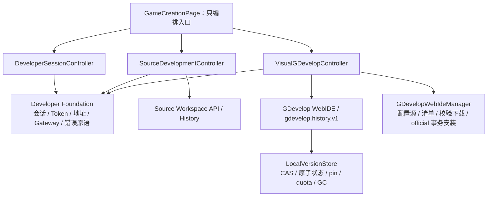

# 开发者入口分层与复用边界

## 目标依赖方向

禁止反向依赖：共享底层不知道编辑器类型；两个入口不能直接调用对方的 controller、
DTO、项目路径或 UI。不存在 `workspaceKind` controller、条件分支式 endpoint 或万能项目
DTO。

## 能力矩阵

| 能力 | 语义与生命周期 | 变化原因 | 归属 | 结论 |
| --- | --- | --- | --- | --- |
| 开发者会话启停、端口、Token、持久路径 | 两入口共用同一个 Gateway 生命周期 | App 进程与前后台策略 | Foundation | 共享 |
| Token 鉴权、AI 危险操作批准、统一错误外壳 | 每个 Developer API 请求一致 | 安全策略和 Developer API 演进 | Foundation | 共享 |
| LAN 地址解析 | 同端口、同网卡模型 | 网络接口变化 | Foundation | 共享 |
| QR、复制、地址选择展示 | 无项目领域语义 | App 纯展示变化 | 纯 UI 原语 | 共享 |
| 源代码工作区链接 | 工作区始终随 Gateway 存在 | 源码工作区路由变化 | Source controller/adapter | 独立 |
| GDevelop 链接与可用性 | 依赖官方 WebIDE 是否已安装 | GDevelop 内核升级与裁剪 | Visual controller/adapter | 独立 |
| GDevelop WebIDE 分发与修复 | 用户依次选择配置源和 ZIP 镜像，固定写入 `GDevelop/official` | WebIDE 发布与镜像可用性 | Visual controller/manager | 独立 |
| 源码文件 revision、before/after、目录恢复 | 文件/目录快照，含 5 分钟操作合并 | 源码编辑与文件系统语义 | 既有 Source History | 独立 |
| GDevelop revision、资源 pin、工程恢复 | 标准 project JSON + 全量二进制资源 | GDevelop 正常保存、用户恢复、资源生命周期 | `gdevelop.history.v1` | 独立 |
| GDevelop 项目分配与原子发布 | immutable workspace target、资源计划、raw project、finalize/commit/recover | 创建/导入必须先形成 App canonical current，浏览器仅缓存 | Visual allocation controller/adapter | 独立 |
| 可恢复项目提交状态机 | prepare、payload finalized、commit requested、receipt、TTL 与 evidence 幂等 | allocation/rekey/restore 都需要崩溃后只向前恢复 | `PendingProjectCommitStore` | 共享底层 |
| 内容 hash、原子索引、CAS pin、配额和零引用 GC | 与编辑器 DTO 无关 | 存储可靠性与容量策略 | `LocalVersionStore` | 共享底层 |

源码历史保持既有文件/目录快照实现，不为了代码形似迁移成 GDevelop CAS DTO；它们只在
更低层的 Developer Gateway 安全与错误原语处汇合。GDevelop 当前工程和历史修订则共享
同一个 CAS/事务核心，不能再建立第二套 IndexedDB history、hash 或引用计数。GDevelop
managed project 的 App identity/index/current/history 是 canonical；浏览器 IndexedDB 只能缓存
编辑态。项目分配先在 App sibling staging 中写齐 exact project bytes、资源和首个 current，
durable commit decision 后再原子发布，不能由浏览器缓存是否写入来决定 App 事务 phase。

上述 `current/history` 只服务于项目分配、GDevelop 正常保存和用户主动恢复。Playmesh AI v2
不调用这条存储链；它只在当前 WebIDE 的 live `gdProject` 上执行官方编辑函数，后续是否保存
仍由用户通过 GDevelop 正常流程决定。

## Controller 合同

- `DeveloperSessionController` 只消费 `DeveloperSessionProvider`，管理会话、端口、Token
  和开关状态，不读取任何编辑器链接。
- `SourceDevelopmentController` 只消费 `SourceDevelopmentProvider`，管理源码链接、失败与
  本机打开 URL。
- `VisualGDevelopController` 只消费 `VisualGDevelopProvider`，管理 WebIDE 可用性、链接、
  两级手动源选择、安装/升级/强制修复、进度、取消、失败与本机打开 URL。配置源选择后才
  请求该源的 `update.json`，ZIP 镜像选择后才开始下载；两级选择互不自动代替用户决定。
- `GameCreationPage` 监听三者并编排两个折叠入口；`DeveloperWorkspaceLinks` 只负责纯展示。

安装链路固定为“内置配置源列表 → 用户选择的 `update.json` → 用户选择的 ZIP → 长度与
SHA-256 校验 → 安全解压 staging → 原子替换 `GDevelop/official`”。修复复用同一链路但强制
重新下载；失败或取消必须保留旧 `official`。安装完成后，同一 Developer Session 会重新读取
Gateway 的 GDevelop 链接，不要求重启会话。该事务不得触碰 `projects`、`history`、Gateway
元数据或 WebView profile/IndexedDB。

## 耦合自审计

- 公共层没有 `workspaceKind`、GDevelop 历史 DTO、源码 `projectRef` 或文件 path 分支。
- GDevelop 公开 wire 身份直接使用 `gameId`，其值同时是 WebIDE `packageName` 和
  `main.json.id`；不签发 opaque handle。内部 UI 可以保留 `projectRef` 适配对象，但不能
  把它发送到 Gateway。
- `gdevelop.history.v1` 路径、DTO、storage namespace 和错误码与
  `/dev/api/projects/{projectId}/local-history` 完全独立。
- GDevelop restore 不调用源码 restore；源码历史 UI 不读取 GDevelop revision。
- WebIDE 可以使用同源 HttpOnly Token，但 JavaScript 无法读取 Token 值。
- 每个 managed root 使用独立 `LocalVersionStore` 锁、配额和 CAS；不同 `gameId` 可并行，
  没有全局历史锁或跨项目淘汰。单个项目仍不支持两个 App 进程同时写同一 `state.json`；
  若未来引入多进程服务，必须先增加跨进程文件锁或迁入事务数据库。
