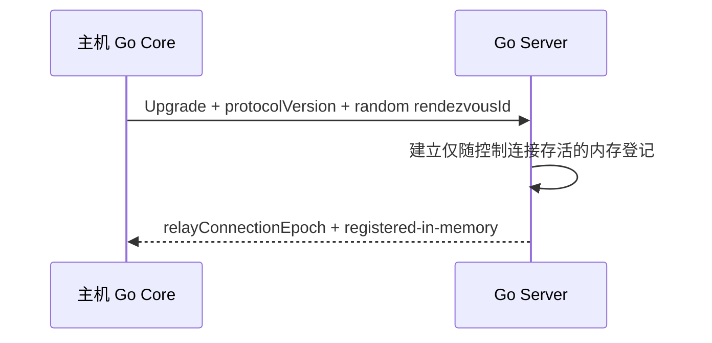
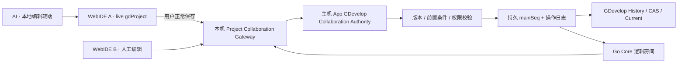

# Playmesh 多人开发协作通道与编辑器接入架构

状态：实施前设计基线
协议草案：Collaboration Channel `1.0.0`、Collaboration Relay `1.0.0`
适用范围：Playmesh App、Go Core、Go Server、源码工作区、GDevelop WebIDE、外部 IDE 适配器
基线日期：2026-08-14

## 1. 文档目的

本文定义 Playmesh 多人开发协作的工程边界、专用通信通道、身份与加密模型、主机权威
一致性、主线提交拦截、在线会话、断线恢复、在线状态、活动审阅，以及源码工作区和
GDevelop 的适配方式。

本文是实施前架构，不表示功能已经完成。实现时必须同步补充协议测试、版本记录和验证
文档；未通过验收矩阵前，不得把本文中的设计能力写入已发布版本日志。

本方案不复用现有游戏 Relay、Go Core Session WebSocket 或 Binary Channel。新通道只
参考它们的连接池、双向复制、背压、限流和资源回收经验，并使用独立协议、路由、状态
和版本声明。这样不会改变任何旧游戏、旧邀请和旧中转协议的行为。

## 2. 先决结论与边界修正

### 2.1 可实现的产品能力

- 主机从具体源码编辑器或 GDevelop WebIDE 内开启、查看和关闭协作，(使用类似分享链接的App级原生浮层统一显示)，不通过“加入协作”
  入口进入自己的项目。
- 所有协作者都只能通过 Playmesh App 的专用项目中心建立成员身份并完成首次加入，普通
  浏览器和 dev-cli 都不能接收邀请或独立建立远端成员会话。dev-cli 与 Source Workspace、
  GDevelop 同为编辑适配器：主机 dev-cli 可以调用本机 App 接口开启协作；协作者必须先在
  App 加入，再由 App 把已经加入的项目交给本机 dev-cli attach 和同步。
- 主机开启协作后，必须逐个输入协作者名称，再为该成员生成独立个人 AES 根密钥。
- 同一协作开放周期具有随机、高熵且稳定的 `rendezvousId`。它只用于把某条 LAN/Relay
  字节流送到主机 Go Core，不承担成员认证。每位成员获得独立的 256 位成员根密钥；只有
  对应成员和主机持有该密钥。主机或底层连接变化不影响已加入成员重连，关闭并重新开启
  协作则生成新世代、新 rendezvousId 和全套新成员根密钥。
- 逻辑协作房间唯一存在于主机 Go Core。LAN 和 Go Server Relay 都只是房间 Transport；
  每名协作者同一时刻只能选择一条活动线路，默认使用上次成功线路，也可以在进入前手动
  选择。所有线路最终进入同一个主机房间和同一条主机权威提交链。
- 主机和客户端 App 启动、网络恢复或 Go Server 重启后，可以重新登记和自动重连。
- 编辑器本身不实现抢锁或只读；源码按整个文件、GDevelop 默认按 canonical folder-project tree
  进入统一协作处理层。只有通过细粒度门禁的 GDevelop 分发才按实例、对象、事件等稳定
  聚合提交。处理层只在一次主线保存提交期间使用极短事务租约，不尝试检测
  dev-cli/外部 IDE 当前打开的文档，也不广播长期文件占用或安装操作系统文件锁。
- 协作者只有在主机在线、完成最新主线同步并保持有效会话时才能打开协作工作副本；主机
  离线时项目卡片可查看但不能进入开发，不支持长期离线分支和主机批量合并。
- 主机可以查看在线成员、当前操作、最后确认同步时间、最后确认主线序号和有界活动
  列表，并从活动记录进入修改审阅。

### 2.2 “兼容旧版本”的准确含义

新增专用协议不能让未实现该协议的旧版 Go Server 自动具备协作能力。可保证的是：

- 新版 Go Server 保留现有 `/relay/v1/**`、Catalog、账号和游戏包行为，旧版 App 继续
  使用原有服务。
- 新协作路由位于独立命名空间，不改变 Relay `3.0.0` 的请求、响应、凭据或生命周期。
- 新客户端先探测 Collaboration Relay 能力；旧版 Go Server 返回 `404` 时，仅把该服务
  标记为“不支持开发协作”，不能回退到游戏 Relay。
- 旧版 Go Core 没有协作能力时，游戏 Session 和 Binary Channel 仍正常工作；新版 App
  只禁用协作入口。

因此，“兼容旧版本服务”是旧能力不被破坏，不是旧服务端支持新功能。

### 2.3 路径只负责定位，成员根密钥负责识别主机与成员

Go Server 不保存长期 rendezvous 注册表，也不能成为客户端信任主机或判断成员资格的
来源。主机为每次协作开放世代生成随机 256 位以上 `rendezvousId`；主机在线连接期间，
Go Server 只在进程内登记 `rendezvousId -> host connections`，控制连接关闭、超时或 Server
重启时整项删除，不写数据库、文件或持久日志。

每份个人邀请包含该成员独立的 256 位 `memberRootKey`。客户端和主机使用它完成双向持钥
证明，并为当前连接派生独立的上下行 AES-256-GCM 会话密钥。Go Server 不接收、验证、
派生或持久化该密钥，也不决定成员是否允许进入。即使 Relay 把连接错配给其他主机，错误
主机没有该成员根密钥，房间握手必须失败；不能无感把已加入成员切换到另一台假主机。

这是对称密钥模型：个人邀请本身是 bearer secret，不能把 AES 根密钥称为公钥或私钥，
也不能让多名成员共享同一密钥。根密钥不直接重复加密业务帧，而只用于握手证明和标准
会话密钥派生，避免长期密钥复用和 AES-GCM nonce 重用。

### 2.4 XPath 不能成为同步目标

XPath 仅允许作为 WebIDE 标记层的易失界面锚点，不能用于权限、租约、提交或合并：

- GDevelop 场景主要由 Canvas/Pixi 渲染，没有可用 XPath。
- React 重绘、虚拟列表滚动、语言和窗口布局都会改变 DOM 路径。
- XPath 不能稳定表示文件、对象 UUID、事件、资源或恢复副本目标。

协议必须使用 `surface + targetId` 表示语义目标；XPath、屏幕矩形或场景坐标只用于当前
界面的可视化提示。

### 2.5 拦截边界位于协作处理层

编辑器插件或 WebIDE 控件不负责申请锁、切换只读或阻止用户修改。源码 IDE 和 GDevelop
写各自的本地工作副本；所有变更在进入权威主线前统一经过 Collaboration Ingress：

```text
编辑器本地工作副本
→ 变更捕获/保存边界
→ Collaboration Ingress
→ 基础版本、提交租约、项目绑定和成员校验
→ 主线提交，或向原协作者返回 stale_base/rejected
```

该模型保证的是“主机按序物化每次已接收的保存结果”，而不是假设普通文件系统能知道用户
何时打开文档或阻止其他人本地修改。同一目标可以并发本地修改；能够证明基础版本已经
过期的提交返回 `stale_base`。dev-cli 无法知道 IDE 内存缓冲区基于哪个版本：远端覆盖后，
旧缓冲区再次保存会被观察为一次新的本地保存，可能再次成为主线。这是无 IDE 集成模式的
明确 last-accepted-save 边界，不能宣传为语义冲突检测。

源码编辑器必须打开 App 管理的工作副本，而不是隐藏的主线存储。App 使用文件系统观察
作为变化提示，并通过内容哈希和周期性全量对账确认状态，不能把 watcher 事件当作可靠
事务日志。GDevelop 通过现有 managed storage 保存边界把本地项目快照交给协作处理层，
不在场景或事件 UI 中增加编辑限制。

## 3. 架构不变量

以下规则在实现中不可被便利性绕过：

1. Go Server 不知道 Playmesh 项目 ID、项目名称、文件名、成员名称和成员根密钥。
2. Go Server 不持有任何可解密协作内容的密钥。
3. 公网 HTTP/Upgrade 只承载协议版本、线路和随机 `rendezvousId` 等最小路由元数据；成员
   根密钥、成员名称、项目绑定、编辑器版本和项目内容都不得发送给 Go Server。HTTPS 可以
   部署，但不是协作前提；业务机密性和完整性由客户端 Go Core 到主机 Go Core 的应用层
   AEAD 会话保证。
4. 每个客户端到主机都是独立加密会话。主机解密、验证并持久化状态变更后，再通过其他
   客户端的独立会话重新加密发送；不存在客户端绕过主机直发权威状态。
5. 每个成员只有一份独立随机 `memberRootKey` 作为房间准入根秘密。主机保存成员与根密钥
   的受保护映射，Go Server 不验证它、不保存成员记录，也不参与撤销。成员撤销只由主机
   关闭活动会话并拒绝后续房间握手来生效。
6. `memberId`、成员根密钥证明、编辑器兼容标识和项目绑定只在端到端加密房间握手或会话
   内发送。
7. 主机是唯一主线、成员目录、提交租约和提交结果的权威；过期变更由原协作者重新应用，
   主机不承担长期离线分支的批量冲突处理。
8. 主机和协作者编辑器都只能写 App 管理的本地工作副本；任何一方都不能直接写隐藏的
   权威主线存储。
9. 所有状态变更必须先由主机持久化权威日志、结果和递增 `mainSeq`，再确认和广播；所有
   主线提交都有唯一 `mainSeq`、作者 `memberId`、聚合版本和 fencing token。presence、光标、
   XPath 标记等易失提示不是权威状态，不受“先持久化再广播”约束。
10. 浏览器 IndexedDB 只是缓存，在线会话工作副本和主机持久日志才是恢复来源；断线恢复
    副本永远不能自动进入主线。
11. 协作者只能由 App 打开专用副本，不能从普通项目入口进入后绕过协作状态。
12. Go Core 协作通道、Go Server 协作中转、协作业务协议分别独立版本化。
13. 协作数据面只能读取、提交和物化主机冻结的 `ProjectContentDescriptor` 所定义的项目
    内容；项目目录外、未纳管或被排除的本机内容不得进入 manifest、CAS、日志或网络帧。
14. 协作能力必须通过 facade、middleware、decorator、Adapter、既有事件钩子和构建期
    overlay 等切片方式接入编辑器；禁止把协作分支散落到编辑器业务源码。功能粒度必须
    服从侵入预算：缺少对象/事件级钩子时退化到保存事件驱动的文件级同步，不能以细粒度
    需求为理由扩大编辑器 Core 修改。极小中立 seam 只可作为单独评审的例外，并通过 patch
    manifest 审计。

## 4. 现有实现事实与复用边界

### 4.1 Developer Foundation

现有开发网关已经提供源码文件 revision、批量写入和 SSE 更新基础：

- `lib/core/developer/developer_web_gateway_io.dart`
- `lib/core/developer/operations/files/file_operation.dart`
- `lib/core/developer/operations/files/file_changes_operation.dart`
- `lib/core/developer/developer_event_hub.dart`
- `assets/playmesh-library/public/developer/workspace.js`

Developer Gateway 使用权限较高的开发 Token，并同时服务源码工作区和 GDevelop。该
Token 不能进入协作邀请，Developer Gateway 也不能直接暴露给远程协作者。协作者页面
只能连接本机回环上的项目级 Collaboration Workspace Gateway。

当前 `lib/main.dart` 初始化了 `window_manager`，但仓库中未找到 App 单实例、跨进程项目入口
互斥或 Source Workspace/GDevelop/dev-cli 共用的 editor session registry。因此“同一项目在
主机本机只有一个 IDE”是新增产品门禁，不是现状；实现必须落在 App facade/唯一 local broker，
不能只在某个页面按钮上判断。

### 4.2 GDevelop 当前态与历史

现有 `gdevelop.history.v1`、`LocalVersionStore` 和 CAS 可用于主机快照、资源去重和历史
检查点，但历史 revision 不是协作主线序号：

- `lib/core/developer/gdevelop_project_history.dart`
- `lib/core/developer/foundation/gdevelop_project_mutation_lock.dart`
- `assets/playmesh-library/public/GDevelop/playmesh/overlays/newIDE/app/src/PlaymeshHistory/PlaymeshHistoryClient.js`
- `assets/playmesh-library/public/GDevelop/playmesh/overlays/newIDE/app/src/PlaymeshProjectMutation/PlaymeshProjectMutationCoordinator.js`

协作需要单独持久化 `mainSeq` 和操作日志，再把已提交结果原子物化到现有 App
canonical current。浏览器状态和页面内 mutation coordinator 不能成为跨设备权威。

当前代码已经提供可收敛到统一工程协作 Authority 的基础，但它们尚不是完整协作流：

- `GDevelopProjectHistoryAdapter.authoritativeChanges` 会在正常保存或用户恢复后发布工程变化。
  其中进程内 sequence 只能作为低延迟失效信号，不能跨进程恢复或代替持久
  `mainSeq`/操作日志。
- Playmesh AI v4 明确不绑定权威 project revision/hash，也不读写 `current/history`。其 writer
  lease 只串行当前 live WebIDE 的修改型工具，不能作为协作 Authority 的提交基础。
- `PlaymeshAiCallCoordinator` 采用“SSE 只唤醒，按 sequence 轮询 call 状态”的模式。工程协作
  事件流可以复用这个通知原则，但不能把 AI call 状态当作工程事实源。

对应现有落点：

- `lib/core/developer/gdevelop_project_history.dart`
- `lib/core/developer/gdevelop_ai_session_service.dart`
- `assets/playmesh-library/public/GDevelop/playmesh/overlays/newIDE/app/src/PlaymeshAi/PlaymeshAiCallCoordinator.js`

GDevelop 场景实例和对象已有 persistent UUID，可以作为协作目标。普通事件缺少通用稳定
ID，不能用事件数组下标或 `aiGeneratedEventId` 代替；这不阻断把整张事件表作为一个聚合的
`aggregate_save`，但会阻断单事件 `semantic`。只有 Gate G4/G7 允许获批的最小中立序列化
seam 时，后者才可增加并序列化 `playmeshCollaborationId`；否则必须停留在较粗粒度模式。

#### 4.2.1 GDevelop 官方公开协作基线

截至 2026-08-14，对 GDevelop 官方仓库 `master` 提交
[`1a0661d`](https://github.com/4ian/GDevelop/commit/1a0661d104ace07d55965d52fb359bddcd485e58)
的只读核对表明，官方公开编辑器协作是“云项目共享 + 完整项目版本提交 + 保存时版本冲突
提示”，不是对象、事件或命令级实时共同编辑：

- 云项目 owner 通过 ACL 添加 `writer/reader`；它解决访问权，不提供工程操作流。
- 打开时按 `currentVersion` 下载版本 ZIP，其中项目主体仍是完整 project JSON。
- 保存时序列化并上传完整 project ZIP，提交 `newVersion + previousVersion`，记录提交人、时间
  和版本链。
- 保存前比较本地打开版本与云端 `currentVersion`；已经被别人修改时，官方客户端询问是否
  整体覆盖，不执行对象级合并或主机裁决。
- 官方团队开发指南仍建议多文件模式、外部事件/布局/扩展拆分以及 Git/Mercurial/SVN，以
  降低多人修改同一文件的冲突概率。

证据入口：

- [官方云项目保存与覆盖提示](https://github.com/4ian/GDevelop/blob/1a0661d104ace07d55965d52fb359bddcd485e58/newIDE/app/src/ProjectsStorage/CloudStorageProvider/CloudProjectWriter.js#L530-L588)
- [官方完整项目版本上传和 previousVersion 提交](https://github.com/4ian/GDevelop/blob/1a0661d104ace07d55965d52fb359bddcd485e58/newIDE/app/src/Utils/GDevelopServices/Project.js#L319-L381)
- [官方团队开发指南](https://wiki.gdevelop.io/gdevelop5/tutorials/how-to-use-gdevelop-as-a-team/)

[官方教育页面](https://gdevelop.io/pricing/education)使用“Real-time project collaboration”
营销表述，但公开客户端代码和当前团队开发文档没有给出 CRDT/OT、持久操作流、presence 或
远端 UI 操作应用器。除非后续获得一份可验证的专有接口契约，否则本文不得把该表述当作
可复用的技术能力。

Playmesh 可以借鉴官方的 ACL、`previousVersion`、完整快照和版本历史思想，但不能复用一个
不存在于公开实现中的官方实时协作通道，也不能照搬“加入者确认整体覆盖”的冲突模型。本文
的 `aggregate_save/semantic`、主机 Authority、持久事件流和远端显示均属于 Playmesh 自研
能力。

### 4.3 现有游戏 Relay

现有 `go-server/internal/relay` 使用临时 tunnelId、Host Lease、Join Capability、连接池
和字节复制；`lib/core/relay` 在 App 端进行游戏 Relay 加密。它服务游戏分享，不能满足
稳定项目 rendezvous、逐成员身份、长期自动重连和开发协作语义：

- `go-server/internal/relay/manager.go`
- `go-server/internal/relay/handler.go`
- `lib/core/relay/relay_tunnel_io.dart`
- `docs/remote-game-relay.md`

新协作通道不得调用游戏 Relay Manager、复用 tunnelId/Host Lease/Join Capability，或把
协作项目伪装成游戏会话。可以抽取无领域语义的双向复制、限流和 idle deadline 工具，
但两个 Manager、路由、配置、指标和协议必须独立。

### 4.4 现有 Go Core Session

Go Core 当前路由只组合健康检查与 `/v1/sessions`，Binary Channel 属于当前游戏会话：

- `go-core/internal/server/router.go`
- `go-core/internal/session/binary_hub.go`
- `go-core/internal/session/binary_protocol.go`
- `go-core/mobile/core.go`

开发协作不得进入 `internal/session`，不得创建隐藏游戏玩家或 Binary Channel，也不能继承
游戏 SDK 的开放 CORS。它需要独立 `internal/collaboration` 模块和只允许本机 App 调用
的控制面。

### 4.5 编辑器最小侵入与切片边界

本文所称“AOP/切片”是架构方法，不要求引入某个 AOP 编译器。各技术栈使用自己的稳定
扩展机制：

| 层次 | 首选切片点 |
| --- | --- |
| Dart/App | facade、Application Service、execution middleware、decorator、event hub |
| Source Workspace | 现有 Developer Operation、Gateway middleware、单一 bootstrap/overlay |
| dev-cli | Adapter Registry、App client、watcher bridge；不修改 IDEA/其他 IDE |
| GDevelop WebIDE | 现有 Playmesh storage/history/mutation seam、构建期 overlay、命令/保存事件 |
| GDevelop Core | 默认不增加协作动作捕获；仅允许另行批准的中立序列化最小 seam |
| Go Core/Go Server | 独立 package、Handler/Transport 接口和装配开关 |

禁止做法：

- 在编辑器大量业务组件中加入 `if collaboration` 分支。
- 直接维护一份长期分叉的完整 GDevelop/编辑器源码树。
- 运行时遍历 DOM、替换随机函数或 monkey-patch 不稳定内部原型来承担正确性。
- 对编译后的压缩 bundle 做无结构字符串替换。
- 让 XPath、组件层级或页面临时状态成为提交身份。
- 为追求对象/事件级同步而在多个 GDevelop Core 模块补建动作捕获调用链。

允许的最小上游补丁必须满足：

1. 一个补丁只增加一个稳定 seam，不包含协作业务策略。
2. seam 默认无观察者时保持原行为，关闭协作后行为与上游一致。
3. 补丁记录在版本化 `patch manifest`，包含上游 commit、目标文件、用途和验证测试。
4. clean upstream + overlays/patches 必须能重复生成完全相同的有效分发 hash。
5. 上游升级导致 patch 上下文或契约变化时构建失败，不能静默跳过。

“不能大面积修改”按结构边界判定，而不是用任意代码行数掩盖分散修改：编辑器 Core 中的
协作业务逻辑必须为零，不修改既有编辑/撤销/保存算法；每个例外 seam 必须局部、默认无
副作用且可独立撤销。出现任何未登记接缝、需要多个上游业务组件联动，或 clean build
无法自动复现时即视为超出预算，必须降低同步粒度或取消增强能力。

例如 GDevelop 普通事件稳定 ID 若要支持细粒度模式，必须进入标准序列化路径；只有这个
中立字段无法通过 overlay 获得且单独评审批准时，才允许增加最小序列化 seam。若没有稳定
的单对象动作 hook，则不再修改 Core 补建 hook，而是由既有保存事件触发 canonical project
文件级同步。成员、网络、租约、主线和 UI 标记始终留在 Playmesh Adapter/overlay。

## 5. 总体调用链

```mermaid
flowchart LR
  HostEditor["主机源码 IDE / GDevelop WebIDE"]
  HostApp["主机 App Collaboration Core\n持久权威 / 成员 / 提交事务"]
  HostGo["主机 Go Core\n唯一逻辑 WS 房间"]
  Server["Go Server\n可选 Relay Transport\n临时配对 / 密文字节复制"]
  ClientGo["协作者 Go Core\n单活动 Transport / Room Client"]
  ClientApp["协作者 App\n在线工作副本 / 断线恢复"]
  ClientEditor["协作者 IDE / GDevelop WebIDE"]

  HostEditor <--> HostApp
  HostApp <--> HostGo
  HostGo <== "不解密的 AEAD 密文字节流" ==> Server
  Server <== "不解密的 AEAD 密文字节流" ==> ClientGo
  ClientGo <--> ClientApp
  ClientApp <--> ClientEditor
```



局域网不经过 Go Server，但仍承载相同的房间协议和 AEAD 数据帧：

```text
协作者 Go Core -> LAN TCP -> 主机 Go Core Collaboration Listener
```

局域网与广域网只替换底层连接来源，上层房间握手、成员认证、协议、租约和同步语义完全
相同。一个协作者同一时刻只挂接一个 Transport；主机可以同时接受不同成员分别从 LAN 或
Relay 进入同一逻辑房间。与现有游戏 LAN 不同，开发协作的局域网链路也必须加密。

## 6. 协议与能力发现

### 6.1 独立版本

```text
playmesh.collaboration.channel.v1     客户端 Go Core <-> 主机 Go Core
playmesh.collaboration.relay.v1       Go Core <-> Go Server
playmesh.collaboration.domain.v1      App <-> App 的协作业务消息
```

三个版本分别协商。任何一层不兼容都必须明确拒绝，不得静默回退到游戏 Relay 或游戏
Session。

### 6.2 Go Server 能力探测

为了不改变旧 `/apps/info` 契约，新增独立端点：

```http
GET /collaboration-relay/v1/info
```

示例：

```json
{
  "protocolVersion": "1.0.0",
  "transport": "playmesh-collaboration-upgrade",
  "publicBaseUrl": "http://relay.example.com:16668",
  "hostPath": "/collaboration-relay/v1/host",
  "clientPath": "/collaboration-relay/v1/client",
  "pairing": "opaque-rendezvous-v1",
  "maxPeersPerRendezvous": 16,
  "maxControlMessageBytes": 16384
}
```

要求：

- 只有 Go Server 的独立协作通道开关为开启状态时才注册该端点和其余协作路由；关闭时
  统一返回 `404`。
- `publicBaseUrl` 可以是 HTTP 或 HTTPS；协作安全不能依赖外层 HTTPS。
- 启用时只声明不透明 rendezvous 配对协议，不声明成员、项目或密码学准入能力。
- `/info` 不提供或要求任何协作解密密钥。即使明文 HTTP 被观察或代理，观察者也只能看到
  线路能力和流量元数据；项目数据由客户端—主机 AEAD 会话保护。
- 响应使用 `Cache-Control: no-store`。
- 新客户端对 `404` 显示“不支持开发协作”，不影响该服务器的其他能力。
- 旧客户端从不访问该端点，不受新增路由影响。

### 6.3 Go Core 能力探测

Go Core 健康信息增加可选的独立能力对象，或者由本机专用端点提供：

```json
{
  "collaboration": {
    "channelProtocolVersion": "1.0.0",
    "maxChannelFrameBytes": 1048576
  }
}
```

字段缺失表示不支持。`maxControlMessageBytes` 只约束 Go Server 能解析的配对前公开消息；
`maxChannelFrameBytes` 由两端 Go Core 在 AEAD 验证并解密后执行，Go Server 无法且不得按
业务帧限长。
不能因为新增协作能力机械改变已有游戏 Session 协议的语义。

## 7. 标识、凭据和名称

### 7.1 数据模型

| 字段 | 产生方 | 用途 | Go Server 是否可见 |
| --- | --- | --- | --- |
| `collaborationGenerationId` | 主机 App | 一次开启协作的世代 | 否 |
| `projectBindingId` | 主机 App | 强制凭据仅用于当前项目 | 否 |
| `rendezvousId` | 主机 Go Core | 在选定 Transport 定位当前主机连接 | 是，仅路由生命周期内 |
| `memberId` | 主机 App | 成员稳定身份 | 否 |
| `displayName` | 主机输入 | 本地和远端成员显示 | 否 |
| `memberKeyLocator` | 从成员根密钥域分离派生 | 主机在房间握手中定位成员密钥；不直接暴露 memberId | Go Server 只会被动看到不透明握手字节，不解析、不保存 |
| `memberRootKey` | 主机为成员生成 | 双向持钥证明及派生当前连接会话密钥 | 否 |
| `roomSessionId` | 主机 Go Core | 标识一次已认证房间会话 | 否，位于加密会话内 |
| `connectionEpoch` | 主机 Go Core | 同一成员单活动连接去重 | 否，位于加密会话内 |
| 上下行 AEAD 会话密钥 | 两端 Go Core | AES-256-GCM 网络数据加密 | 否 |

`rendezvousId` 使用系统安全随机源生成，不直接使用 `gameId`、项目名、本地路径或成员信息。
它不是成员凭据，也不允许 Go Server 据此认定某个客户端有项目权限。关闭协作后，该世代
全部标识和根密钥失效；再次开启生成新世代。

### 7.2 逐成员 AES 根密钥

主机添加成员时，为该成员生成独立 256 位随机 `memberRootKey`。禁止多个成员共享一把根
密钥，也禁止直接拿根密钥和固定 nonce 加密业务帧。规范派生：

```text
memberKeyLocator = Truncate128(
  HMAC-SHA-256(memberRootKey,
    "playmesh-collaboration-member-locator-v1" || generationNonce))

handshakeKey = HKDF-SHA-256(
  inputKeyMaterial = memberRootKey,
  salt = clientNonce || hostNonce,
  info = "playmesh-collaboration-handshake-v1" || transcriptHash)

clientToHostKey/IV = HKDF-Expand(handshakeKey, "c2h-aead-v1")
hostToClientKey/IV = HKDF-Expand(handshakeKey, "h2c-aead-v1")
```

握手使用 HMAC-SHA-256 做双向持钥证明，业务帧使用 AES-256-GCM。两个方向使用不同密钥、
不同 IV 基值和单调帧序号；协议规定重放拒绝、序号上限、重连重新派生和达到阈值前强制
rekey。密码学组合必须使用成熟库并通过跨 Dart/Go 测试向量，不自行实现 AES、GCM、HKDF
或 HMAC 原语。

### 7.3 添加成员与昵称

主机点击“添加协作者”时必须输入名称，之后才生成凭据：

```json
{
  "memberId": "uuid",
  "displayName": "张三",
  "role": "editor",
  "memberKeyLocator": "opaque-derived-locator",
  "rootKeyRef": "host-local-secret-reference",
  "status": "invited"
}
```

规则：

- 名称去除首尾空白后必须非空，建议限制为 1～32 个 Unicode 字符。
- 同一世代内，Unicode 规范化并 case-fold 后的名称必须唯一。
- 昵称由主机成员目录提供，客户端自报昵称不得覆盖。
- 成员可以由主机改名；历史活动保留 `displayNameAtEvent`，避免改名后审计失真。
- 根密钥必须使用 256 位系统安全随机数，并带邀请格式版本和输入校验码。
- 主机必须保留可用于后续认证的根密钥，而不能只保留普通散列；具体终端保护由平台自身
  负责，但密钥绝不能进入项目内容、同步 manifest、Go Server、浏览器存储或日志。
- 主机撤销成员时持久化 `status=revoked`，关闭该成员活动房间会话并拒绝后续握手；不向
  Go Server 上传撤销表，也不要求 Relay 理解成员。

### 7.4 个人邀请与项目绑定

主机添加成员后生成该成员唯一的 App 专用链接，最小载荷为：

```json
{
  "version": 1,
  "rendezvousId": "random-256-bit-id",
  "generationNonce": "random-generation-nonce",
  "memberKeyLocator": "opaque-derived-locator",
  "memberRootKey": "base64url-256-bit-secret",
  "routeHints": [
    {"routeId": "relay-1", "kind": "relay", "endpoint": "http://relay.example.com:16668"},
    {"routeId": "lan", "kind": "lan"}
  ]
}
```

链接不包含成员名称、项目 ID、项目名称或任何所谓“个人私钥”；它本身就是该成员的 bearer
secret。App 导入后先创建 `pending` 邀请记录，不能仅根据链接内的提示字段绑定或覆盖本地
项目。只有主机通过对称握手认证成功，并在加密会话内返回权威 `projectBindingId`、
`memberId`、`displayName`、`adapterKind` 和版本要求后，App 才把该根密钥正式绑定到该项目。
本地已有同一项目 ID 但世代或主机证明不同的记录必须停止并要求用户重新确认，不能静默
替换。

## 8. 加密模型

### 8.1 单一端到端加密边界

公网和局域网的可解密边界都只有客户端 Go Core 与主机 Go Core。Go Server、HTTP 代理和
LAN 中间设备可以观察路由元数据、`memberKeyLocator`、随机 nonce、HMAC proof 等不透明
握手字节及 AEAD 密文，但不能由此取得成员根密钥、成员/项目字段或业务明文。Go Server
实现不得解析、验证或持久化这些房间握手字节，也不终止安全会话。

HTTPS 可以提供线路端点认证和部分元数据隐私，但不是协议前提；HTTP Upgrade 上仍必须
运行相同的客户端—主机对称认证和 AES-256-GCM 会话。不能因为外层使用 HTTPS 而省略
AEAD 房间层。

### 8.2 客户端—主机房间握手

Relay 或 LAN 建立字节通道后，Go Core 执行以下握手：

```text
C -> H: version, memberKeyLocator, clientNonce,
        clientProof = HMAC(memberRootKey,
          "client-proof-v1" || canonical(transcript))

H -> C: hostNonce, roomSessionId, connectionEpoch,
        hostProof = HMAC(memberRootKey,
          "host-proof-v1" || canonical(fullTranscript))

C/H: HKDF-SHA-256 派生独立 c2h/h2c AES-256-GCM key + IV
C -> H: AEAD client.finished(transcriptHash)
H -> C: AEAD host.finished(transcriptHash)
C/H: 之后只允许 AEAD 安全帧
```

transcript 至少绑定协议版本、`rendezvousId`、generation nonce、双方 nonce、连接角色、
`roomSessionId` 和 `connectionEpoch`。主机先用 locator 找到候选根密钥，再以常量时间验证
client proof；任何错误统一失败关闭。host proof 使客户端确认对端确实持有自己的个人根密钥，
而不是相信 Relay 声称的主机身份。双方 finished 成功前不能把成员标为在线。nonce 每次
连接重新生成，主机对 locator 维护有界近期 clientNonce 重放缓存；proof 和业务密文均不可
跨连接重放。

### 8.3 假主机与密钥边界

Relay 可以拒绝服务、观察流量、错配或转发连接，但错误主机没有该成员的 `memberRootKey`，
不能生成有效 host proof，也不能派生会话密钥。客户端不得在握手失败后接受 Server 返回的
新身份或降级为明文；关闭并重新开启协作后，必须由主机重新分享新的个人邀请。

对称模型不能区分“真正主机”和“另一个取得同一成员根密钥的终端”；邀请泄露后的终端
风险由邀请持有者负责，不属于 Relay 能解决的问题。协议仍必须保证一个成员的根密钥不能
认证为另一成员，也不能派生其他成员会话。

### 8.4 Go Server 临时登记

Go Server 主机登记不做协作密码学认证：



登记只绑定当前长连接。Server 只做协议限长、连接配额、空闲超时和字节配对；控制连接关闭
或超时后原子删除 rendezvous、连接池和配对状态，服务器重启后由主机重新登记。任何人即使
冒充主机占用路径，最多造成拒绝服务；客户端的房间握手不会接受没有成员根密钥的假主机。

### 8.5 客户端—主机—客户端

每个协作者与主机建立独立 AEAD 会话：

```text
客户端 A --AEAD_A--> 主机 Go Core 房间 --AEAD_B--> 客户端 B
```

客户端 A 的操作由主机解密后执行：

```text
认证成员
→ 校验编辑器兼容标识
→ 校验项目绑定
→ 校验提交租约和基础版本
→ 写入权威日志并物化
→ 为每个接收者重新编码
→ 通过各自 AES-GCM 会话加密发送
```

主机必须能看到明文才能承担权威验证与提交判定，因此本方案不是“客户端之间连主机也不可
见”的群组端到端加密。它保证 Go Server、网络中间人和其他无关客户端无法解密。

Go Server 仍能观察服务器 Origin、IP、连接时间、流量大小、方向和 `rendezvousId`，这是
中转元数据，不应宣称完全匿名或“零信息泄露”。

### 8.6 单活动通道与线路选择

每名协作者同一时刻只能有一个活动 Transport：

1. App 默认选择该项目上次成功使用的 `routeId`，用户也可在打开前手动选择 LAN 或某个
   Relay 线路。
2. 只有该线路成功建立通道并完成房间认证、权威同步后，项目才允许打开。
3. 切换线路时先关闭旧连接，再建立新连接；主机房间以 `memberId + connectionEpoch` 做
   保底去重，新连接认证成功后旧连接立即失效。
4. 连接失败只提示选择其他线路或重试，不并行竞速多条线路，也不在后台静默切换身份。

主机可以同时监听 LAN 并连接一个或多个明确配置的 Relay，以服务从不同线路进入的不同
成员；单活动限制针对单个协作者。首版把一个 Relay 线路定义为一个明确的 Go Server 服务
端点。若同一域名背后随机分发到互不共享连接的多个进程，该部署不受支持；未来扩容应由
入口层按 rendezvousId 做连接亲和，而不是让 Go Server 建立协作房间或成员目录。

## 9. Go Server 专用 Collaboration Relay

### 9.1 模块建议

```text
go-server/internal/collaborationrelay/
  manager.go
  handler.go
  host_registry.go
  connection_pair.go
  limits.go
  protocol.go
  *_test.go
```

`internal/server` 单独组合并注册该模块。不得把字段加入现有 `relay.Tunnel`，不得让
`collaborationrelay.Manager` 调用 `relay.Manager`。

可以提取以下纯基础工具：

- 有背压的 `io.Copy` 双向复制。
- idle deadline 包装。
- IP 连接计数。
- Header Upgrade 解析。
- 安全随机数和严格协议限长。

提取后的工具不能包含 tunnelId、游戏 Relay 错误码或协作业务字段。

### 9.2 独立启用开关

Go Server 必须为 Collaboration Relay 提供与游戏 Relay 完全独立的开关，默认关闭：

```json
{
  "schemaVersion": 1,
  "enabled": false,
  "publicBaseUrl": "http://relay.example.com:16668",
  "limits": {
    "maxRendezvous": 1000,
    "maxPeersPerRendezvous": 16
  }
}
```

建议保存为独立的可选配置文件：

```text
go-server/collaboration-relay.json
```

不建议直接把 `collaborationRelay` 字段加入现有 `server.json`。当前 Go Server 对
`server.json` 使用严格 JSON 解码，旧版二进制遇到未知字段会拒绝启动；独立文件可使旧版
二进制直接忽略新配置，在回退旧版本时继续提供原有 Catalog、账号和游戏 Relay 服务。

开关规则：

- 文件不存在等同 `enabled: false`。
- `enabled: false` 时不创建 Collaboration Relay Manager、不启动清理任务、不注册
  `/collaboration-relay/**` 路由，也不占用协作连接和内存配额。
- `enabled: true` 时必须完整校验 HTTP/HTTPS `publicBaseUrl`、容量、超时和协议配置；配置
  无效必须拒绝启动协作模块，不能回退到游戏 Relay。
- 开关与 `supportsGameRelay` 无关；游戏 Relay 可以开而协作关闭，也可以游戏 Relay 关闭
  而协作开启。
- 首期启用/关闭在 Go Server 安全重启后生效。关闭前由服务退出流程断开协作连接；不做
  一半连接继续运行的热切换。
- 协作配置不得继承游戏 Relay 的 tunnel TTL、连接上限或公开地址；相同值也必须显式
  配置，避免两个协议后续演进时互相改变行为。

Go Server Collaboration Relay 不配置、接收或生成任何成员根密钥、会话密钥或协作解密
材料。服务器自身普通 HTTPS 证书（若部署）属于通用 Web 运维边界，不进入协作成员身份，
也不能成为接收成员凭据的理由。

独立配置文件只保存管理员开关和资源限额，不保存任何 rendezvous、成员或主机会话。公共
中转不得提供持久项目登记、离线目录或重启恢复表。

管理端增加独立表单“开启开发协作中转”，通过受管理员 Session 和 CSRF 保护的接口读写
该文件，例如：

```text
GET /<ADMIN_PATH>/api/admin/collaboration-relay/config
PUT /<ADMIN_PATH>/api/admin/collaboration-relay/config
```

保存使用严格 schema 校验和同目录临时文件原子替换。管理 UI 必须提示“重启后生效”；
公开页面、`/apps/info` 和旧管理 API 不返回该配置或管理入口。

### 9.3 外部路由草案

```text
GET /collaboration-relay/v1/info
GET /collaboration-relay/v1/host       Upgrade
GET /collaboration-relay/v1/client     Upgrade
```

`/host` 在 Upgrade 后承载最小的 `host.register`、`host.pending`、`host.keepalive` 和
`host.close`；`/client` 只提交 `client.join(rendezvousId)`。需要转入数据面的连接收到
`tunnel-ready` 后停止控制帧解析并切换为客户端—主机 AEAD 房间字节流的原始复制。

建议 Header：

```text
X-Playmesh-Collaboration-Rendezvous
Upgrade: playmesh-collaboration-tunnel
```

控制面只发送协议版本、角色、随机 `rendezvousId`、连接 nonce、relayConnectionEpoch 和
机器错误码；成员根密钥、成员身份、项目字段、编辑器版本和房间证明完全不发送。不存在
成员能力票据、成员验签或撤销接口。不存在目标、主机离线和无待配对连接统一返回
`relay_target_unavailable`，避免把路径存在性做成枚举接口。

### 9.4 内存状态

```text
Rendezvous
  rendezvousId
  relayConnectionEpoch
  hostControlConnection
  hostLastSeen
  pendingHostConnections
  activePairs
  closing
```

该表只存在于进程内存。主机控制连接关闭/超时或 Server 重启时立即删除整项并断开关联
连接；不存在落盘、数据库、快照或重启恢复。Server 无法判断登记者是不是业务主机；路径
冒用最多造成拒绝服务，成员身份和假主机拦截由主机 Go Core 房间握手负责。

### 9.5 连接池

首期参考现有 Relay 使用主机待配对连接池：

- 主机 Go Core 根据成员上限维持一定数量的待配对 Upgrade 连接。
- 客户端只提交所选线路和固定 `rendezvousId`，Go Server 不询问成员身份。
- Go Server 取出一条当前 relayConnectionEpoch 的主机连接并开始复制。
- 配对连接结束后主机自动补充连接池。
- 没有可用主机连接时返回统一 `relay_target_unavailable`，客户端退避重试或由用户选择
  其他线路。

这比首期自研多路复用协议风险更低。未来若改为单连接多流，必须另升 Relay 协议版本。

### 9.6 限制和日志

必须限制：

- 全局 rendezvous 数。
- 单 IP 登记和加入频率。
- 单 rendezvous 并发成员数。
- 待配对连接数和等待时间。
- 单连接空闲时间、持续时长和带宽。
- 未完成房间握手的连接时间和流量；Server 只按握手前字节/时间上限切断，不解析证明。

持久日志不得记录 `rendezvousId`、成员根密钥、房间握手字节、项目数据或客户端业务密文。
只允许无 rendezvous 标签的聚合指标、错误码、连接数量和字节数；进程内诊断标识使用进程
重启即失效的随机别名。

### 9.7 Relay 线路部署约束

首版一个 `routeId` 必须对应一个明确的 Go Server 服务端点，主机与选择该线路的协作者
必须进入同一服务进程。不得把同一端点随机分发到互不共享内存连接的多个实例。该限制是
Transport 部署约束，不是协作房间状态：V1 不要求 Go Server 集群、跨节点 rendezvous 表或
持久化路由。未来若需横向扩展，由入口层按 `rendezvousId` 做连接亲和或返回明确节点地址，
Go Server 仍不理解房间、成员、项目和权限。

## 10. Go Core 专用 Collaboration Channel

### 10.1 模块建议

```text
go-core/internal/collaboration/
  service.go
  local_control.go
  host.go
  client.go
  room.go
  room_peer.go
  relay_transport.go
  lan_transport.go
  aead_handshake.go
  aead_peer.go
  frame.go
  send_queue.go
  limits.go
  *_test.go
```

该模块不得导入 `internal/session` 的 Store、Binary Hub 或玩家身份。可复用 Go 标准库、
统一日志和服务生命周期原语。

### 10.2 Go Core 的职责

- 在主机端维护唯一的进程内 `CollaborationRoomHost`，把来自 LAN/Relay 的连接挂接到同一
  逻辑 WebSocket 房间；房间不是 Go Server 房间，也不持久化项目数据。
- 建立 LAN Listener 或连接指定 Collaboration Relay，并为协作者维护唯一活动 Transport。
- 完成对称持钥握手、HKDF、AES-256-GCM 帧、顺序、重放拒绝、背压、心跳和断线通知。
- 将成员 locator 和认证结果转交本机 App Collaboration Core，根密钥只按当前握手需要短暂
  提供给 Go Core，不由 Go Core 长期持久化。
- 为每个远端连接提供随机 transportPeerId，不能把它当成员 ID。
- 将 App 已持久化并确认可广播的业务消息发送给指定已认证 peer 或房间广播。
- 以 `memberId + connectionEpoch` 保证每名成员只有一个活动房间会话；线路切换后新会话
  认证成功即淘汰旧会话。
- 接受 App 持久化并传入的上次成功线路引用，按 App 指示重连；Go Core 不自行长期保存项目
  线路，也不并行竞速多条线路。

Go Core 不负责：

- 长期保存成员根密钥。
- 判断成员名称或权限。
- 判断编辑器版本是否一致。
- 管理文件、GDevelop 对象和事件。
- 分配租约或 mainSeq。
- 合并或接受断线恢复副本。
- 保存项目审计记录。

### 10.3 本机控制面

Collaboration Channel 控制面只允许 Playmesh App 本机调用：

- 默认绑定 `127.0.0.1` 随机端口。
- 使用 Go Core 启动时返回给 App 的高熵 boot token。
- 不使用游戏 SDK 的 `Access-Control-Allow-Origin: *`。
- 拒绝浏览器 Origin、私网跨域预检和无 boot token 请求。
- boot token 不写日志、不进入 WebIDE；WebIDE 只连接 App 创建的项目级回环网关。

本机接口至少提供：

```text
创建/销毁主机逻辑房间
启动/停止指定 LAN 或 Relay Transport
为客户端选择/切换唯一活动线路
查询房间、线路和重连状态
订阅 peer connected/disconnected/auth-request
接受或拒绝 peer 认证
发送已提交的单个、多目标和房间广播业务帧
接收业务帧
轮换当前本机会话
```

### 10.4 AEAD 安全帧

对称握手完成后使用独立二进制帧，首版至少包含：

```text
magic
channelProtocolVersion
frameType
flags
streamId
messageId
ackId
directionalSequence
payloadLength
ciphertextAndTag
```

帧头中不加密但参与认证的字段必须作为 AES-GCM AAD；每个方向的 sequence 严格递增并参与
nonce 构造，相同 key/nonce 组合绝不能重复。必须设置单帧、队列、每秒帧数和未确认可靠帧
上限。连续光标、拖动预览和 presence 使用
可合并的 latest 队列；提交、租约、认证和会话控制使用可靠有序帧，队列满时返回错误而不是
静默丢弃。

## 11. 主机准入与编辑器版本判定

### 11.1 判断位置

加入者的编辑器版本是否允许加入，只由主机 App 的 `CollaborationAdmissionPolicy`
判断。不同编辑器使用不同的唯一兼容标识，不定义一个包含任意 IDE 信息的通用完整
指纹：

```text
Go Server 配对
→ memberRootKey 双向持钥认证并建立 AEAD 房间会话
→ 客户端提交 EditorCompatibilityProof
→ 主机精确比较
→ 允许或拒绝进入项目
```

Go Server 和 Go Core Transport 不解释编辑器类型或版本。

### 11.2 GDevelop：比较有效安装包 SHA-256

GDevelop 加入判断只比较主机和加入者的 `gdevelopBundleSha256`：

```json
{
  "editorKind": "gdevelop",
  "gdevelopBundleSha256": "64-char-lowercase-hex"
}
```

该 SHA-256 必须来自受信安装清单，并覆盖实际执行的完整不可变 GDevelop 分发：

```text
官方 GDevelop WebIDE
Playmesh overlay
另行获批的 GDevelop Core 中立 seam（若有）
随包加载的固定协作脚本和 schema
```

不能对项目目录、用户资源、缓存、IndexedDB、临时文件或整个可变安装目录在每次加入时
重新求哈希，否则相同编辑器会因本地运行状态不同而被错误拒绝。推荐在构建/安装阶段对
规范化不可变文件清单计算一个 `effectiveBundleSha256`，写入受校验的 lock manifest；
运行时验证清单和关键文件后直接读取该值。

当前 `assets/playmesh-library/public/GDevelop/playmesh/webide-lock.json` 中的
`sourceArchiveSha256` 只描述上游源码归档，Playmesh 修改另以 `playmeshRevision` 表示，
因此不能直接用该上游哈希判断协作兼容。实施时必须新增覆盖最终有效分发的
`effectiveBundleSha256`。不能把多个独立 revision 字符串拼接后假装成文件内容哈希。

主机内部记录当前协作世代的 `gdevelopSyncMode`，用于选择同步算法和 UI 展示：

```text
project_tree   既有保存事件驱动的 canonical folder-project tree CAS
aggregate_save 保存事件驱动的 schema-aware 聚合替换与聚合 revision CAS
semantic       已通过 Gate G4/G7 的可选细粒度语义操作
```

它不是加入者自报的兼容字段，也不增加一项准入比较。`effectiveBundleSha256` 相同已经保证
两端拥有相同实现；认证后客户端直接遵循主机下发的世代模式。模式只能由主机关闭当前协作、
重新进行能力审计后开启新世代来改变，Go Server 不知道该值。

### 11.3 源代码编辑器：比较 Playmesh App 版本

源码协作加入判断只比较主机和加入者的 Playmesh App 完整版本：

```json
{
  "editorKind": "source",
  "playmeshAppVersion": "MAJOR.MINOR.PATCH+BUILD"
}
```

版本必须包含构建号；仅比较语义版本而忽略不同构建，可能让包含不同 WebIDE 静态资源
或协作适配器的 App 被错误视为一致。

该值必须取自当前已安装 App 的受信构建版本元数据，例如 Flutter 构建产生的
`MAJOR.MINOR.PATCH+BUILD`，不能由加入请求自行填写，也不能由页面 JavaScript 提供。

这一规则成立的前提是发布流程保证“相同 App 完整版本意味着相同的源码协作实现”。凡是
修改源码 WebIDE 静态资源、Collaboration Workspace Gateway、源码适配器或相关 schema，
都必须同步提升 App 构建版本；不同平台若携带不一致的协作实现，也不能发布成同一个完整
版本。应增加静态契约测试约束该版本纪律，否则仅比较 App 版本会产生假一致。

外部 IDEA 插件只需先与它连接的本机 App 完成兼容性握手。远端主机不获取、不比较
JetBrains productCode、IDEA build number 或插件版本；远端源码编辑器一致性只由
Playmesh App 完整版本决定。插件不兼容本机 App 时，本机 App 必须在发起远端加入前
拒绝打开该编辑器。

dev-cli 项目同样属于源码协作：远端准入比较 `adapterKind=dev-cli` 和两端 Playmesh App
完整版本，不把 dev-cli 二进制版本增加为第二个远端兼容性事实。主机和协作者各自的
dev-cli 只需与各自本机 App 完成本机 Source API 兼容握手；版本可展示在项目卡片和诊断
信息中，但只要本机握手通过，就不要求两端 CLI 字符串完全相等。

### 11.4 协议版本独立校验

Collaboration Channel、Relay 和 Domain 协议仍需按各自版本协商。这些是传输/业务协议
校验，不属于编辑器版本判断，也不能用 App 版本或 GDevelop SHA-256 替代。

不一致时返回明确但不泄露项目内容的错误：

```text
editor_kind_mismatch
gdevelop_bundle_sha256_mismatch
playmesh_app_version_mismatch
collaboration_protocol_mismatch
```

### 11.5 冻结和升级

主机开启协作时冻结 `requiredEditorCompatibility`：

- GDevelop 项目冻结 `gdevelopBundleSha256`。
- 源码项目冻结 `playmeshAppVersion`。

客户端显示本机值和主机要求值，并允许用户安装准确版本后重试。没有匹配版本时不能以
只读或兼容模式偷偷加入；若以后需要只读降级，应另立明确产品策略。

协作开放期间主机不能改变已冻结值。若主机更新 GDevelop 分发或升级源码侧 App：

- 协作进入 `host_editor_mismatch` 暂停状态。
- 已连接成员停止向主线提交，协作工作会话暂停；尚未提交的内容只保存为本机恢复副本。
- 主机恢复原版本，或关闭协作后用新兼容标识重新开启。

该检查主要是兼容性防线，不是强密码学设备证明。被完全控制的客户端仍可能伪造版本或
SHA-256 上报；如果未来需要防恶意伪造，必须增加 App 完整性证明或受信构建证明。

## 12. Collaboration Core 业务架构

```text
CollaborationCore
  MembershipAuthority       成员、名称、角色、根密钥引用、撤销
  AdmissionPolicy           项目绑定、协议和编辑器兼容标识
  PresenceService           在线、当前动作、语义目标
  CommitLeaseAuthority      主线提交租约和 fencing token
  CommitCoordinator         mainSeq、验证、物化、广播
  ReplicaManager            客户端本地副本和增量追赶
  OnlineSessionGate         主机在线与工作会话准入
  LocalDevelopmentWorkspaceRegistry 同一项目的本机唯一开发入口（共享依赖）
  RecoveryStore             断线未提交内容的本机恢复副本
  StaleChangeCoordinator    stale_base 返回与重新应用流程
  ActivityIndex             有界成员活动审阅
  CollaborationJournal      权威日志和崩溃恢复
```

通用核心不能包含 `if editor == gdevelop` 之类领域分支。编辑器通过
`CollaborationEditorAdapter` 提供聚合标识、快照、提交捕获和非阻断更新通知，不提供锁定
UI 或长期离线合并。

源码类适配固定为一个实现、两个注册身份：

```text
SourceCodeCollaborationAdapterCore
  SourceWorkspaceBinding    adapterKind=source-workspace
  DevCliBinding             adapterKind=dev-cli
```

两个 Binding 复用同一文件 manifest、CAS、增量拉取、变更上报、删除/重命名、事件流、
`stale_base` 和主机 Source API；不得复制第二套 dev-cli 协作文件协议。Binding 只负责入口、
本地工作目录和 adapterKind 准入。

`LocalDevelopmentWorkspaceRegistry` 在创建 WebView、Source Workspace 或签发 dev-cli attach 会话之前，
以项目目录册的稳定 `localWorkspaceKey` 原子申请本机开发入口，并返回不可猜测的
`localEditorSessionId` fencing token；协作开启/加入后，`projectBindingId` 必须绑定为同一 key
的别名，不能因新 generation 创建第二入口。后续 Gateway 编辑调用必须携带并校验该 token，
释放也只能由当前 owner 完成。主机和
协作者适用同一规则；一个项目只能存在一个健康活动入口，`source-workspace`、`gdevelop` 和
`dev-cli` 相互排斥。第二次打开返回
`workspace_already_open`，App 应优先聚焦已有界面；无法聚焦时显示入口类型和关闭方法，不能
再创建第二个编辑会话。

该 Registry 是 Developer Workspace 的中立、始终启用服务：普通单机开发和协作开发都必须
经过同一 facade；否则可以先打开未协作页面再绕过互斥。它不依赖协作功能开关，也不向编辑器
源码注入判断。

这是本机 UI/连接生命周期约束，不是协作聚合锁，不向远端广播，也不阻止其他成员各自在
自己的 App 打开唯一入口。WebView 销毁、dev-cli detach 或本机连接断开后释放；渲染进程崩溃
通过心跳和有界宽限回收，不能形成永久锁。若 Playmesh App 允许同一用户启动多个进程，则
必须先提供 OS 单实例保证或由唯一的本机 broker 承担 Registry；仅使用每个 Dart 进程自己的
Map 不能满足该不变量。AI 不占用第二个开发入口，也不直接竞争 Authority；它只修改当前
入口的 live 工程。只有用户随后触发的普通保存才按该入口的 revision/前置条件参与竞争。

互斥对象是“受 App 管理的工程会话”，不是场景、文件或标签页；同一 Source Workspace/
GDevelop 会话内部仍可打开多个文件、场景和面板。dev-cli 只能占有一个 App attach/binding，
但 App 无法阻止用户让两个外部 IDE 进程同时打开同一普通目录；这些磁盘写入会被视为同一
dev-cli 会话内的文件保存。若产品要物理保证“外部 IDE 也只能开一个窗口”，仍需 IDE 插件或
受管文件系统，不能由本 Registry 承诺。

## 13. 生命周期

### 13.1 主机开启

1. 具体源码编辑器或 GDevelop UI 调用统一协作 facade。
2. 主机确认项目没有未恢复事务或其他协作世代。
3. 捕获并冻结项目绑定、编辑器兼容标识、Adapter 能力模式、`ProjectContentDescriptor` 和
   主线快照；GDevelop 同时冻结 `gdevelopSyncMode`。
4. 生成 collaborationGenerationId、generationNonce 和随机 rendezvousId。
5. 在 App 本地凭据库与权威状态库中持久化世代、成员目录、mainSeq、journal/checkpoint 引用
   和线路配置；这些内部文件永不属于项目同步内容。
6. 启动主机 Go Core `CollaborationRoomHost`，同时按配置开放 LAN 和/或在选定 Go Server
   建立仅内存 rendezvous 登记及待配对连接池。
7. 编辑器显示线路、成员管理、在线状态和关闭按钮。

主机不需要使用专用加入入口；主机编辑器被登记为 owner 成员，其本地修改也通过同一个
Collaboration Ingress 进入主线。

### 13.2 添加成员

1. 主机必须输入显示名称。
2. 校验名称规范化唯一性。
3. 生成 memberId、独立 256 位 memberRootKey 和派生 memberKeyLocator。
4. 绑定当前 projectBindingId、generationId 和 role。
5. 持久化成员目录和密钥引用，再生成并显示包含 rendezvous、线路提示和该成员根密钥的
   App 专属邀请。
6. 成员状态为 `invited`。

### 13.3 客户端加入

1. 用户从 App 专用入口粘贴/扫描主机为该成员生成的专属邀请。
2. App 验证邀请结构并保存为 pending；用户选择线路，默认使用该邀请/项目上次成功线路。
3. Go Core 通过所选 LAN 或 Relay 建立唯一活动 Transport；Relay 只按 rendezvousId 配对，若
   主机未登记返回 `relay_target_unavailable`。
4. 客户端和主机使用个人 memberRootKey 完成双向 HMAC 持钥证明并派生 AES-GCM 会话；密钥
   不发送给 Go Server。
5. 在加密房间会话内提交 generation、项目绑定请求和编辑器兼容标识。
6. 主机验证成员状态、项目绑定和精确版本；随后下发当前 Adapter 会话模式。
7. 主机返回权威 memberId、displayName、成员目录、mainSeq 和同步计划，App 此时才把个人
   根密钥正式绑定到该项目。
8. 第一次加入时从主机下载完整初始快照和资源，在 staging 校验后建立本地副本。
9. 只有写入 `initialized` 收据后项目才进入协作项目列表并允许打开相应编辑器。

第一次加入必须主机在线，Go Server 不能代替主机提供元数据或项目快照。已经初始化的
成员以后仍必须在主机在线、增量同步成功并取得在线工作会话后才能打开项目。

### 13.4 关闭与重新开启

关闭协作时：

- 停止接受新的主线提交并撤销协作者在线工作会话。
- 等待有限时间完成正在提交的事务。
- 追加 `collaboration.closed` 日志。
- 断开成员、释放提交事务、销毁 Go Core 房间并删除 Go Server 内存登记。
- 撤销当前世代全部邀请和成员根密钥。
- 保留项目主线、历史和必要审计，但清理密钥。

重新开启必须生成新世代、新 rendezvousId 和全套新成员根密钥；可以选择只保留成员名称
模板，不能复活旧密钥。旧 App 保存的路径和密钥不会自动接受新世代，只有再次导入新的
个人邀请才能加入。

### 13.5 协作者预览与产品发布权限

“提交到协作主线”和“发布项目”是两个不同动作：

- 协作主线提交：协作者可以产生变更包，由主机处理层验证和排序后进入主线。
- 产品发布：把项目导出、打包、上传游戏源、写入发布库或形成可分发版本，只允许主机
  owner 执行。

默认权限矩阵：

| 能力 | 主机 owner | 协作者 editor |
| --- | --- | --- |
| 本地编辑 | 允许 | 允许 |
| 向主机提交变更包 | 允许 | 允许 |
| 查看实时成员和自己的活动 | 允许 | 允许 |
| GDevelop 本地预览 | 允许 | 允许 |
| 源码项目独立预览入口 | 不适用，编辑即所见结果 | 不适用，编辑即所见结果 |
| dev-cli 本地运行/预览（不产生正式发布物） | 允许 | 允许 |
| 导出/打包发行版本 | 允许 | 拒绝 |
| 上传游戏源或修改已发布版本 | 允许 | 拒绝 |
| 发布到本机公共游戏库 | 允许 | 拒绝 |
| 正式安装到公共/发行目录 | 允许 | 拒绝 |
| 项目 rekey、迁移和发布配置 | 允许 | 拒绝 |
| 关闭协作和成员管理 | 允许 | 拒绝 |

GDevelop 预览只运行该成员本地工作副本，可以包含尚未进入主线的修改；dev-cli 的 `run`
若实际走临时 `/preview` 且不写发布库，也按预览允许。源码开发按所见即所得工作区运行，
不增加一个虚构的“预览”步骤或按钮。权限按真实副作用分类，不能只按命令名称判断。

同一份 `CollaborationRolePolicy` 必须由 App Collaboration Gateway、Operation/Application
Service middleware 和最终发布、导出、上传、正式安装服务共同调用，形成入口校验和最终
副作用防线；不是在编辑器组件中复制三套判断。远端传入的 `role`、页面参数或 dev-cli 参数
都不能把协作者提升为 owner。协作者尝试调用正式发布类操作时统一返回 `owner_required`，
并写入有界安全活动记录。

## 14. 权威序列和持久事务

主机维护唯一递增 `mainSeq`。每个提交至少包含：

```json
{
  "mainSeq": 1058,
  "operationId": "uuid",
  "authorMemberId": "member-a",
  "displayNameAtCommit": "张三",
  "aggregateId": "gdevelop:event:event-id",
  "baseAggregateVersion": 17,
  "newAggregateVersion": 18,
  "fencingToken": 380,
  "payloadHash": "sha256",
  "committedAt": "host-time"
}
```

提交状态机：

```text
PREPARED
→ JOURNALED
→ MATERIALIZED
→ CHECKPOINTED
→ COMPLETE
```

执行顺序：

```text
验证成员和会话世代
→ 验证编辑器兼容标识仍有效
→ 验证项目绑定
→ 验证提交租约、fencing token 和基础聚合版本
→ 追加不可变权威日志
→ 原子物化到源码工作区或 GDevelop current
→ 更新 CAS/检查点
→ 广播 CommittedOperation
```

如果主机在 `JOURNALED` 后崩溃，下次打开必须先继续物化或确定性回滚，不能让编辑器在
日志和当前态不一致时继续写入。现有历史 revision 和源码内存 revision 都不能代替
`mainSeq`。

## 15. 主线提交租约与统一拦截

提交租约不代表“成员正在编辑”，只覆盖协作处理层把一个变更包写入权威主线的短事务：

```json
{
  "commitLeaseId": "uuid",
  "aggregateId": "gdevelop:event:event-id",
  "operationId": "uuid",
  "authorMemberId": "member-a",
  "authorityEpoch": 12,
  "fencingToken": 380,
  "baseAggregateVersion": 17,
  "deadline": "host-monotonic-deadline"
}
```

统一流程：

```text
捕获本地变更包
→ 固化变更包和 baseMainSeq/baseAggregateVersion
→ Collaboration Ingress 自动申请短提交租约
→ 比较并交换聚合版本
→ 追加权威日志并物化主线
→ 释放提交租约
```

规则：

- 编辑器不感知、不申请、不续期提交租约，也不会因为其他成员正在编辑而切换只读。
- 同一文件、对象或事件可以在不同设备上同时本地修改；只有把保存结果写入主线的瞬间由
  短 `CommitLease` 串行化，不存在覆盖整个编辑时段的占用。
- 同一时刻只有一个有效提交事务可以改变相同聚合的主线版本。
- 后到变更若 `baseAggregateVersion` 已过期，不得自动覆盖；主机返回 `stale_base`。原
  协作者本机保存恢复副本，先同步最新主线，再自行重新应用需要保留的修改。
- 多聚合变更按稳定 aggregateId 顺序原子申请提交租约，失败时不允许部分提交。
- `CommitLeaseAuthority` 位于单一主机进程；申请采用稳定顺序、全有或全无且有硬超时，不能
  持有一部分租约再等待另一部分，也不提供由客户端长期持有的等待队列。因此不存在循环
  等待型死锁；崩溃、超时和断线只会使本次提交失败并由 fencing token 废除旧事务。
- 超时、旧 authorityEpoch 和旧 fencing token 都不能继续提交。`authorityEpoch` 与 mainSeq、
  聚合 revision 一样由主机持久化；它不是 Go Server 的 relayConnectionEpoch。
- 主机自己的编辑器同样只产生本地变更包，不拥有绕过比较并交换的特殊写路径。
- presence 可以显示“某成员正在本地修改某目标”，但该状态不构成排他权限。

提交租约应只覆盖日志和物化事务所需的短时间，不使用原先覆盖整个编辑时长的 30 秒租约
和续期模型。具体事务超时根据最大原子写入与快照测试确定；presence 心跳仍可独立使用
5 秒初始值。

## 16. 源码编辑器适配

本节定义唯一的 `SourceCodeCollaborationAdapterCore`。App 内置 Source Workspace 和
dev-cli 都使用本节协议与实现；第 18 节只补充 dev-cli 的 adapterKind、App 入口、当前
目录保护和命令交互，不能重新实现文件同步。

### 16.1 变更聚合范围

```text
source:file:<stableFileId>       文件内容变更聚合
source:tree:<directoryId>        新建/删除/移动/重命名结构聚合
source:project-maintenance       批量生成、导入、全局格式化聚合
```

不同文件的变更可以直接并行提交。同一文件也允许多人本地编辑，主机只在保存提交瞬间
使用短 `CommitLease` 排序。能够可靠携带旧基础 revision 的提交返回原协作者处理，不能
覆盖先提交结果，也不进入主机冲突队列；dev-cli 无法识别的旧 IDE 缓冲区后续保存则按一
次新的文件保存处理。

### 16.2 编辑流程

```text
从 App 项目页进入本地工作副本
→ IDE 正常编辑和保存
→ 文件观察只发出“可能变化”提示
→ 内容哈希对账并生成稳定变更包
→ Collaboration Ingress 验证 baseRevision
→ 自动取得短提交租约并提交，或向本机返回 stale_base/rejected
→ 更新本地主线 shadow 和其他客户端副本
```

在线同步不需要广播每个按键。可靠内容在保存或受控检查点提交；光标和选区只作为可
丢弃 presence。

### 16.3 IDEA 和其他外部编辑器

外部编辑器不需要安装“锁定文件”插件。Playmesh App 从项目卡片启动或打开该项目的
受管本地工作副本，通过文件观察、内容哈希和周期性对账捕获保存结果。权威主线位于 App
控制的隐藏状态/CAS 中，不是 IDE 直接打开的目录。

可选的轻量编辑器插件只能增强昵称、presence、同步状态和审阅入口，不能成为正确性的
必要条件，也不能负责主线拦截。远端主机不比较 IDEA 版本，只比较两端 Playmesh App 的
完整版本。

文件系统 watcher 可能合并、重复或丢失事件，因此只用于触发扫描。每个待提交文件必须
重新读取稳定内容、计算 hash，并与最后本地基线比较。批量重命名或生成任务需要在短
debounce 后形成一个结构变更包，必要时通过全量目录清单纠正 watcher 漏报。

对能够在 App 内跟踪编辑基线的 Source Workspace，当远端主线更新到达时：

- 本地目标无未提交修改：立即物化到工作副本，由 IDE 自己处理外部文件刷新。
- 本地目标有未提交修改：不得覆盖工作文件；先保存本机恢复副本，再更新主线 shadow，
  并要求原协作者在最新版本上重新应用。
- 远端更新影响其他文件：只更新不冲突文件。

dev-cli 不适用上述“检测未提交编辑缓冲区”规则。它只能观察磁盘保存结果，收到新的主线
文件版本后直接原子覆盖相应受管项目文件，并使用 operationId/mainSeq 抑制 watcher 回声。
外部 IDE 是否重新加载磁盘文件由 IDE 决定；旧内存缓冲区稍后再次保存时，会被当作一次
新的完整文件保存，系统无法证明它来自旧基线。

### 16.4 项目内容边界

“位于项目目录内”和“属于项目内容”不是同一个概念。主机开启协作时必须冻结一个由主机
Adapter 生成、主机 owner 确认的 `ProjectContentDescriptor`：

```json
{
  "projectId": "stable-project-id",
  "rootIdentity": "host-local-root-id",
  "includedRoots": ["src", "assets", "project-config"],
  "includedFiles": ["playmesh-cli.json"],
  "excludedPatterns": [".git/**", "node_modules/**", "build/**"],
  "secretDenyPatterns": [".env*", "**/*.key", "**/*.pem"],
  "linkPolicy": "reject",
  "policyHash": "sha256"
}
```

具体路径来自相应源码子 Adapter，不允许 Collaboration Core 猜测整个当前目录都是项目。
新增文件只有位于允许的项目根、通过排除/秘密规则且路径安全校验成功时，才能成为项目
内容。需要新增同步根时必须由主机 owner 更新描述并产生审计事件，不能由协作者提交包
自行扩大范围。

所有路径在进入 watcher 处理前转为项目根相对路径并做规范化；绝对路径、`..` 穿越、UNC/
设备路径、替代数据流、符号链接、junction/reparse point、硬链接和解析后逃逸项目根的路径
首期全部拒绝。目录扫描不能跟随链接。项目目录的父目录、相邻工程、用户目录、IDE 全局
配置、SSH/Git 凭据、系统临时目录、构建缓存和依赖缓存不进入同步。

GDevelop 只同步受管 folder-project tree、项目内资源和由当前项目 CAS 持有的 blob。引用项目外绝对
路径的资源必须先显式导入项目受管资源，不能由协作层直接读取和发送原路径内容。

`ProjectContentDescriptor.policyHash` 是项目绑定的一部分并由主机在加密通道内下发。加入
者只能采用主机描述的收窄结果；若本机平台无法安全表达某路径，必须拒绝该项或整个同步，
不能扩大扫描范围来“兼容”。

## 17. GDevelop 适配

GDevelop 协作 Authority 只接收正常编辑流程产生的保存/语义事务。Playmesh AI v4 不是第二个
事务生产者：它只在当前 WebIDE 的 live `gdProject` 上调用官方编辑函数并形成普通 dirty 状态，
不会写 history/current、创建 revision 或提交证据。用户之后执行的正常保存与其他人工保存
使用完全相同的协作边界。

Authority 固定为主机 App `Collaboration Core`，不是 Go Server、AI 服务或任一 WebIDE。
Go Core 房间只转发已认证提案、已提交事件和易失 presence；Go Server 仍只是密文字节通道。



核心原则是同步“可验证的工程事务和权威结果”，不复制整个浏览器内存、IndexedDB 或
`gdProject` 运行时对象。WebIDE 只通过本机 Gateway 参与；远端 WebIDE 不直接连接 Go Core、
Go Server 或其他浏览器。

统一参与者会话至少包含：

```text
projectBindingId
gameId
clientSessionId
memberId                 // 主机认证结果
actorId                  // Authority 派生，客户端不可自报提权
source                   // human | system
baseMainSeq
baseGDevelopRevision
lastEventSequence
capabilities
```

AI `editorSessionId` 只属于本机调用协调，不进入成员、提交或历史模型。Agent Token、提示词、
审批正文、私有对话、turn/call ID 和完整工具参数永不进入房间广播或协作活动列表。AI 辅助后
由用户触发的保存仍按该用户的普通保存记录，不增加 AI 专用 source。

正常保存与系统操作转换成同一个 `GDevelopOperationTransaction`：

```json
{
  "operationId": "uuid-idempotent",
  "projectBindingId": "host-project-binding",
  "gameId": "com.playmesh.game.xxx",
  "source": "human|system",
  "initiatedByMemberId": "authority-derived",
  "clientSessionId": "webide-session",
  "baseMainSeq": 1058,
  "baseGDevelopRevision": 42,
  "scope": ["scene:Menu", "object:Player"],
  "changes": [],
  "preconditions": {},
  "resourceReferences": [],
  "undoOfOperationId": null
}
```

`source`、actor/member 和权限上下文由 Authority 写入，不能相信客户端字段。成功提交统一
产生带 `mainSeq + gdevelopRevision + eventSequence + projectContentHash +
resourceManifestHash` 的 `CommittedGDevelopOperation`。所有字段先持久化，再由 Go Core 房间
广播；当前进程内 `GDevelopAuthoritativeProjectChange` 只能唤醒消费者去读取该权威结果。

同一事务协议支持三种 payload：

- `project_tree`：`changes` 是一次 canonical project tree/current 替换及资源清单引用，整份工程
  是一个聚合。所有正常保存都走同一日志，但不能进行对象级自动合并。
- `aggregate_save`：`changes` 来自一次正常保存前后的 schema-aware 聚合投影，只携带受影响
  聚合的 canonical after-state、baseAggregateRevision 和引用闭包；它不声称还原用户动作。
- `semantic`：`changes` 是稳定实体/字段/集合/资源操作，可以按作用域和字段前置条件并行。
  只有后续门禁通过后启用。

### 17.1 默认文件级聚合

规定内的默认能力不依赖对象级修改钩子，协议模式为
`gdevelopSyncMode=project_tree`：

| 内容 | aggregateId |
| --- | --- |
| canonical folder-project tree | `gdevelop:project-tree` |
| 项目受管资源 | `gdevelop:resource:<resourceId>` |

GDevelop WebIDE 不增加只读、抢锁或“等待编辑权”逻辑。现有 managed storage 的手动保存/
自动保存事件把 canonical project tree 作为一个原子状态交给 Collaboration Ingress；主机按
`projectTreeRevision + contentHash` 比较并交换，接受后广播权威版本，基础过期则返回
`stale_base`。资源仍按 `ProjectContentDescriptor` 和 CAS 清单增量传输。

该模式能保证主机排序、过期保存不覆盖新主线和在线副本最终收敛，但不能因为物理上拆成多个
JSON 就把场景或事件当作独立冲突域。浏览器会话镜像仍只是编辑缓存，不能绕过保存边界成为主线。
“整个工程树”也不包含编辑器安装、缓存、外部绝对资源或其他非项目内容。

这里的“实时”只表示：主机接受、持久化并分配 `mainSeq` 后立即通知其他在线端。它不广播
保存前的鼠标拖动轨迹、输入过程或撤销栈。干净 WebIDE 收到通知后自动重载权威 current；
存在本地 dirty 状态的 WebIDE 立即显示“远端已有新版本”，但不得为了视觉一致而静默覆盖。
因此 GD0 能提供提交后亚秒级通知和最终收敛，不能提供同一项目文件内无中断的共同编辑。

### 17.2 推荐聚合级保存与可选语义增强

`gdevelopSyncMode=aggregate_save` 是低侵入条件下的推荐目标。它不要求每个 GDevelop UI 动作
产生 hook，而是在既有正常保存边界执行：

```text
保存前 canonical snapshot + 保存后 canonical snapshot
→ GDevelopAggregateProjector 按冻结 schema 投影
→ 比较 aggregateHash/revision
→ 生成一个或多个 canonical aggregate replacement
→ 主机以多聚合原子事务校验、持久化并广播
```

首版只允许白名单聚合：

| 内容 | aggregateId | 首版并发语义 |
| --- | --- | --- |
| 场景属性、层与摄像机 | `gdevelop:scene-properties:<sceneId>` | 不同场景可并行，同场景整体 CAS |
| 场景实例集合 | `gdevelop:scene-instances:<sceneId>` | 首版按场景实例集合 CAS |
| 对象定义、行为和对象变量 | `gdevelop:object:<persistentUuid>` | 不同对象可并行，同对象整体 CAS |
| 场景事件表 | `gdevelop:scene-events:<sceneId>` | 整张事件表一个聚合，不合并同表并发插入 |
| 外部事件 | `gdevelop:external-events:<stableId>` | 不同外部事件可并行 |
| 场景/全局变量 | `gdevelop:variables:<scopeId>` | 按变量容器 CAS |
| 项目设置和扩展 | `gdevelop:project-settings` | 整体 CAS；升级类变化可提升为 maintenance |
| 项目受管资源 | `gdevelop:resource:<logicalId>` | 按 expected contentHash CAS |

投影器必须忽略无语义序列化噪声，验证引用闭包和 round-trip hash；跨聚合的删除、重命名、
扩展升级、导入或未知 schema 变化必须形成原子的多聚合 maintenance 事务，不能拆成可能产生
悬空引用的独立广播。无法证明安全拆分时，本次保存自动退回 `project_tree` 事务。

聚合级保存可以让“修改不同对象、不同场景或不同外部事件”的在线提交自动合并，也能让
未编辑相同聚合的其他客户端在提交后立即刷新当前界面；它不能恢复保存前的动作顺序，也
不能把同一事件表内两个并发插入自动合并。相同编辑器版本/SHA 只保证算法一致，仍必须比较
相同 baseMainSeq、baseAggregateRevision 和 baseHash，不能用版本一致替代状态一致。

`gdevelopSyncMode=semantic` 是在此之上的可选增强。只有现有 hook/overlay 能在第 4.5 节侵入
预算内稳定捕获语义操作，并通过 Gate G4/G7 后，才允许新协作世代启用以下更细聚合：

| 内容 | aggregateId |
| --- | --- |
| 场景实例位置、角度、大小和实例属性 | `gdevelop:instance:<persistentUuid>` |
| 对象定义、行为和对象变量 | `gdevelop:object:<persistentUuid>` |
| 单个事件 | `gdevelop:event:<playmeshCollaborationId>` |
| 场景变量 | `gdevelop:variables:scene:<sceneId>` |
| 全局变量 | `gdevelop:variables:global` |
| 外部事件 | `gdevelop:external-events:<stableId>` |
| 项目设置和扩展 | `gdevelop:project-settings` |
| 历史恢复、导入、扩展升级等维护操作 | `gdevelop:maintenance` |

普通事件需要稳定 `playmeshCollaborationId`。优先由 overlay/既有序列化扩展实现；只有中立
字段序列化无法从外部获得且单独评审批准时，才允许增加一个最小 Core seam，使其随标准
工程树重组后的项目模型序列化、复制和反序列化。不能使用事件数组路径或 AI 事件 ID 代替。

若单对象动作 hook 不存在或实现会超出侵入预算，本节整体关闭，运行时保持第 17.1 节的
`project_tree`，或在聚合投影器已经独立通过门禁时保持 `aggregate_save`；不能在 GDevelop
Core 补建跨模块动作捕获链。

细粒度模式下，同一事件表的两个编辑器可以先在本地创建事件：

```text
本地创建稳定 eventId 和候选排序键
→ managed storage 生成事件容器结构变更包
→ Collaboration Ingress 自动取得短提交租约
→ 主机验证 eventId、父容器和基础容器版本
→ 提交并按主机 mainSeq 固化最终排序
```

两次有效并发插入都保留，顺序由父容器、排序键和主机 mainSeq 确定。

### 17.3 场景拖动

本节的瞬时拖动可视化只适用于第 17.2 节 `semantic` 能力已经通过门禁的安装；否则拖动结果
只在下一次正常保存后按 `project_tree` 或 `aggregate_save` 同步。细粒度模式下，场景拖动不
申请编辑锁。拖动结束后的自动保存生成实例变更包并由处理层拦截。拖动中可
发送节流后的临时坐标用于远端可视化，但临时坐标不写主线，丢失时以最后权威提交为准。
如果同一实例的主线版本已经变化，本地拖动结果保存为该协作者的恢复副本并返回
`stale_base`，不能覆盖主线。在线保存产生的候选可按第 17.5 节进入有界主机冲突审阅；断线
恢复副本不得自动上传或进入该队列。

### 17.4 删除和大型操作

本节细粒度事务同样是可选增强；`project_tree` 把它们作为一个项目树版本提交，
`aggregate_save` 只在引用闭包完整时把它们作为原子多聚合事务提交。细粒度模式中，删除对象
的变更包需要在处理层原子获得对象定义、关联实例及相关结构的短提交租约。
历史恢复、扩展升级和项目导入首期使用项目维护提交事务；事务期间暂停其他
主线提交。其他成员已经产生的本地修改在提交时收到 `maintenance_in_progress`，由原成员
在维护完成并同步最新主线后重新应用。

远端主线到达时，处理层先更新隐藏 main shadow：当前 GDevelop 本地基线干净时可以通过
managed storage 的既有外部更新通知重新加载/应用；存在未提交本地修改时不得覆盖当前
编辑缓存，先保存恢复副本并要求原成员重新应用。该通知用于刷新，不用于限制编辑。

主机连接断开时，App 立即把 GDevelop 协作页面切换到统一“主机离线，会话已暂停”页面，
保存尚未提交的本机恢复快照并销毁当前协作 WebView 会话。它不修改 GDevelop 内部控件，
但也不允许用户在失去权威主机后继续把该页面当作有效协作项目编辑。重新在线后必须从
主机主线重新建立页面；恢复快照不会自动合并。

### 17.5 结构化操作、前置条件和冲突矩阵

不对整个 GDevelop 工程树使用 CRDT。`project_tree` 始终按整工程 revision 冲突；
`aggregate_save` 按白名单聚合 revision/hash 冲突；仅在 `semantic` 模式下使用稳定实体操作
和字段级前置条件。首版语义规则：

| 并发情况 | Authority 处理 |
| --- | --- |
| 修改不同稳定对象/实例 | 前置条件独立时自动合并 |
| 新增不同 UUID 对象/事件 | 自动保留，容器最终顺序由 mainSeq/排序键确定 |
| 同一对象的不同字段 | 仅当存在独立 fieldVersion 且官方 API 可安全应用时自动合并 |
| 同一字段同时修改 | 返回 `field_conflict`，不使用最后写入覆盖 |
| 删除与修改同一实体 | 返回 `delete_update_conflict` |
| 同一事件子树同时提交 | 使用短 `ScopeCommitLease` 串行验证/提交；旧基础返回冲突 |
| 同一资源 logicalId 被替换 | 比较 expected contentHash，不同则冲突 |
| 标签增加/删除 | 使用显式 set-add/set-remove，可按元素合并 |
| 人数、方向、项目设置等标量 | 每字段前置版本比较 |

`ScopeCommitLease` 只覆盖 Authority 验证和持久物化的短事务，不等待任何远端客户端完成
应用，也不代表成员从开始编辑到保存期间占有对象，更不把 GDevelop 控件强制只读。租约
必须有界超时并由提交状态机自动释放；presence 可以显示“正在编辑该作用域”作为软提示，
其他成员仍可本地编辑，但重叠提交必须由前置条件决定成功或冲突。
纯文本脚本字段如以后需要字符级并发，可以单独引入文本 CRDT；不能把该能力扩展成全工程
CRDT。

任何过期提交都由主机处理，而不是让加入者决定是否覆盖：Authority 先把候选内容、当前
权威内容、共同 base、成员和 hash 持久化成有界 `PendingConflictProposal`，但不把候选当成
`CommittedOperation` 广播。owner 可以选择保留当前版本、接受候选或在主机端形成手工合并
结果；决议作为新的权威事务持久化后才广播所有客户端。`project_tree` 冲突只能整体选择或
手工重做，`aggregate_save/semantic` 才能把审阅范围收窄。主机离线恢复副本不自动进入该队列。

### 17.6 ProjectCollaborationController 与实时应用

WebIDE 新增独立、可移除的 `ProjectCollaborationController` overlay，不放进 AI 面板，也不
在场景、对象树和事件表组件中散落协作分支。职责：

1. 向本机 App Gateway 注册 `clientSessionId`、最后 eventSequence 和能力模式。
2. 订阅工程事件流；收到自己 operationId 时只确认 revision/mainSeq，不重复执行。
3. 收到其他参与者或系统的提交时，`aggregate_save` 应用 canonical aggregate，`semantic`
   应用结构化操作；只通过锁定版本中公开、受测的 GDevelop 修改 API 或受测的聚合重载边界
   更新 live 工程，禁止直接修改未公开内部对象或做 JSON 文本片段替换。
4. 应用成功后刷新受影响的场景、对象树、属性面板和历史状态，并抑制由远端应用产生的
   保存回声。
5. 操作缺失、eventSequence 跳跃、类型不支持或最终 hash 不一致时进入快照恢复。

本地脏状态按能力退化：

- `project_tree`：只能识别“整个项目干净/脏”。干净时自动重新加载权威 current；脏时暂停
  外部应用，保存 recovery copy，并要求用户比较、放弃或在同步后手工重放。
- `aggregate_save`：远端 aggregate 与本地 dirty aggregate 不重叠时应用并刷新当前场景、对象
  树、事件表或属性面板；重叠时立即标记 stale，保留本地候选，提交时进入主机冲突处理。
- `semantic`：能够证明远端 scope 与本地 dirty scope 不重叠时直接应用；重叠时只暂停该
  scope，显示双方前置版本、字段和操作证据，不强制覆盖。
- 本地无修改且日志跨度过大：获取最新 CAS 快照，再重放 snapshot 之后的持久操作。
- 本地有修改且日志跨度过大：不自动覆盖；先保存恢复副本，再让用户选择查看差异、放弃
  本地修改或同步后重新应用。

整份工程重载是恢复手段，不是 semantic 模式的日常同步方式。本机唯一入口规则使
`BroadcastChannel` 不再承担多 WebIDE 协调；即使页面内部使用它做低延迟 UI 通知，也不能
作为重连、跨 App 或远端事实源，事实仍来自主机持久日志。

本机 Gateway 的可靠性顺序为：WebSocket 推送操作/presence/短租约；SSE 作为只读唤醒降级；
REST 按 `afterEventSequence` 轮询持久日志作为最终恢复事实。SSE 和 WebSocket 断线都不能
造成操作丢失。远端网络只由 App/Go Core 房间承载，WebIDE 不直连远端。

现有 AI 执行层中“工具名/参数 → 官方 EditorFunction → live `gdProject`”的适配代码可以抽出
为中立 `GDevelopFunctionReplayAdapter`，但现有 AI session/turn/call/SSE 通道不能作为协作
Transport、日志或 Authority。函数重放只能是远端显示加速路径，必须同时满足：

```text
effectiveBundleSha256/toolContractHash 相同
本地当前 aggregateHash == committed baseHash
函数在协作 allowlist 内且参数已规范化
执行后 aggregateHash == committed expectedAfterHash
```

任何条件不满足、函数生成本地随机 ID、涉及资源/扩展安装、发生部分应用或 UI 刷新结果不
确定时，丢弃重放结果并使用 canonical aggregate/快照恢复。人工 UI 操作不会自动经过 AI
函数通道，仍以保存差分为主；不能反向猜测它对应哪个 AI 工具。

### 17.7 AI 只作为本地编辑辅助

AI 修改不直接进入工程协作流：

```text
用户批准本地 AI 工具
→ WebIDE 在同一个 live gdProject 上执行官方 EditorFunction
→ 官方回调更新界面与 dirty 状态
→ 用户按 GDevelop 正常流程保存
→ 该普通保存才进入 Collaboration Ingress
→ Authority 按该用户的成员身份校验并提交
```

AI writer lease 只串行当前项目的本地工具执行，不能迁移成 Authority commit lease。这里没有
工程克隆、AI 工程证据、AI revision、AI history transaction、AI maintenance transaction 或
失败回滚。AI 函数失败时只报告调用结果；已经发生的 live 修改仍由当前编辑器和用户处理。

其他成员看不到 AI 会话活动，只会在用户正常保存后看到普通工程变更。提示词、Token、审批
正文、私有对话、turn/call ID 和工具参数永不进入房间广播或协作活动列表。共享 AI 对话如果
未来需要，必须是独立、显式授权的产品功能，且不能改变保存边界。

为应用一个已经提交的中立协作操作而携带的 canonical aggregate 或规范化 replay 参数，不是
AI 工具参数；它必须从保存后的工程差分重新生成、按项目内容白名单裁剪并在客户端—主机
AEAD 内传输，不能直接复制 AI call input。

### 17.8 多人撤销和历史

多人协作中的撤销不是把全局工程指针退回旧 revision：

- 参与者默认只能撤销自己已提交且仍可逆的操作。
- 撤销生成新的 `GDevelopOperationTransaction`，填写 `undoOfOperationId` 并携带当前前置条件。
- 目标字段/实体已被他人继续修改时，逆操作返回冲突，不覆盖后续工作。
- 每条持久历史记录保存 initiating member、source=human/system、scope、before/after hash、
  revision/mainSeq 和最小审阅摘要。

`project_tree` 模式无法安全提供字段级个人撤销，只能把完整历史恢复作为 owner 的 maintenance
事务，并与当前 project revision 做严格比较。`aggregate_save` 最多在聚合 revision/hash 前置
条件仍成立时提交聚合级逆事务；真正的字段/实体级“每位参与者独立撤销”属于 semantic 模式
Gate G4 的验收内容。

### 17.9 当前版本不引入在线 Authority

本文所称持久操作日志位于主机 App，并通过现有主机 Go Core 房间传播。把 Authority、工程
日志或 CAS 放入公共在线服务，会改变“Go Server 只做通道、主机唯一真源、主机离线不能
开发”的既定安全和产品边界，因此不纳入当前实施阶段。

离线草稿自动合并、主机迁移、在线 Authority 或双主复制只能作为未来独立 ADR；不能在本
版本第三阶段暗中加入，也不能让公共 Relay 保存工程操作或快照。

## 18. dev-cli 同级源码协作 Binding

### 18.1 同级身份、共享源码实现

dev-cli 在产品注册和准入上与 Source Workspace、GDevelop 同级，但在实现上完全复用
第 16 节的源码协作适配器：

```text
CollaborationEditorAdapter Registry
  source-workspace -> SourceCodeCollaborationAdapterCore + SourceWorkspaceBinding
  dev-cli          -> SourceCodeCollaborationAdapterCore + DevCliBinding
  gdevelop         -> GDevelopCollaborationAdapter

DevCliBinding
  -> dev-cli/internal/adapter/registry
       javascript
       typescript
       cocos
```

dev-cli 现有 `internal/adapter.Adapter` 和唯一 Registry 只负责工程根、JavaScript、
TypeScript、Cocos 等本地差异；文件 manifest、增量同步、Source API DTO、CAS、删除、
重命名、事件和状态机只能来自 `SourceCodeCollaborationAdapterCore`。不得创建
`DevCliFileSyncProtocol`、第二套 App 文件 Handler 或第二个内容版本事实。

`SourceWorkspaceBinding` 和 `DevCliBinding` 都不是完整同步适配器，也不实现提交算法。
它们只向同一源码核心提供 `adapterKind`、本地工作区描述、打开/attach 入口和 UI 展示
信息。源码核心之外不能再出现按 dev-cli 分叉的 revision、manifest 或冲突处理规则。

“同级”不表示 dev-cli 是独立网络客户端。固定调用链为：

```text
本地 dev-cli
→ 127.0.0.1 App 本机 Source API（dev-cli 会话）
→ 本机 App Collaboration Core
→ 本机 Go Core Collaboration Channel
→ LAN / Go Server / 主机 App
```

dev-cli 不直接连接远端主机或 Go Server，不实现成员根密钥握手、AEAD 或 Relay Transport，
也不持有 memberRootKey。App 未运行时，任何 dev-cli 协作命令都必须失败关闭。

### 18.2 主机开启

项目声明者不是加入者。主机可以在 dev-cli 工程目录执行本机命令，请求本机 App 开启
协作：

```text
playmesh-cli collaboration host open
playmesh-cli collaboration host status
playmesh-cli collaboration host member add --name <name>
playmesh-cli collaboration host close
```

具体命令形式实施时遵守 CLI 现有路由风格。CLI 只把当前项目上下文、Adapter Registry
检测结果、文件 manifest 和用户操作交给本机 App；App 负责选择线路、生成 rendezvous、
逐成员根密钥、邀请、权威日志和网络会话。成员根密钥只保存在 App 本地凭据库。

开启后项目冻结：

```json
{
  "adapterKind": "dev-cli",
  "playmeshAppVersion": "MAJOR.MINOR.PATCH+BUILD",
  "sourceCollaborationAdapterVersion": "1.0.0",
  "localDevCliVersion": "display-only",
  "integrationType": "javascript|typescript|cocos"
}
```

`integrationType` 用于本地文件选择和开发行为，不允许其他类型的顶层协作适配器伪装成
dev-cli。

### 18.3 协作者只能从 App 加入

dev-cli 不提供 `collaboration join <link>`，也不能读取二维码、邀请或个人根密钥。加入
流程固定为：

```text
用户在 Playmesh App 项目中心扫码/输入链接
→ App 使用个人根密钥完成主机/成员双向认证并验证 adapterKind
→ App 检查本机 dev-cli 是否存在且版本匹配
→ App 从主机完成首次 manifest/CAS 初始化
→ 项目卡片显示“dev-cli 项目，已就绪”
→ 用户点击进入或在 CLI 查询已加入项目
→ dev-cli attach App 已签发的本地工作会话
```

所有协作者仍只由 App 建立身份。CLI 只能查询和 attach 本机 App 已经加入、已经初始化且
当前主机在线的项目：

```text
playmesh-cli collaboration projects
playmesh-cli collaboration attach --project <local-collaboration-project-id>
playmesh-cli collaboration status --watch
playmesh-cli collaboration detach
```

`attach` 固定以当前工作目录为目标；`local-collaboration-project-id` 是本机 App 项目中心
签发的非秘密句柄，只能在同机回环接口解析，不能作为远端凭据使用。

### 18.4 只允许 dev-cli 对端

由 `DevCliBinding` 开启的协作，主机 AdmissionPolicy 必须同时验证：

```text
remote.adapterKind == dev-cli
remote.playmeshAppVersion == host.playmeshAppVersion
remote.sourceCollaborationAdapterVersion 与主机兼容
Collaboration Domain/Channel 版本兼容
```

Source Workspace 和 GDevelop 适配器即使项目内容看起来相同也不能加入、初始化或同步。
反方向同样不允许：dev-cli 不能 attach Source Workspace/GDevelop 协作项目。该限制由主机
App 判断，Go Server 不知道 adapterKind。

`localDevCliVersion` 不进入远端相等判断。每端 App 在本机 attach 前检查 dev-cli 与当前
Source API 是否兼容；任意一端本机握手失败时，该端不得进入工作会话。这样既保持
`adapterKind=dev-cli` 的产品隔离，又不制造第二套源码同步兼容规则。

### 18.5 复用本机 Source API

App 不新增一套 DevCli 文件接口。DevCliBinding 调用与 Source Workspace 相同的源码开发
Application Service、文件操作、批量 changes、revision 和事件流；仅由本机 App 为当前
协作项目签发不同的短期调用会话：

- 只允许本机 dev-cli 使用 App 签发的短期、项目级凭据。
- 不复用可连接远程 Developer Gateway 的全局开发 Token，也不把该 Token 交给成员。
- collaboration 模式拒绝非 loopback 目标；现有 `playmesh-cli to <远程 App>` 不能取得
  协作权限。
- CLI 每次 attach 都由 App 检查主机在线、项目世代、成员状态和 adapterKind。
- 文件请求进入同一个 `SourceCodeCollaborationAdapterCore`，再由 Collaboration Ingress
  决定提交、stale_base 或物化。
- App 负责全部远端消息，CLI 只调用本地 Source API 并接收本地事件流。

本机短期会话可以增加鉴权壳和 attach 入口，但具体文件请求必须进入现有 Source API
Handler/Application Service，不能创建 dev-cli 专用文件路由，也不能复制文件读写、
revision、原子变更和历史逻辑。

### 18.6 主机真源和文件策略

dev-cli 主机工程目录是该适配器的可编辑主机工作区；App 的权威 journal/current manifest/
CAS 是其事务真源。主机 dev-cli watcher 把工作区变化提交本机 App，经同一
Collaboration Ingress 后形成 mainSeq。主机 App 启动或重新开放时必须先让 dev-cli 对账
工程 manifest，不能假定 watcher 从未漏报。

共享源码核心接收统一 `SourceWorkspaceDescriptor`。`DevCliBinding` 只把现有 dev-cli 子
Adapter Registry 的工程识别结果映射成该描述，内容包括：

- 需要进入主机真源和同步的源码、场景、资源和项目配置。
- 必须排除的 `.git`、`node_modules`、缓存、构建输出、临时目录和系统文件。
- 可能包含秘密且必须拒绝同步的凭据、环境文件和私钥路径。
- 单文件、文件数量、总大小、符号链接和大小写冲突策略。

文件选择、安全校验和 manifest 生成仍由唯一源码核心执行；`DevCliBinding` 不拥有
`CollaborationFilePolicy` 或第二份 JavaScript/TypeScript/Cocos 路径清单。现有 Registry
仍是集成类型和工程根的唯一事实源。

主机 dev-cli 或本机 App 不在线时，主机适配器状态为 `host_adapter_unavailable`，所有远端
项目卡片禁止进入。仅 Go Server 连接在线而 host dev-cli 没有对账工作区，不算主机可用。

### 18.7 文件上报和下行同步

`attach` 成功后的本地上报链路：

```text
IDEA/其他 IDE 保存文件
→ dev-cli watcher 收到变化提示
→ debounce 后通过本机 Source API 上报“可能变化”的路径提示
→ SourceCodeCollaborationAdapterCore 重新读取稳定内容并计算 manifest/hash
→ 同一源码核心生成带 baseMainSeq/baseRevision 的 ChangeEnvelope
→ Collaboration Ingress 处理
→ App 返回处理状态
```

处理状态至少包括：

```text
observed             已捕获，尚未提交
syncing              本机 App 正在发给主机
committed            已由主机写入 mainSeq
host_offline         主机或主机 dev-cli 不在线，会话停止
recovery_saved       未提交内容仅保存为本机恢复副本
stale_base           基础版本过期，需原协作者在最新主线上重新应用
rejected             权限、项目绑定或数据校验失败
resync_required      本地基线不可继续增量同步
```

远端下行链路：

```text
本机 App 收到主线文件清单/内容状态
→ 本机项目级事件流推送给 dev-cli
→ dev-cli 校验目标 mainSeq、项目内容路径和内容 hash
→ 直接原子覆盖/创建受管项目文件，或按主机 manifest 删除受管文件
→ 向本机 App 确认已应用 mainSeq
```

`dev-cli` 使用 operationId、目标 mainSeq 和内容 hash 抑制物化产生的 watcher 回声，不能
把下行同步再次上报。文件替换使用同目录临时文件和原子 rename；批量变更使用本地事务
清单，崩溃后通过全量 hash 对账恢复。

dev-cli 不跟踪“当前打开文档”，也不等待 IDE 关闭文件。若平台或 IDE 已持有的文件句柄
导致原子覆盖失败，则该 mainSeq 维持 `apply_pending` 并按有界退避重试；在成功应用前该
工作区不能上报该文件的新变更，也不能声称已经同步。不能通过长期占用锁来解决此失败。

远端覆盖后，IDE 中尚未保存的旧缓冲区可能再次写回磁盘。watcher 只能把它识别成新的
保存并重新提交；因此 dev-cli 模式提供的是主机排序的文件级 last-accepted-save，而不是
文档会话级冲突识别。主机仍通过短 CommitLease 保证每次物化原子、有序并广播一致结果。

主机掉线时，CLI 立即停止工作会话、保存未提交恢复副本并撤销目录的协作资格。它不能
物理阻止 IDEA 继续修改普通磁盘文件；这些后续修改不监听、不排队、不上传。恢复在线后
先由 App 从主机建立干净版本，恢复副本只能由原协作者手工重放。

### 18.8 当前目录身份与覆盖保护

执行 `attach` 时必须在任何下载、删除、重命名或配置写入前分类当前目录：

```text
EmptyDirectory
RecognizedSameProject
RecognizedDifferentProject
NonEmptyUnknownProject
BoundToDifferentCollaboration
```

项目身份至少读取 dev-cli 现有 `playmesh-cli.json` 中的稳定项目 ID；成功绑定后另写入
非敏感本地绑定元数据：

```json
{
  "schemaVersion": 1,
  "adapterKind": "dev-cli",
  "projectId": "stable-project-id",
  "projectBindingId": "host-issued-binding-id",
  "collaborationGenerationId": "generation-id",
  "lastSnapshotId": "sha256",
  "lastAckedMainSeq": 1058
}
```

绑定文件不能包含 memberRootKey、房间会话密钥或本机 App 会话 Token；该文件必须明确排除
在 `ProjectContentDescriptor`、manifest、CAS、recovery copy 和网络同步之外。

当且仅当当前目录非空、能够可靠识别本地 `projectId`，且它与远端项目 ID 一致时，CLI
必须在取得远端权威 manifest 后、执行任何项目文件写入前进行二次确认：

```text
当前操作会将当前项目所有文件同步为远端主机文件，这会使你丢失所有本地差异内容，是否继续 Y/N
```

这里的“当前项目所有文件”指共享 `SourceWorkspaceDescriptor` 纳入协作管理的文件。`.git`、
依赖目录、构建缓存、系统文件以及安全策略明确排除的秘密文件不属于同步范围，不得被删除
或覆盖。确认默认值必须为 `N`；输入 `N`、空输入、EOF 或中断时立即退出，不写绑定、不
创建 staging、不下载内容且不修改当前目录。确认发生前可以读取本地身份和远端 manifest/
hash 元数据，但不能下载文件内容。

交互式终端接受明确的 `Y` 后才能执行。无 TTY/自动化调用必须默认失败；若以后确实需要
自动化，只能增加语义直白的 `--discard-local-differences` 显式参数，不能使用通用 `--force`
绕过，也不能由 App 项目卡片暗中代填。

处理规则：

- 空目录：不显示丢失差异确认；经本机 App 从在线主机取得完整当前 manifest，并按共享源码核心处理的
  `SourceWorkspaceDescriptor` 拉取全量源工程；在 AppData staging/CAS 完整校验后，以可恢复
  materialization journal 和逐文件同目录原子替换初始化当前目录。不能宣称整个当前目录可
  原子 rename，尤其 Windows 当前目录和已打开句柄不支持该保证。这里的“完整项目”不是
  `playmesh/package/` 发布包，而是现有 dev-cli 子
  Adapter 识别并映射到统一工作区描述的源码、场景、资源和配置。
- 已识别为同一 projectId，且已有绑定与当前 `projectBindingId + collaborationGenerationId`
  相同：显示上述二次确认；确认后以主机 manifest 为唯一结果，覆盖内容不同的受管文件并
  删除只存在于本地的受管文件。网络仍按 manifest/hash 只传输差异 blob，“增量传输”不
  表示保留本地差异。
- 已识别为同一 projectId，但尚无协作绑定：显示上述二次确认；确认后以主机 manifest
  覆盖/删除本地差异，再写入绑定。初始 attach 不为这些已明确放弃的差异自动生成 recovery
  copy；用户需要保留时应在选择 `N` 后自行备份，再重新执行。
- projectId 不同：返回 `project_id_mismatch`，不得创建 staging、下载内容或修改任何文件。
- 非空但无法可靠识别 projectId：返回 `workspace_not_empty_or_unrecognized`，不得猜测。
- 已绑定其他主机或 projectBindingId：返回 `collaboration_binding_mismatch`；仅项目 ID 相同
  不能覆盖该保护。

删除和重命名也必须等最终 manifest、rootHash 和所有文件内容校验成功后一次性物化；失败
保留原目录。符号链接、大小写冲突、保留名和目录穿越按 dev-cli 既有路径安全策略拒绝。

### 18.9 预览和发布

dev-cli 源码开发总体是所见即所得模式。现有 `run` 若确认只走临时 `/preview`、不写发布库、
不导出正式包且不安装为正式版本，则协作者可以执行；上传、正式导出/打包、发布和正式安装
始终拒绝。只有主机 owner 可以执行这些最终副作用。不能仅在命令帮助中隐藏，CLI、本机
App Collaboration Gateway、Operation/Application Service middleware 和最终副作用服务都要
调用同一角色策略。

## 19. Presence、动作标记和 XPath

### 19.1 语义消息

```json
{
  "memberId": "member-a",
  "surface": "gdevelop.events",
  "targetId": "event-stable-id",
  "action": "editing",
  "uiAnchor": {
    "kind": "dom",
    "xpath": "optional-volatile-value",
    "rect": {"x": 0, "y": 0, "width": 0, "height": 0}
  }
}
```

权威目标是 `surface + targetId`。DOM 节点优先注册：

```html
data-playmesh-collaboration-target="gdevelop:event:event-stable-id"
```

GDevelop Canvas 使用实例 UUID、场景坐标和相机变换，不使用 XPath。

### 19.2 外带 JS

WebIDE 统一加载版本锁定的：

```text
playmesh-collaboration-overlay.js
```

它只负责：

- 成员颜色和昵称标签。
- 当前选中、编辑和同步状态边框；不渲染文件占用或编辑锁。
- 源码光标与选区。
- GDevelop 实例外框和事件行标记。
- 在线、离线和等待租约提示。

外带 JS 不解析远程任意脚本，不根据 XPath决定权限，也不直接写项目。远程只传结构化
数据，所有文本按普通文本渲染，禁止作为 HTML 注入。

### 19.3 有意义的动作

不广播或持久化每次原始 DOM 点击、按键和鼠标移动。记录有审阅价值的语义动作：

- 进入/离开编辑目标。
- 获得、释放、失去或被拒绝租约。
- 开始/结束拖动。
- 创建、删除、移动和重命名。
- 保存、提交和提交被拒绝。
- 会话断开、保存本机恢复副本、stale_base 和重新提交结果。

光标、选区和拖动预览是可合并易失消息；提交和结构操作是可靠消息。

## 20. 在线成员和有界活动审阅

### 20.1 在线与同步状态

只有完成个人根密钥双向认证、项目绑定和编辑器兼容标识验证，并保持心跳的房间连接才算
在线。
Go Server 上的匿名或未认证连接不能显示为协作者。

主机为每位成员维护：

```json
{
  "memberId": "member-a",
  "displayName": "张三",
  "online": true,
  "currentAction": "正在编辑 Player.js",
  "lastAuthenticatedAt": "host-time",
  "lastAckedMainSeq": 1058,
  "lastSyncedAt": "host-time",
  "lastCommitAt": "host-time",
  "sessionStatus": "active"
}
```

`lastSyncedAt` 是主机收到客户端确认已应用 `lastAckedMainSeq` 的时间，不使用客户端自报
时钟。主机离线或会话结束后只能显示最后确认状态，不能声称知道客户端磁盘上的恢复
副本或后续普通文件修改。

客户端昵称来自主机成员目录；本机显示“我 · 张三”，其他成员显示主机分配名称。

### 20.2 活动记录

为避免与 GDevelop Event 混淆，UI 使用“协作活动记录”。结构：

```json
{
  "activityId": "uuid",
  "memberId": "member-a",
  "displayNameAtEvent": "张三",
  "source": "human",
  "initiatedByMemberId": "member-a",
  "category": "commit",
  "action": "source.file.updated",
  "target": {
    "surface": "source",
    "targetId": "stable-file-id",
    "displayLabel": "src/Player.js"
  },
  "result": "accepted",
  "mainSeq": 1058,
  "summary": "修改 Player.js",
  "occurredAt": "host-time",
  "reviewRef": "operation-id"
}
```

`reviewRef` 可以打开已提交源码 diff、GDevelop 聚合变更、被拒绝变更摘要或重新提交结果。
恢复副本属于原协作者本机，不上传给主机活动列表。列表只保存摘要和索引，不重复嵌入
完整项目、凭据或源代码正文。

AI 调用不生成协作事务或 activity；AI 辅助后的用户正常保存仍使用该用户的普通成员身份。
提示词、Token、审批正文、私有对话、turn/call ID 及完整工具参数不得进入 activity、
presence、reviewRef 或远端帧。

### 20.3 长度限制

初始默认值：

| 项目 | 默认限制 |
| --- | ---: |
| 单页查询 | 50 条 |
| 每成员最近活动索引 | 200 条 |
| 项目全局最近活动索引 | 2,000 条 |
| 单条摘要 | 512 UTF-8 字节 |
| 目标显示名称 | 256 UTF-8 字节 |
| 最近活动保留期 | 30 天 |
| 易失 presence 发送 | 节流合并后最高 10 次/秒 |

同时执行条数、总字节和时间限制；达到任一限制时从最旧索引开始淘汰。活动索引不是权威
提交日志，主线历史按独立检查点和保留策略管理。

默认权限：

- 主机查看所有成员活动和修改详情。
- 协作者查看全员实时 presence，但历史活动只查看自己。
- 未认证连接看不到成员名称和活动。

## 21. 主机唯一真源与连接前增量同步

### 21.1 唯一真源

主机权威日志、主机 current 和主机 CAS 共同构成唯一真源。协作者设备上的内容全部是可
丢弃的工作投影，不具有与主机竞争的源地位：

```text
主机 mainSeq/current/CAS       唯一真源
协作者 main shadow             最后确认的主机投影
协作者 session workspace       当前在线会话工作目录
协作者 recovery copy           仅本机恢复材料，永不自动上报
```

协作者每次进入开发前必须在线连接主机并把投影同步到当前 `mainSeq`。主机离线、版本不
兼容或同步未完成时，不签发工作会话，也不允许从 App 项目卡片进入开发。

主机自己可以在没有 Go Server 的情况下继续本地开发，因为主机就是权威端。主机重新
上线后，所有协作者以主机新 mainSeq 为准，不存在“选择主机代码还是协作者代码”的问题。

### 21.2 源码文件级增量同步

源码主线为每个检查点维护确定性清单：

```json
{
  "snapshotId": "sha256-canonical-manifest",
  "mainSeq": 1058,
  "rootHash": "sha256-merkle-or-canonical-manifest",
  "files": [
    {
      "stableFileId": "uuid",
      "path": "src/player.js",
      "contentHash": "sha256-exact-bytes",
      "size": 1204,
      "mode": "regular"
    }
  ]
}
```

`dev-cli` 连接本机 App 时提交最后确认的 `snapshotId/mainSeq/rootHash`。App 经加密通道向
主机请求同步：

```text
客户端基线仍在主机增量日志内
→ 主机返回该 mainSeq 之后的 create/modify/delete/rename 变更清单
→ 客户端按 contentHash 请求本地 CAS 缺失的文件/blob
→ AppData staging/CAS 中验证内容并写 materialization journal
→ 逐文件原子替换、删除和重命名，记录可恢复进度
→ 校验最终 rootHash
→ 提交 main shadow/session workspace 物化收据
→ 写入 lastAckedMainSeq
→ 允许 dev-cli attach 和打开 IDEA
```

如果增量日志已经压缩或客户端基线未知：

```text
主机返回当前完整文件 manifest，不返回整个代码包
→ 客户端用 stableFileId/path/contentHash 比较本地清单
→ 只下载 hash 不同或缺失的文件
→ 应用删除和重命名
→ 校验当前 rootHash
```

只有第一次加入、本地清单损坏或协议/schema 无法增量恢复时才执行逻辑上的完整初始化；
即使如此，也应通过 CAS 跳过本地已经具有相同 hash 的内容。

Hash 必须针对文件精确字节，不能在不同端私自规范化换行或编码。路径必须执行项目根
约束、大小写冲突、保留名、符号链接和目录穿越检查。批量应用必须有事务清单和崩溃恢复，
不能在下载一半时把工作目录标记为可进入。

#### 21.2.1 Blob 分块协议

任何大于安全帧有效载荷的文件/资源都使用内容寻址分块传输：

```text
blob.offer(hash, totalSize, chunkSize)
blob.request(hash, missingRanges)
blob.chunk(hash, offset, length, chunkHash, bytes)
blob.complete(hash, totalSize)
blob.abort(hash, reason)
```

`chunkSize` 不得超过双方协商的 `maxChannelFrameBytes` 减去协议与 AEAD 开销，首版默认
512 KiB。每块先校验范围、长度和 chunkHash，完整接收后再校验 totalSize 和最终 SHA-256，
成功后才提升到 CAS。部分 blob 只放 AppData staging，支持 missingRanges 断点续传，并受
单 blob、项目总量、成员并发、临时磁盘和压缩展开比配额约束。所需 blob 未全部验证和物化
前不得确认对应 mainSeq；断线、撤销、超时和关闭项目时有界清理部分内容。

### 21.3 GDevelop 三级同步与恢复

GDevelop 不能把 folder-project 分片当作一组可独立覆盖的普通源码文件。客户端提交最后确认的
`mainSeq/projectTreeRevision/contentHash` 后，默认工程树模式执行：

- hash 一致：只更新确认序号和缺失资源。
- hash 不一致：主机返回权威 canonical project tree 与资源 manifest；客户端只下载缺失
  内容，但按官方引用重组完整项目模型。
- 应用完成后在临时项目中反序列化验证，再原子替换本地 main shadow。

第 17.2 节 `aggregate_save` 通过门禁时使用 canonical 聚合结果链：

- 增量链存在：主机返回对象、实例、完整事件表、变量、设置等已提交 canonical 聚合 after-state
  及其 revision/hash，以及缺失资源 CAS hash；客户端不从 JSON diff 猜测用户动作。
- 增量链已压缩：主机返回当前 canonical project tree 清单/快照和资源 manifest，客户端
  只下载缺失资源，但重新建立完整项目模型。

仅当 `semantic` 另行通过 Gate G4/G7 时，增量链才可携带稳定对象、实例、事件和字段操作；
这些操作必须经官方修改 API 或验证重放适配器应用，并在应用后校验最终 hash。不能安全应用
时按 canonical 聚合结果恢复，仍失败则退回完整项目快照。

不能只替换 `main.json` 中某段文本，也不能根据浏览器 IndexedDB 判断已同步。GDevelop
实际兼容 SHA-256 必须先通过，随后才允许应用项目增量。

### 21.4 本地脏内容和断线恢复

连接或进入前，App/`dev-cli` 比较 session workspace 与最后物化 hash：

- 完全一致：直接应用主机增量。
- 存在未确认修改：先复制为带时间、旧 mainSeq 和内容 hash 的本机 recovery copy，再以
  主机版本重建协作工作目录。
- recovery copy 不进入待上传队列，不生成 merge proposal，也不出现在主机冲突列表。

协作者如需保留恢复内容，必须在重新在线并同步主机最新版本后，由自己查看恢复 diff，
手动重新应用到当前工作目录。重新保存后它是一个基于当前版本的新变更包，可以正常
提交。主机不需要逐文件处理长期离线冲突。

主机在已打开会话中掉线时：

1. App 撤销工作会话并停止 Collaboration Ingress 接收变更。
2. GDevelop 关闭/挂起当前协作 WebView；dev-cli detach 并停止 watcher 上报。
3. 已观察但未确认的内容写入本机 recovery copy。
4. 普通磁盘文件仍可能被 IDEA 继续修改，但该目录已经不是有效协作工作区，后续内容不
   会自动上传。
5. 重新连接后先按主机真源建立干净会话，再由原协作者决定是否手动重放恢复内容。

### 21.5 在线并发 stale_base

即使所有人在线，两个成员仍可能同时本地修改同一聚合。对能够可靠携带编辑基线的 Source
Workspace 和 GDevelop，主机按提交租约和基础版本串行：

- 第一个有效提交进入主线并增加 mainSeq。
- 第二个过期提交返回 `stale_base` 和最新聚合版本。
- Source 第二位成员本机保存其未提交内容、同步最新版本并自行重新应用；主机活动列表只记录
  拒绝摘要，不创建逐文件冲突队列。
- GDevelop 在线保存候选可持久化为有界 `PendingConflictProposal` 供 owner 审阅；候选没有
  mainSeq，不作为已提交内容广播。owner 选择保留主线、采用候选或手工合并后，最终结果先
  持久化再分配 mainSeq 和广播。
- 任何断线 recovery 都不自动进入上述 GDevelop 审阅队列。

dev-cli 只能观察磁盘文件的先后状态，不能证明外部 IDE 保存内容所基于的内存文档版本。
已知 baseRevision 过期时仍返回 `stale_base`；无法证明过期的后续保存作为新操作进入主机
短 CommitLease，形成文件级 last-accepted-save。所有客户端最终按主机 mainSeq 直接覆盖
为相同受管文件结果。

## 22. 本地存储与秘密管理

所有协作内部状态建议保存在 App 数据目录，而不是项目目录：

```text
<AppData>/collaboration/v1/
  state.json
  journal/
  checkpoints/
  activity-index/
  joined-catalog/
  workspace-bindings/
```

成员元数据、main shadow、session workspace、dev-cli 目录绑定和 recovery copy 都放在 App
管理的专用协作空间，不进入普通项目选择器，也不属于 `ProjectContentDescriptor`。App 另
维护 `JoinedCollaborationCatalog`，只索引本机已经成功加入的项目、Adapter 类型、主机显示
信息、最后同步状态和本地凭据引用；Go Server 不参与该目录。即使项目根下为了工具兼容
存在 `.playmesh/**` 本地标记，也必须默认排除在 manifest、CAS、日志和网络同步之外。

recovery copy 必须与可进入的 session workspace 分离，并明确标记 `neverAutoUpload=true`。
用户删除前可以查看或导出，但它不能被 Collaboration Core 扫描成待提交内容。

以下秘密由 App 本地凭据库持久化，不得进入项目内容或 Go Server：

```text
主机保存的逐成员 memberRootKey
协作者保存的本人成员 memberRootKey
可选 resumeSecret
```

终端本地密钥保护由对应平台自身负责，不作为本方案的 Relay 或协作一致性阻断；但功能上
必须能够在 App 重启后恢复正确的成员—项目—根密钥绑定。Go Core 本机 boot token 是每次
App/Go Core 启动生成、只存在内存且随进程退出失效的本机 IPC 凭据，不得列为长期秘密。
Go Core 只在当前握手/会话内使用 App 提供的必要根密钥和派生会话密钥，不自行长期持久化。

## 23. UI 入口

### 23.1 主机编辑器

具体源码编辑器和 GDevelop WebIDE 调用统一 facade。关闭状态显示“开启协作”；开启后
显示：

```text
协作状态和编辑器兼容标识
GDevelop 同步模式（文件级/细粒度）
中转服务器及连接状态
LAN/Relay 可用线路和当前主机登记
成员专属邀请、个人 AES 根密钥轮换、关闭协作
添加成员（名称必填）
成员名称、角色、在线状态
当前动作、最后同步时间和 lastAckedMainSeq
最近活动列表和审阅入口
邀请复制/轮换和成员撤销
```

敏感响应使用 `Cache-Control: no-store`，凭据默认遮挡，复制动作有明确安全提示。

### 23.2 协作者 App

App 增加独立的“开发协作项目”页面。页面主体不是立即要求输入链接，而是列出该 App
已经持有有效成员资格或已经完成初始化的全部协作项目；右上角固定提供：

```text
[ 扫码加入 ] [ 输入链接加入 ]
```

“全部项目”只能来自本机安全保存的成员凭据和已初始化副本，不能由 Go Server 枚举。
Go Server 不知道项目、主机名称和成员身份，因此不得新增公共项目列表 API。App 可以在
后台尝试连接每个已保存项目以刷新在线状态；主机离线时使用最后一次经过主机认证并缓存
的元数据。

项目卡片至少显示：

```text
项目图标、项目名称和项目类型
项目摘要、项目稳定本地标识
“{hostDisplayName} 的协作项目”
上次成功线路和当前线路
对应编辑器名称和可读版本
实际兼容标识
GDevelop 同步模式（适用时）
主机在线/离线/连接中
本地副本是否完整
最后确认同步时间和 lastAckedMainSeq
本机恢复副本数量和最近 stale_base 状态
Source Workspace / GDevelop：[ 进入本地开发 ]
dev-cli：[ 复制当前目录 attach 命令 ]
```

显示示例：

```text
像素冒险
张三的协作项目 · 线路：局域网
编辑器：GDevelop 5.6.276
兼容：SHA-256 e17a9c…42bd
主机在线 · 已同步至 mainSeq 1058 · 2 分钟前

工具站点
李四的协作项目 · 线路：relay-1
编辑器：dev-cli 2.0.0 / IDEA
兼容：Playmesh App 3.4.1+208，Source Adapter 1.0
主机离线 · 暂不可进入 · 本机恢复副本 1 项
命令：playmesh-cli collaboration attach --project local_cp_...
```

GDevelop 卡片的实际加入判定仍使用完整 `effectiveBundleSha256`；友好版本只用于显示。
源码卡片实际判定使用 Playmesh App 完整版本；IDEA 名称只是项目建议/当前本地打开方式，
不参与远端准入。dev-cli 卡片使用 `adapterKind=dev-cli` 与源码协作兼容标识判断远端准入；
显示的 CLI 版本只用于本机兼容诊断，并且只能通过本机 dev-cli attach 打开工作目录。命令
栏提供复制按钮，但主机离线或本机 dev-cli 与 App 不兼容时仍可复制，实际执行必须返回明确
状态且不能修改目录。对非空且项目 ID 相同的目录，attach 仍必须在 CLI 内显示覆盖差异的
二次确认，项目卡片不能代替用户确认。

`hostDisplayName` 是主机 App 在个人根密钥认证后的 AEAD 会话内发布的本地显示名称；在
没有中心账号体系时，它不是经过平台实名验证的身份。真正的连接连续性由该项目绑定的
个人根密钥证明，不依赖 Go Server 返回的名称或身份。

### 23.3 第一次加入必须主机在线

扫码或输入链接后的第一次加入必须完成以下在线事务：

```text
解析专属邀请并保存为 pending，不立即绑定项目
→ 用户选择线路或默认上次线路，Go Server/LAN 只建立到 rendezvous 的字节通道
→ 使用个人 memberRootKey 双向认证主机和成员并建立 AEAD 房间会话
→ 在加密会话内验证成员状态、项目绑定和项目世代
→ 主机判断编辑器兼容标识
→ 获取经过主机认证的项目元数据和主机显示名称
→ 获取 adapterKind、初始 mainSeq、snapshotId、manifest 和内容 hash
→ Source Workspace/GDevelop 在 App staging 中下载并校验受管副本
→ dev-cli 写入 joined 收据和本机项目句柄，等待用户在目标目录执行 attach
→ 项目卡片按 Adapter 显示进入按钮或 dev-cli 命令
```

主机不在线、凭据无效、版本不一致或初始快照未完整校验时，不能创建一个可进入的空项目
或残缺副本。App 可以把邀请保存在“等待首次连接”区域并自动重试，但该记录不算已经参与
的项目，“进入本地开发”按钮必须禁用。

对 dev-cli，App 首次加入必须在线取得并认证当前 manifest，但不替用户选择或覆盖磁盘
目录。实际全量源工程物化在用户执行卡片所示 `attach` 命令时完成，届时主机和主机
dev-cli Adapter 仍必须在线；否则命令失败且当前目录保持不变。

这是当前架构的必要结果：Go Server 不保存项目内容和成员凭据，无法在主机离线时提供
第一次初始化。

### 23.4 已初始化项目的在线进入

`initialized` 只表示已经成功加入过，不授予离线打开权。每次进入都必须：

```text
确认主机和对应主机 Adapter 在线
→ 重新认证成员和当前世代
→ 验证本机 Adapter 类型与兼容标识
→ 按主机唯一真源完成增量/manifest 同步
→ 校验最终 rootHash/snapshotId/mainSeq
→ 签发短期 onlineWorkSession
→ 打开本地工作副本
```

- 主机或主机 Adapter 离线：按钮禁用并显示“主机离线，暂不可开发”。
- 同步失败或本地兼容标识变化：不能进入；不存在“仍然离线打开”的按钮。
- GDevelop：App 打开受管 GDevelop 会话，允许编辑和本地预览，但不授权发布。
- Source Workspace：App 打开自己的受管源码工作区，所见即所得，不增加预览。
- dev-cli：App 项目卡片显示带本机项目句柄的准确 attach 命令；用户在目标目录执行后，
  CLI 向 App 申请短期会话并按目录身份规则全量初始化或增量同步，再由 IDEA 或其他 IDE
  打开该目录。App UI 本身不能把它当 Source Workspace 打开，也不能替用户选择目录。
- 存在 recovery copy：不阻止同步主机干净版本，但在项目卡片提供“查看恢复内容”，由原
  协作者在线后手工重新应用。

不提供普通浏览器加入或项目中心落地页。系统链接只能唤起 Playmesh App；外部浏览器最多
显示“请使用 Playmesh App”，不能获得项目元数据、成员目录、项目内容或 WebIDE。

### 23.5 本机唯一开发入口

打开 Source Workspace、GDevelop 或执行 dev-cli attach 前，App 必须先查询
`LocalDevelopmentWorkspaceRegistry`：

- 同一 `localWorkspaceKey`（含 `projectBindingId` 别名）没有活动入口：取得入口句柄后再创建
  页面/CLI 会话。
- 已有健康入口：拒绝新建并尝试聚焦原界面；不能只隐藏第二个窗口后仍让它在后台保存。
- 原入口失联：等待有界宽限并回收旧句柄，再重新执行在线认证与主线同步，不能继承旧 dirty
  状态或提交租约。
- 两次并发打开：Registry 原子选择一个 `localEditorSessionId`，失败方在创建 WebView、目录
  物化和 watcher 之前退出；旧 token 不能释放或冒充新入口。
- 不同项目互不阻塞；远端不同成员互不阻塞。

该限制删除“同一主机 App 内多个 IDE 同时编辑同一项目”的产品场景，但没有删除真实多人
并发：远端成员和当前主机编辑器仍可能同时提交保存，必须继续经过统一 Authority、持久
事件恢复和冲突规则。AI 只是当前主机编辑器内的本地编辑来源，不单独提交。

对 dev-cli，上述“唯一”只指 App 看到的 attach/binding 唯一；外部 IDEA/VS Code 是否又打开
同一目录不可观测，仍遵循第 18.7 节的文件级 last-accepted-save 语义。

## 24. 计划代码落点

以下为实施计划，不是当前已存在文件：

```text
lib/core/collaboration/
  collaboration_service.dart
  collaboration_facade.dart
  collaboration_models.dart
  interceptors/
  membership/
  admission/
  leases/
  journal/
  replica/
  stale_change/
  presence/
  activity/
  credentials/
  transport/

lib/core/developer/workspace_sessions/
  local_development_workspace_registry.dart

lib/core/developer/collaboration/
  collaboration_workspace_gateway.dart
  source_code_collaboration_adapter_core.dart
  source_workspace_binding.dart
  dev_cli_binding.dart
  gdevelop_collaboration_adapter.dart
  gdevelop_collaboration_authority.dart
  gdevelop_operation_transaction.dart
  gdevelop_operation_log.dart

assets/playmesh-library/public/developer/
  playmesh-collaboration-overlay.js

assets/playmesh-library/public/GDevelop/playmesh/
  collaboration-patch-manifest.json
  overlays/newIDE/app/src/PlaymeshCollaboration/
    PlaymeshCollaborationBootstrap.js
    PlaymeshCollaborationClient.js
    PlaymeshCollaborationAdapter.js
    ProjectCollaborationController.js
    GDevelopOperationApplier.js
    PlaymeshCollaborationOverlay.js

go-core/internal/collaboration/
go-server/internal/collaborationrelay/

dev-cli/internal/collaboration/
  app_client.go
  commands.go
  watcher_bridge.go
  workspace_binding.go
```

`dev-cli/internal/collaboration` 只实现本机 App 调用、命令交互、工作目录身份和 watcher
提示桥接；它不包含远端 Transport、加密、manifest 算法、CAS、revision 或冲突协调。
`dev_cli_binding.dart` 与 `source_workspace_binding.dart` 均委托同一个
`source_code_collaboration_adapter_core.dart`。

Host Collaboration Service 的生命周期必须独立于 Developer Gateway 和游戏 Session。
Developer Gateway 关闭或重启不能自动关闭已经开启的协作；具体编辑器 UI 只调用 facade。

## 25. 实施顺序

### 阶段 0：ADR 和安全协议冻结

- 固定三个协议版本和失败码。
- 固定个人邀请、双向 HMAC 持钥证明、HKDF-SHA-256、AES-256-GCM 帧、nonce/sequence、
  rekey 和失败码格式。
- 固定 Go Core 本机控制面权限。
- 生成跨 Dart/Go 的测试向量并完成密码学审查。
- 盘点 Source Workspace/GDevelop 的现有扩展点，冻结切片清单、最小 seam 和 patch manifest
  格式；没有审计记录的编辑器源码修改不得进入实现。

### 阶段 1：专用 Go Server Relay

- 新模块、独立配置/管理开关、独立路由、能力探测。
- 默认关闭；关闭时不注册路由和不启动 Manager。
- 随机 rendezvous 的主机在线内存登记和纯字节配对；Server 不实现成员认证或密码学准入。
- relayConnectionEpoch、连接池、限流、聚合统计和清理。
- 明确一个 routeId 对应一个服务端点；首版不支持同一端点背后的随机无亲和多实例。
- 验证旧 Relay 和 Catalog 行为逐项不变。

### 阶段 2：Go Core Collaboration Channel

- 独立模块和本机控制面。
- 主机逻辑 WebSocket 房间与 LAN/Relay Transport。
- 逐成员根密钥握手、HKDF、AES-256-GCM 安全帧和重放拒绝。
- 每名协作者单活动通道、上次线路选择、connectionEpoch 去重、可靠/latest 队列、重连和
  资源回收。

### 阶段 3：App 协作核心与 UI

- App 凭据库中的逐成员名称、AES 根密钥及项目绑定。
- 主机成员面板与 App 专用加入入口。
- GDevelop SHA-256 / 源码 App 版本冻结和主机判定。
- 同一项目本机唯一开发入口；普通开发与协作开发的 Source Workspace、GDevelop 和 dev-cli
  attach 共用中立 Registry，覆盖重复打开、聚焦已有入口、崩溃回收和多 App 进程门禁。
- 权威日志、租约、presence 和活动索引。

### 阶段 4：源码适配

- 实现唯一 `SourceCodeCollaborationAdapterCore`，覆盖 manifest/CAS、增量内容、树结构
  事务、保存回放、`stale_base` 和主机物化。
- 添加 `SourceWorkspaceBinding` 与 `DevCliBinding` 两个同级注册身份，不复制同步实现。
- 文件操作通过现有 Application Service/Gateway middleware 切入；编辑器页面只加载单一
  协作 bootstrap/overlay，不在文件树、编辑器和发布组件中散落协作判断。
- 冻结 `ProjectContentDescriptor`，对所有 manifest、watcher、CAS 和物化路径执行同一项目
  内容边界，禁止目录外、未纳管、秘密和链接逃逸内容。
- dev-cli 只通过本机 Source API attach，完成 App 连接检查、目录身份校验、同项目非空目录
  二次确认、watcher 提示和下行应用；验证它不存在任何远端网络路径。
- dev-cli 不实现打开文档检测或长期文件占用；验证主机下行版本直接覆盖受管项目文件、
  watcher 回声抑制、`apply_pending` 重试和文件级 last-accepted-save 行为。
- IDEA/CLI 与本机 App 的兼容握手、两端 App 完整版本校验。

### 阶段 5：GDevelop 在线适配

- 先把普通保存/恢复产生的 `authoritativeChanges` 接到持久 GDevelop operation/event log；
  当前进程 sequence 不再承担恢复。AI call 的 SSE/轮询继续保持独立，不接入工程日志。
- 实现独立 `ProjectCollaborationController`；验证主机唯一 WebIDE 与远端协作者 WebIDE：本机
  提交只确认，远端提交在干净页面自动应用，脏页面不被覆盖并进入 recovery/比较流程。
- 交付既有保存事件驱动的 canonical folder-project tree 统一事务、资源增量和全端覆盖；人工
  保存进入同一 Collaboration Ingress，不新增 AI 专用提交或对象级 Core hook。AI 修改只有在
  用户触发普通保存后才沿该路径进入协作主线。
- 盘点现有 storage/history/mutation seam 和构建期 overlay；只有它们足以捕获稳定语义操作
  时才试做实例、对象、事件和结构变更包。
- 只允许另行评审的中立稳定 ID 序列化 seam；缺少单对象动作 hook 或超出侵入预算时，停止
  细粒度路线并保留文件级模式。
- 细粒度能力只有通过冲突矩阵、个人逆操作撤销、远端官方 API 回放、事件缺口恢复、并发
  插入、Canvas 标识、保存协调和最小侵入门禁后才启用。

### 阶段 6：在线门禁与恢复副本

- 主机与对应 Adapter 在线状态、进入门禁和会话撤销。
- 断线时停止协作页面/CLI 会话并保存未提交恢复副本。
- 重连时从主机 manifest/rootHash 建立干净基线；恢复副本只允许原协作者手工重放。
- 验证恢复副本永不自动上传、不形成离线分支或主机批量冲突队列。

### 阶段 7：安全、故障和升级验证

- Go Server/Go Core/App 崩溃和重启。
- 网络切换、乱序、重复、背压和磁盘不足。
- 凭据泄露、撤销、重放、伪造主机和版本欺骗。
- GDevelop overlay 升级和旧服务兼容回归。

## 26. 测试矩阵

### 26.1 协议和加密

- 错误 memberRootKey、跨成员 locator、不同 generation/rendezvous、错误角色 proof 和旧握手
  transcript 必须失败。
- 成员根密钥和派生会话密钥不出现在 HTTP Header、Relay 控制正文、日志和指标；抓取明文
  HTTP 只能看到公开探测、Upgrade、随机 rendezvous、连接 epoch 和机器错误码。
- 主机控制连接关闭或 Server 重启后，内存中不存在该 rendezvous 或待配对连接；磁盘、
  数据库和持久日志中从未写入这些值。
- 即使恶意 Server 强行错配连接，错误主机也无法生成该成员的 host proof，客户端失败关闭
  且不得静默接受新主机或明文降级。
- clientNonce/hostNonce 每次连接不同；c2h/h2c 密钥和 IV 分离；序号回退、重复 nonce、同一
  密文重放、截断帧和认证标签错误必须失败关闭且不产生提交。
- HTTP 和 HTTPS publicBaseUrl 都能建立相同的客户端—主机 AES-GCM 房间会话。
- Go Server 捕获的数据不能还原成员根密钥、成员/项目信息或业务帧。
- `go-server/internal/collaborationrelay` 不提供成员验签、decrypt、AEAD 或房间解析路径；配对
  后的负载只进入有界双向字节复制。
- 默认上次线路和手动换线都只产生一个活动 connectionEpoch；旧线路不会继续接收权威消息。
- 一个 routeId 对应明确服务端点；无亲和随机多实例部署在启用检查中明确拒绝。

### 26.2 旧版本兼容

- 新 Go Server 的原 `/relay/v1/**` 回归测试逐项不变。
- 独立协作配置缺失或 `enabled: false` 时，全部协作路由返回 `404`、Manager 不启动，
  Catalog、账号和游戏 Relay 行为不变。
- 开启协作通道不隐式开启游戏 Relay，关闭任一通道也不改变另一通道。
- 新协作配置文件不修改现有 `server.json`；旧版 Go Server 忽略它后仍能启动旧服务。
- 旧 App 不访问新路由仍能使用游戏 Catalog 和 Relay。
- 新 App 遇到旧 Go Server 的 `404` 只禁用协作中转。
- 新 Go Core 加入协作路由后，现有 Session/Binary 测试全部通过。
- 旧 Go Core 缺少协作能力时，App 显示明确升级提示而不影响游戏。

### 26.3 成员和版本

- 添加成员不输入名称必须拒绝。
- 两位成员根密钥必须不同，A 的根密钥不能认证为 B。
- 客户端自报昵称不能覆盖主机名称。
- 撤销和根密钥轮换立即关闭该成员活动会话并影响新认证，Go Server 无需接收撤销信息。
- GDevelop 有效分发 SHA-256 不一致必须由主机拒绝。
- 源码协作的 Playmesh App 完整版本不一致必须由主机拒绝。
- IDEA 自身版本不同不参与远端判断，但插件与本机 App 不兼容时必须在本机拒绝。
- 主机开放期间升级编辑器后，协作进入暂停而非继续提交。

### 26.4 并发和一致性

- 不同源码文件并行；同一文件允许同时本地编辑，保存提交只在主机短 CommitLease 内
  串行。携带可证明旧基础版本的提交返回原协作者 `stale_base`，编辑器不切换只读。
- GDevelop 默认文件级模式下，同一 canonical project 的并发保存由主机串行，旧
  `projectTreeRevision` 返回 `stale_base`，不能覆盖新版本。
- GDevelop `aggregate_save` 模式下，不同白名单聚合可基于各自 revision/hash 合并；同一完整
  事件表或其他同一聚合的旧基础返回 `stale_base`。未知差异、引用闭包不完整或应用后 hash
  不一致时整笔回退 `project_tree`，不允许部分采用投影结果。
- 主机唯一 WebIDE 与远端协作者 WebIDE 共享持久 eventSequence：本机提交只确认，远端提交
  在干净页面应用；SSE/WS 丢事件后 REST 重放得到同一 revision/hash。AI call sequence 与
  工程 eventSequence 保持隔离。
- AI 多工具调用只修改主机 WebIDE 的 live 工程，不产生 operationId/mainSeq；用户后续正常
  保存作为一个普通保存事务参与 revision/前置条件竞争。
- 文件级模式的脏 WebIDE 收到外部提交时不被覆盖，先保存 recovery；干净窗口可重新加载
  current。eventSequence 跳跃或 hash 不一致必须走快照恢复。
- 仅在细粒度能力启用时：同场景不同实例并行；同一实例旧基础不能覆盖新版本；同事件表
  不同事件并行插入均保留且全端顺序一致。
- 仅在细粒度能力启用时：不同字段按 fieldVersion 合并；同字段、删除/修改、同 logicalId
  资源替换按冲突矩阵拒绝；ScopeCommitLease 不把编辑器切成只读。
- 在线 `stale_base` 候选只有先持久化为有界 `PendingConflictProposal` 才能供 owner 审阅；候选
  不获得 mainSeq、不作为已提交结果广播。owner 裁决后的最终结果必须先持久化再广播。断线
  recovery 不得自动进入该队列。
- 个人撤销生成新的逆 operation；目标已被他人继续修改时必须冲突。文件级模式不宣称支持
  个人字段级撤销。
- 旧 fencing token、过期 baseVersion 和重复 operationId 不产生提交。
- 崩溃发生在每个事务阶段后都能恢复到单一结果。
- 超过单帧上限的文件能按块传输和续传；坏 chunkHash、最终 hash、越界 range、配额耗尽和
  中途崩溃均不产生半文件或提前确认 mainSeq。

### 26.5 在线会话、断线恢复和审阅

- 主机或对应主机 Adapter 离线时，项目不可进入；活动会话立即停止且不能产生可上传的
  离线分支。
- 断线前未提交内容只进入本机恢复副本，重连后不会自动上传或进入主机冲突队列。
- 重连必须先按主机 manifest/rootHash 建立干净基线，恢复副本只能由原协作者手工重放。
- `lastSyncedAt` 来自主机确认，客户端错误时钟不影响显示。
- 活动列表分页、条数、字节和时间上限同时生效。
- 被淘汰活动索引不破坏权威日志和项目恢复。
- AI call 不生成 presence/activity。提示词、Token、审批正文、私有对话、turn/call ID 和完整
  工具参数不出现在远端帧或持久活动索引。

### 26.6 dev-cli Binding

- dev-cli 未连接本机 App 时所有协作命令失败，且没有到 Go Core、Go Server 或远端主机的
  直接网络连接。
- 只有 App 专用入口能建立协作者成员资格；CLI 不接受链接、二维码或 memberRootKey。
- Source Workspace 和 dev-cli 使用同一 Source API 契约、manifest/CAS、revision、事件、
  `stale_base` 和物化测试向量，仅 `adapterKind`、入口与工作区 Binding 不同。
- `adapterKind=dev-cli` 只能与同类项目 attach；两端 App 完整版本不一致时由主机拒绝；
  CLI 版本仅做各自本机兼容握手。
- 空目录不显示覆盖确认并可初始化；非空同项目目录在任何文件内容下载/写入前显示规定的
  `Y/N` 二次确认，默认 `N`。
- 对上述提示输入 `N`、空输入、EOF、中断或处于无 TTY 环境时，目录、绑定和 staging 均
  保持不变；确认 `Y` 后受管文件与主机完全一致，本地差异不保留。
- 项目 ID 不同、身份未知或绑定到其他主机时在确认前直接拒绝，不能以 `Y` 或通用
  `--force` 绕过。
- `.git`、依赖、构建缓存和安全策略排除项不因主机 manifest 被删除；受管文件的额外项
  则在确认后按权威 manifest 删除。
- 主机下行提交直接覆盖、创建、删除或重命名受管项目文件；物化产生的 watcher 事件不能
  被再次上报。
- 文件句柄导致原子覆盖失败时进入 `apply_pending` 并有界重试；成功前不得确认 mainSeq，
  也不得接受该文件的新上报。
- 远端覆盖后模拟旧 IDE 内存缓冲区再次保存：它被作为一次新的文件保存提交并由主机重新
  排序，验证系统不宣称能够识别打开文档或旧编辑意图。
- dev-cli 协作协议、活动列表和 presence 中不存在长期文件 claim、owner、TTL 或平台锁
  状态。
- dev-cli 协作者模式允许确认无正式副作用的本地 `run`/预览，拒绝正式打包、导出、上传、
  发布和安装，同时允许正常源码编辑并向主机提交。

### 26.7 项目内容边界

- manifest、CAS、日志、recovery copy 和网络 ChangeEnvelope 中的每个路径都能反查到冻结
  的 `ProjectContentDescriptor`，不存在“扫描整个当前目录”的旁路。
- 绝对路径、`..`、UNC/设备路径、替代数据流、符号链接、junction/reparse point、硬链接
  和解析后逃逸根目录的路径全部拒绝。
- 相邻项目、用户目录、IDE 全局配置、SSH/Git 凭据、临时目录、依赖和构建缓存即使 watcher
  报告变化，也不读取内容、不计算内容 blob、不上报。
- 协作者不能通过提交新配置扩大 included roots；只有主机 owner 更新描述后才能纳入新的
  项目内容，且变更产生审计事件和新 `policyHash`。
- GDevelop 外部绝对资源必须先导入项目受管资源；未导入时不读取、不打包、不通过协作传输。

### 26.8 编辑器最小侵入

- 协作关闭时所有 facade/interceptor/decorator 为 pass-through，现有编辑、保存、预览和发布
  回归结果不变。
- 协作业务只存在于登记的 App middleware、Adapter 和 overlay 模块；扫描测试拒绝在编辑器
  业务组件中新增未登记的协作分支。
- 每个不可避免的 GDevelop Core seam 都存在 patch manifest 条目、上游 commit 锚点和契约
  测试；seam 无观察者时保持标准行为。
- 不存在为对象/事件捕获新增的跨模块 Core 调用链；没有稳定 hook 时，自动化验证功能退化
  到保存事件驱动的 canonical folder-project tree 同步。
- 从 clean upstream 自动应用 overlays/patches 后得到相同 `effectiveBundleSha256`。
- 上游升级导致 patch 上下文、导出符号或序列化契约变化时构建失败，不得静默跳过。
- 删除 collaboration overlay 后，编辑器仍可独立构建；不存在只有协作代码才能补齐的隐式
  全局副作用。

### 26.9 本机唯一开发入口

- 同一项目已有 Source Workspace、GDevelop 或 dev-cli attach 任一健康入口时，另外两类入口
  和同类第二入口都返回 `workspace_already_open`，且不会创建隐藏编辑会话或启动同步。
- 并发打开竞态只签发一个 `localEditorSessionId`；旧 token、其他项目 token 和非 owner 的
  release/编辑调用都失败。
- 普通开发入口先打开后再开启协作，或协作重新生成 generation，仍命中同一
  `localWorkspaceKey`，不能绕过互斥创建第二页面。
- 不同项目可以分别打开；远端成员各自的唯一入口不受主机本机 Registry 阻塞。
- 关闭页面、dev-cli detach、渲染进程崩溃和连接失联后，旧句柄在有界时间内释放；重开前
  仍需重新认证、同步主线和取得新的 onlineWorkSession。
- 若平台允许两个 Playmesh App 进程并存，跨进程测试仍只能有一个入口；无法证明时必须先
  启用 App 单实例或唯一 broker，不能用进程内 Map 通过验收。
- AI 不占第二入口，也不直接提交；AI 辅助后的用户正常保存与当前人工编辑、远端成员的提交
  一样受 revision/前置条件约束。
- 单个受管 Source/GDevelop 会话内可以打开多个文件/场景/标签页；dev-cli 只验证唯一 attach，
  不把“外部 IDE 进程/窗口唯一”列为可实现断言。

## 27. 完成定义

该能力只有同时满足以下条件才算完成：

- 游戏 Relay、Session 和 Binary Channel 没有被复用或改变语义。
- Go Server 具有默认关闭、与游戏 Relay 独立的协作通道开关；关闭时不注册路由或启动
  后台协作任务。
- Go Server 专用中转只在主机控制连接存活期间保存最小 rendezvous 路由状态；断开、超时
  或重启立即删除且从不持久化。配对后只复制客户端—主机 AEAD 密文字节。
- 公网 HTTP/Upgrade 只承载最小路由元数据；Go Server 不接收成员根密钥、不执行成员准入/
  撤销、不解析房间帧，也不解密任何协作数据。LAN/WAN 使用同一应用层 AES-GCM 房间协议。
- 每位成员由主机输入名称并获得独立、项目绑定的 256 位 AES 根密钥；主机撤销即关闭其
  会话并拒绝后续房间握手。
- 错配或假主机没有该成员根密钥，无法完成 host proof；Relay 最多造成拒绝服务，不能让
  已加入成员无感进入另一假主机。
- 主机 Go Core 维护唯一逻辑房间；每名协作者同一时刻只有一条活动 LAN/Relay Transport，
  默认使用上次成功线路并允许手动选择。
- 所有权威状态变更都在主机日志、物化结果和 mainSeq 持久化后才确认及广播；presence、
  光标和 XPath 等易失提示明确不属于权威状态。
- GDevelop 有效分发 SHA-256 或源码 App 完整版本由主机精确判断，不一致不能加入。
- 主机和远端编辑器使用同一租约、提交和 mainSeq 规则。
- 源码以及 GDevelop `project_tree`、已启用的 `aggregate_save`/`semantic` 的并行粒度、结构
  事务、冲突边界和回退行为均通过端到端测试；未通过对应门禁的模式不得出现在能力声明中。
- GDevelop 正常保存和系统恢复进入同一 Authority/operation log/current 物化链。AI 只修改
  当前 live WebIDE，只有用户后续正常保存才进入该链，不存在 AI 保存或旁路提交路径。
- 每个 App 对同一项目只允许一个活动开发入口；Source Workspace、GDevelop 和 dev-cli attach
  互斥，重复打开聚焦原入口或明确拒绝，崩溃后可有界回收且多 App 进程不能绕过。
- 当前唯一 WebIDE 使用独立 ProjectCollaborationController 追赶持久 eventSequence；SSE/WS
  只是通知，REST/日志重放可以恢复丢失事件，脏页面不会被静默覆盖。
- AI call 不生成远端活动；提示词、Token、审批正文、私有对话、turn/call ID 和完整工具参数
  都不进入协作帧或活动索引。
- App 外不能建立协作者成员资格；dev-cli 只能调用本机 App，并与 Source Workspace 复用
  唯一源码协作核心而保持不同 `adapterKind`。
- 主机离线时协作者不能打开或继续协作；恢复副本不自动上传，系统不存在长期离线分支。
  在线冲突候选只能进入有界 owner 审阅队列，且未裁决候选绝不成为主线或向成员广播。
- dev-cli 对非空同项目目录同步前必须二次确认，拒绝确认时零写入，接受后受管文件严格以
  主机 manifest 为准。
- 所有适配器只同步 `ProjectContentDescriptor` 定义的项目内容，任何目录外或未纳管内容都
  不能进入 manifest、CAS、日志、恢复副本和网络帧。
- dev-cli 不同步文件占用、不检测已打开文档，也不安装平台文件锁；只保证保存提交瞬间的
  主机事务排序以及主线结果对受管项目文件的直接覆盖。
- 编辑器接入使用可移除的切片：协作业务位于 facade/middleware/Adapter/overlay；所有不可
  避免的 GDevelop Core 修改都只能是另行批准、默认无副作用的中立最小 seam，并通过 patch
  manifest、clean rebuild 和关闭功能回归测试。没有单对象 hook 时使用保存事件文件级同步，
  不以扩大 Core 修改换取功能粒度。
- 协作者可以提交源码/GDevelop 变更并执行不产生正式副作用的本地预览/运行，但不能执行
  产品发布、正式导出/打包、上传或正式安装；最终服务必须再次校验 owner。
- 在线成员、最后同步时间和有界活动审阅符合权限与保留规则。
- App 以外的普通浏览器无法进入协作项目。
- 崩溃、断网、服务器重启、凭据撤销和存储不足均有确定失败与恢复路径。
- 协议文档、实现、测试、版本记录和回滚方式在同一变更中保持一致。

## 28. 已知成本与后续边界

- 严格要求 GDevelop 有效分发 SHA-256 和源码 Playmesh App 完整版本一致会增加升级协调
  成本，但能避免 overlay、schema、静态资源和适配行为不一致。协作开放期间不得改变
  已冻结值。
- Go Server 不建立成员目录也不执行成员撤销；被撤销者只要仍知道 rendezvousId，可能继续
  消耗受限的隧道尝试，但不能通过主机房间认证。该拒绝服务成本由 Relay 通用 IP/连接限流
  控制，不能为此把成员密钥或撤销表上传给 Server。
- 对称邀请是 bearer secret：任何取得某成员根密钥的终端都能以该成员身份连接，也可能向
  该成员模拟主机。按当前边界，邀请和终端安全由参与者负责；若未来需要设备级不可转移
  身份，必须另升协议引入设备密钥，不能假称 AES 根密钥已经提供该能力。
- 一个 Relay 线路对应一个明确服务端点；首版不支持同一端点后的随机无亲和多实例。该限制
  牺牲透明横向扩展，但保持 Go Server 只做通道。
- 主机是权威和明文处理端，主机设备被攻破时无法靠中转加密保护项目。
- Go Server 虽不能解密内容，仍能观察连接和流量元数据。
- 任意外部 IDE 都可能在 dev-cli 会话停止后继续修改普通磁盘文件；系统只能撤销协作资格，
  无法在不接管文件系统的前提下物理阻止编辑。再次 attach 会明确提示并丢弃受管本地差异。
- dev-cli 在线时也无法知道 IDE 是否持有未保存缓冲区；远端版本覆盖磁盘后，旧缓冲区再次
  保存可能成为新的主线结果。该模式优先保证主机序列一致和全端覆盖，不保证意图级冲突
  检测；需要该能力时必须安装 IDE 插件或改用受管编辑器。
- GDevelop 事件稳定 ID 和 overlay 将产生持续的上游升级维护成本。
- `aggregate_save` 不是廉价 JSON diff：schema-aware projector、引用闭包、规范化噪声、原子
  多聚合事务和应用后 hash 校验都需要持续随 GDevelop schema 升级；门禁失败时只能退回
  `project_tree`。
- 复用 AI 修改函数只能复用受验证的执行适配层，仍需固定工具契约、前后 hash、克隆预执行
  和副作用白名单；它不能覆盖普通 UI 动作，也不能把 AI 会话/SSE 变成协作协议。
- AI 不进入 operation log，避免新增 AI producer 转换、before/after 证据和专用逆操作维护。
  AI 辅助产生的 dirty 内容只在用户正常保存时按既有 `project_tree`、`aggregate_save` 或
  已启用的 `semantic`
  保存规则处理，不能宣称 AI 自身提供结构化自动合并。
- 本机唯一开发入口减少了同设备多 IDE 的回声与 dirty 协调，但需要处理页面崩溃、CLI 失联
  和多 App 进程绕过；它不能替代远端并发或持久事件恢复。AI 调用只受本地审批、writer
  lease 和非取消边界约束。
- 切片原则降低编辑器 fork 成本，但不能消除获批最小 seam 的升级维护；如果上游缺少稳定
  单对象 hook，默认结果是关闭细粒度增强并保留保存事件文件级同步，而不是扩大补丁。只有
  中立序列化能力确有必要且单独获批时才维护小型补丁，不得用脆弱 monkey-patch 伪装成
  零侵入实现。
- 不支持离线协作降低了主机合并复杂度，但牺牲主机离线时的可用性；恢复副本需要原作者
  手工重放，长时间修改可能有较高人工成本。
- 主机是单一提交和内容权威，吞吐、可用性和灾难恢复均受主机能力约束；首版必须有备份与
  journal 恢复验证，但不能把备份提升成第二主机。
- 首期不支持主机迁移、双主复制、同一聚合内部 CRDT 或无主机自动冲突裁决。
- 公共在线 Authority、离线草稿自动合并和主机迁移与当前“主机唯一真源/Relay 只做通道”
  冲突，必须另行设计信任、密钥、存储和迁移协议，不属于本文后续普通迭代。
