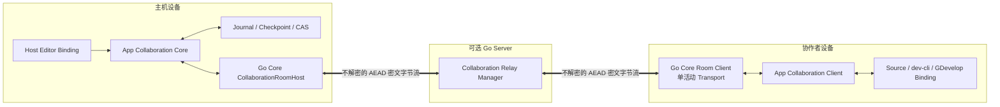

# Playmesh 多人开发协作可行性评估与实施方案

状态：实施前评审稿
评估日期：2026-08-14
输入架构：[development-collaboration-architecture.md](development-collaboration-architecture.md)
适用仓库：Playmesh App、Go Core、Go Server、dev-cli、GDevelop WebIDE

## 1. 结论

### 1.1 总体判断

方案总体可行，但不是“复用现有 Relay 再加几个编辑器回调”即可完成的功能。可靠实现至少
需要同时补齐四项当前不存在的基础能力：

1. 主机 Go Core 逻辑 WebSocket 房间、LAN/Relay Transport、逐成员对称认证和客户端—主机
   AES-256-GCM 端到端加密。
2. App 内持久化的主机权威日志、`mainSeq`、聚合 revision 和崩溃恢复。
3. App 级成员身份、个人 AES 根密钥持久绑定、角色鉴权和协作项目入口。
4. 源码与 GDevelop 两类编辑器的确定性变更捕获和主线物化。

所有编辑器接入还必须遵守“切片优先、最小 seam”约束：协作业务放在 App facade、操作
middleware、Adapter、既有事件钩子和构建期 overlay 中，不把协作条件散落到编辑器源码。
功能粒度必须服从侵入预算：如果 GDevelop 没有对象/事件级稳定钩子，就使用既有保存事件
触发 canonical folder-project tree 同步，不得为了保留细粒度能力而扩大 Core 修改。极小的中立
序列化 seam 也只能作为单独评审的例外，不是默认实施路径。

推荐按以下可交付层次推进：

| 层次 | 范围 | 判断 |
| --- | --- | --- |
| A | 专用 Relay、Go Core 房间、成员认证、单活动线路、在线状态 | 可行，协议和安全工程量较大 |
| B | Source Workspace 文件级协作 | 可行，现有 revision/批量文件接口可作为基础 |
| C | dev-cli 文件级协作 | 可行，但只能提供文件级 `last-accepted-save`，不能识别 IDE 打开文档或编辑意图 |
| D | GDevelop 正常保存统一 Authority 的全项目在线同步 | 可行，现有持久 revision、CAS、历史和保存边界可复用；AI v4 只修改 live WebIDE，不是 Authority producer；仍需持久事件流与远端应用 Controller |
| E | GDevelop 保存驱动的 schema-aware 聚合协作 | 条件可行；不需要逐动作 hook，但必须证明聚合投影、引用闭包、原子多聚合提交和远端刷新安全；失败即保留 D |
| F | GDevelop 同场景、同事件表的细粒度语义并发 | 条件可行；仅在既有 hook/overlay 和获批最小 seam 的预算内完成，超出即保留 D/E |

第一条建议发布主线是 A + B + C。D 可以作为受限预览版并行推进，E 是低侵入条件下推荐的
GDevelop 实用目标；F 未通过本文 Gate G4 前，不应写入发布承诺。

AI 不与人工保存合并成第二种协作 producer。AI 只修改当前 live WebIDE；用户之后的正常保存
才进入上述 D/E 的 Authority、事务信封、版本排序、持久历史、通知和应用结果。进程内
`authoritativeChanges` 和 SSE 都不能代替持久 operation/event log；这一缺口已列为 B9，而
不是被文档假设为已经完成。

### 1.2 明确不可承诺的能力

以下能力在当前产品边界下不可可靠实现，架构应继续排除：

- dev-cli 无插件情况下识别 IDEA、VS Code 或其他 IDE 当前打开的文档和未保存缓冲区。
- 仅靠 watcher 阻止任意 IDE 保存，或跨 Windows/Linux/macOS 提供强制文件占用锁。
- 主机离线时继续形成可自动合并的协作分支。
- 只凭 GDevelop 保存前后的完整 JSON 快照，恢复所有并发用户的编辑意图；聚合投影只能对
  白名单独立聚合做状态合并，不能还原同一事件表内的动作顺序。
- 让 Go Server 在不知道成员凭据和项目内容的同时代替离线主机完成首次加入。
- 只用隐藏按钮限制协作者发布；发布限制必须进入服务端本机操作执行链。

### 1.3 推荐的一致性语义

- 主机 App 是唯一成员、日志、`mainSeq` 和项目主线权威。
- 主机 Go Core 维护唯一逻辑房间；LAN 和 Go Server Relay 只是 Transport。每名协作者同一
  时刻只选择一条活动线路，默认使用上次成功线路，所有已认证成员最终进入同一房间。
- Go Server 只在主机控制连接存活期间保存随机 rendezvous 和连接池，按路径配对后复制
  客户端—主机 AEAD 密文字节；它不验证成员、不处理撤销、不解析房间消息。主机断开或
  Server 重启立即删除，不持久化任何协作登记。
- 主机 App 对所有权威状态变更执行“journal/物化/mainSeq 持久化完成后才确认和广播”；
  presence、光标和 XPath 标记等易失提示不属于权威状态。
- Source Workspace 使用持久 file/tree revision 和比较并交换。
- dev-cli 只观察磁盘保存；主机按短 `CommitLease` 排序，结果直接覆盖各端受管项目文件。
- GDevelop 默认使用保存事件触发 canonical folder-project tree revision CAS；聚合投影门禁通过后
  可升级到保存驱动的 `aggregate_save`，只有在编辑器最小侵入门禁内取得稳定 ID 和语义操作
  时才启用 `semantic`。
- 主机离线立即撤销在线工作会话；恢复副本永不自动上传。

## 2. 评估依据与当前实现事实

本评估以 2026-08-08 的全仓只读盘点为基础，并于 2026-08-13 重新核对 GDevelop 工程历史、
AI v3 会话和 WebIDE live-project 执行链，2026-08-14 又核对 GDevelop 官方仓库公开协作实现。
工作区包含尚未提交的开发内容，因此下表是“当前工作区事实”，
不是某个已发布 Git 提交的保证；进入实施前应在选定基线提交上重新
运行一次同样的审计。

| 领域 | 当前事实 | 对实施的含义 |
| --- | --- | --- |
| Playmesh App | `pubspec.yaml` 为 `4.2.0+28` | 源码协作可冻结完整 App 版本，但发布纪律必须保证同版本构建内容相同 |
| App 本机实例/开发入口 | `lib/main.dart` 只初始化 `window_manager`，当前未找到 App 单实例、跨进程项目入口互斥或统一 editor session registry | “主机本机只有一个 IDE”尚是待实现门禁，不能仅靠页面按钮假设成立 |
| Go Core | `mobile/core.go` 为 `0.5.0`；Router 只有 `/health`、`/v1/sessions` | 协作 Channel 和本机控制面均需新增 |
| Go Core 路由 | 当前 Router 整体套用游戏 SDK 开放 CORS | 协作控制面必须拆出，不能继承 `Access-Control-Allow-Origin: *` |
| Go Server | 游戏 Relay 协议为 `3.0.0`，Manager 为内存 tunnel/连接池 | 可复用复制、限流、超时经验，不可复用凭据和路由语义 |
| Go Server 配置 | `server.json` 使用 `DisallowUnknownFields()` | 独立 `collaboration-relay.json` 是正确兼容方案 |
| 源码文件 API | 已有读取、完整替换、patch、删除、revision CAS、批量写 | 可抽成共享 Source Application Service |
| 源码 revision | `GameLibraryDeveloperProjectCatalog._revisions` 当前为进程内 Map | 不能直接作为协作权威，App 重启后会丢失 |
| 源码批量写 | 有 staging 和异常回滚，但进程崩溃可能停在部分 rename 后 | 需要可恢复 journal，不能把现接口称为崩溃级原子事务 |
| 源码路径 | 已拒绝绝对路径、`..` 和部分内部目录 | 可作为项目内容边界基础，但仍需 Adapter 产生显式内容描述 |
| GDevelop | 上游 `v5.6.276`，Playmesh revision `18` | 可冻结版本，但当前 lock 不提前记录尚未产出的最终分发 SHA-256 |
| GDevelop 官方协作基线 | 官方 `master@1a0661d` 的公开客户端采用云项目 ACL、完整 project ZIP 版本、`previousVersion` 和保存前版本比较；冲突时询问保存者是否整体覆盖 | 官方公开实现不是可复用的对象/事件实时操作通道；可借鉴快照、版本链和历史，但 Playmesh 聚合实时显示与主机裁决必须自研 |
| GDevelop 历史 | 已有持久 revision、CAS、`saveCurrent(baseRevision)` 和权威变更流 | 是 GDevelop 协作主线最有价值的现有基础 |
| GDevelop 权威变更信号 | `authoritativeChanges` 已发布 gameId、revision、项目/资源 hash 和 sequence，但 sequence 来自进程内 Map | 可作为唤醒源，不能作为跨进程持久操作日志或恢复游标 |
| GDevelop AI 会话 | v4（editor-session `4.0.0`）只保存内存 session/turn/call、审批、结果、writer lease 和 session-scoped `approvalMode`；同 session reattach 保留模式，close/Developer Mode 重启恢复 `request_approval`，不写项目或历史；Chat 使用根 `{echo,calls}` 和根 echo 的 return-status v3，Agent 返回状态保持 v1 且无 echo；当前 WebIDE 直接在 live `gdProject` 上调用官方函数，不读写 history/current/revision/evidence | AI 不接入协作 Authority；`approvalMode` 不是协作状态，不广播或持久化，外部 Agent 也无权修改；用户正常保存才进入工程协作流 |
| WebIDE AI 调用状态 | `PlaymeshAiCallCoordinator` 使用 SSE 唤醒、按 sequence 轮询调用列表；该状态不是工程日志 | 工程协作可复用“实时通知非事实源”的原则，但不能复用 AI call 状态作为恢复事实 |
| GDevelop mutation | 当前 `PlaymeshProjectMutationCoordinator` 仅是页面内队列 | 不能承担跨设备主机权威或分布式一致性 |
| GDevelop 事件 | 当前 overlay 中没有通用 `playmeshCollaborationId` | 同事件表并发插入不能直接可靠实现 |
| Developer Gateway | 使用一个权限较高的 Developer Token | 协作者不能复用；必须增加项目级短会话和角色执行中间件 |
| Operation permission | `permission` 当前主要是操作元数据，未见角色执行中间件 | `project.publish` 等权限必须新增真实执行校验 |
| dev-cli | 版本 `2.0.0`，已有 Adapter Registry、项目路径解析和 App API 客户端 | 适合增加同级 Binding，不应实现远端网络协议 |
| dev-cli `run` | 当前命令走本机 `/preview` 临时运行链，不是正式发布 | 协作者可运行；仍由最终服务确保不写发布/正式安装状态 |
| dev-cli 文件监听 | 当前没有协作 watcher/manifest 同步实现 | 需要新增本机桥接，但同步算法应留在 App 的 Source Core |
| App 凭据持久化 | 当前 App 尚无统一协作凭据库 | 必须持久恢复成员—项目—AES 根密钥绑定；终端静态保护由平台自身负责，不作为 Relay 阻断 |

## 3. 分模块可行性矩阵

评级含义：高表示当前技术栈和边界清晰；中表示可实现但有关键补建；条件表示必须先通过
PoC；低表示不应作为首版目标。

| 模块 | 可行性 | 复杂度 | 主要依据 | 实施条件 |
| --- | --- | --- | --- | --- |
| Go Server Collaboration Relay | 高 | 中 | 已有 raw TCP Upgrade、连接池、背压和限流范式 | 新 Manager、路由、配置和指标完全独立 |
| Go Core 逻辑房间 | 高 | 中高 | Go Core 可新增独立 WebSocket room，不需要编辑器参与 | 房间只保存在线会话，权威状态仍由 App 持久化 |
| 逐成员 AES 会话 | 高 | 中高 | HMAC/HKDF/AES-GCM 均有成熟库 | 固定 transcript、双向 key/IV 分离、nonce/rekey 和跨语言向量 |
| LAN/Relay 同一数据协议 | 高 | 中 | 两者都只提供双向字节通道 | 每成员单活动 Transport，完成同一房间握手 |
| App 成员与邀请 | 高 | 中 | 数据模型简单、主机在线验证明确 | 先完成根密钥与项目世代持久绑定状态机 |
| App 凭据持久化 | 高 | 中 | 只需功能性持久恢复成员根密钥映射 | 不进入项目、浏览器、Go Server 或日志；终端保护策略不纳入本方案阻断 |
| 主机权威 journal | 高 | 高 | GDevelop 已有 LocalVersionStore/CAS 可借鉴 | Source revision 和 tree 状态必须持久化并做 crash injection |
| Source Workspace 协作 | 高 | 高 | 文件 API、revision、批量接口和事件已存在 | HTTP Handler 与业务服务解耦，增加项目级会话 |
| dev-cli Binding | 中高 | 中高 | 现有 Registry、Context 和 App API 客户端可复用 | 接受 last-accepted-save 和直接覆盖语义 |
| GDevelop 项目级同步 | 高 | 中高 | 已有持久 revision、CAS、saveCurrent 和资源引用 | 先按整个 canonical project 做 CAS，不宣称细粒度合并 |
| GDevelop 聚合级保存协作 | 条件中高 | 高 | 正常保存边界可取得前后 canonical 状态，实例/对象已有部分稳定身份 | 白名单投影、引用闭包、多聚合原子提交、dirty aggregate 和远端应用 PoC 通过；不宣称还原用户动作 |
| GDevelop 语义操作协作 | 条件 | 很高 | 普通事件没有通用稳定 ID，人工 UI 动作也不经过 AI 通道 | 稳定 ID、语义捕获、确定性回放、引用完整性和排序 PoC 全部通过 |
| XPath/界面标记 | 高 | 中 | 只做易失 UI overlay，不参与一致性 | 使用 `surface + targetId`，Canvas 目标不用 XPath |
| 编辑器切片接入 | 高 | 中 | 当前已有 Gateway middleware、Adapter Registry 和 GDevelop overlays | 扩展点清单、最小 seam、patch manifest 和 clean rebuild 门禁 |
| 在线/活动审阅 | 高 | 中 | 主机已有事件流范式 | presence 与持久 activity 分层、有界保留 |
| 协作者禁止发布 | 高 | 中 | 发布操作集中在 Developer Operation Registry | 增加真实角色中间件和底层服务二次校验 |
| 主机离线禁用 | 高 | 中 | 在线门禁简单明确 | App 必须关闭会话，不能只在 UI 显示离线 |
| 离线开发自动合并 | 低 | 很高 | 与唯一主机真源和当前产品决定冲突 | 不实施 |

## 4. 对目标架构的必要修正

### 4.1 Source revision 不能复用当前进程内计数

当前文件 API 的 `expectedRevision` 对单次 App 进程内并发有用，但 `_revisions` 在内存中，
App 重启会退回 0。协作实现必须新增持久的：

```text
mainSeq
authorityEpoch
stableFileId -> revision, contentHash, relativePath, deleted
treeRevision
lastCheckpointMainSeq
journal replay position
```

推荐把通用的 `foundation/local_version_store.dart` 扩展为 Source CAS 基础，并在其上增加
Source tree journal；不要把 `DeveloperProjectCatalog._revisions` 直接改名后当成协作状态。

### 4.2 当前批量文件写不是崩溃级原子事务

现有 `writeFilesAtomic` 在 Dart 异常路径会回滚，但进程在删除旧文件和 rename 临时文件之间
被终止时，无法执行 catch 回滚。协作主线提交必须采用：

```text
校验 base revision
→ 所有新内容写入 CAS/staging 并 fsync
→ 写 PREPARED journal 并 fsync
→ 写 JOURNALED 权威记录并分配 mainSeq
→ 幂等物化文件树
→ 写 MATERIALIZED/COMPLETE
→ 广播
```

启动时在允许编辑前重放未完成事务。测试必须在每个阶段强制杀进程并验证只有一个结果。

### 4.3 GDevelop 快照差分不能替代语义操作

对单实例位置变化或单对象属性变化，前后 JSON 结构差分通常能够得到可用聚合；但以下场景
不能仅靠快照可靠恢复用户意图：

- 同一事件列表不同位置的并发插入和移动。
- 删除对象与另一端新增对象实例同时发生。
- 扩展升级、变量重命名和引用更新跨多个聚合。
- GDevelop 自身序列化造成的无语义排序或默认值变化。

因此 GDevelop 分三级实施，后两级分别受聚合正确性与侵入预算门禁约束：

1. 工程树 CAS：复用既有保存事件，把官方 folder-project 的 `game.json` 与分片文件树作为一个
   原子权威聚合；物理多文件不构成独立冲突域；
   基础过期即拒绝，引用资源仍按项目内容描述和 CAS 单独传输。
2. 聚合级保存：使用冻结的 schema-aware projector 比较保存前后 canonical 状态，只对对象、
   场景属性、场景实例集合、整张事件表、外部事件、变量、设置和资源等白名单聚合产生
   canonical replacement；不同聚合可合并，同聚合仍按 revision/hash 冲突。
3. 语义操作级：仅当既有 hook/overlay 能在侵入预算内产生稳定 ID 操作时，由主机验证和
   排序，支持单事件/单实例等更细并发。

没有对象/事件级钩子时可以停留在第一级，或在聚合门禁通过后停留在第二级；两者都是合格
降级，不新增横跨 GDevelop Core 的动作捕获逻辑。只有第三级同时通过 Gate G4 和 Gate G7
后，才满足“同一事件表并发插入均保留”的增强要求。

官方公开协作采用完整项目版本和整体覆盖提示，进一步证明“项目共享”不能替代上述二、三
级。相同 GDevelop 版本/SHA 只保证代码路径一致，并不保证客户端具有相同 base state；所有
重放和聚合应用仍必须比较 baseMainSeq、aggregate revision/hash 和最终 afterHash。

### 4.4 dev-cli 不是远端协议客户端

dev-cli 只能调用本机 App：

```text
dev-cli -> 本机 App 项目级 Source API -> App Collaboration Core -> Go Core
```

CLI 不持有 memberRootKey，不实现房间 HMAC/HKDF/AES-GCM 或 Relay Transport，也不连接
Go Server。它只负责命令交互、项目目录身份、文件变化提示和下行物化。

### 4.5 dev-cli 只能提供文件级保存顺序

watcher 无法知道 IDE 打开的文档和内存基线。收到主机文件后直接覆盖磁盘；IDE 旧缓冲区
之后再次保存，会成为一项新的文件保存。因此 dev-cli 的保证是：

- 主机对已收到的完整文件状态分配确定 `mainSeq`。
- 所有在线副本最终覆盖为相同主机结果。
- 不保证理解编辑意图，不保证三方合并，不使用长期文件锁。

### 4.6 角色权限必须进入执行链

当前 `DeveloperOperationDefinition.permission` 主要用于描述操作，不能单独阻止发布。需要
新增共享 `CollaborationRolePolicy`，由 App Collaboration Gateway、Operation/Application
Service middleware 和最终发布、导出、上传、正式安装服务共同调用。UI 仅负责提示，最终
副作用服务必须再次校验 owner。协作者项目级会话不能持有普通 Developer Token。

### 4.7 成员根密钥必须可持久恢复，但终端安全不属于本方案阻断

主机和协作者 App 都必须在重启后恢复 `projectBindingId + generationId + memberId +
memberRootKey` 的正确绑定；否则长期邀请和自动重连无法成立。该状态放在 App 凭据库，绝不
进入项目内容、浏览器存储、Go Server、日志或 dev-cli。

本方案按既定边界不评估终端静态密钥保护、恶意本机进程或邀请被终端用户主动复制的风险，
因此“缺少某种 OS 安全存储插件”不再是实施阻断。Go Core local boot token 是每次进程启动
生成、只存在内存的本机 IPC 凭据，也不能列入长期持久秘密。

### 4.8 编辑器源码修改必须受切片预算约束

“AOP/切片”在本项目中表示横切关注点集中化，不要求引入语言级 AOP 框架：

```text
编辑器动作/保存
→ 稳定 hook 或 Application Service
→ Collaboration Interceptor
→ Adapter
→ Collaboration Core
```

推荐顺序：

1. 复用已有公开接口、保存边界和事件流。
2. 使用 facade、middleware、decorator 或 Adapter 包裹现有业务服务。
3. 使用构建期 overlay 增加独立模块和单一 bootstrap。
4. 前三项无法提供对象/事件级数据时，先降低到保存事件驱动的 `project_tree`；只有独立的
   schema-aware projector 门禁通过后才升级为 `aggregate_save`。
5. 只有中立序列化能力无法从外部获得、补丁保持局部且经过单独架构评审时，才允许增加
   最小 Core seam；不得用这个例外新增单对象动作捕获链。

最小 seam 只能暴露中立的稳定 ID 序列化或复用原有提交 hook，不能包含新的单对象动作捕获
链，更不能包含成员、网络、主线、权限或冲突策略。所有 seam/overlay 记录在版本化 patch
manifest：上游 commit、目标文件、用途、输入/输出契约、回归测试和有效分发 hash 都必须
可追踪。

“不能大面积修改”以结构边界而不是任意代码行数判定：编辑器 Core 中协作业务逻辑必须为
零；不得修改既有编辑/撤销/保存算法；每个例外 seam 必须局部、默认无副作用且可独立撤销；
新增任何未登记接缝、需要跨多个上游业务组件联动，或无法由 clean build 自动复现时，
均视为超出预算。超出预算的处理是降低同步粒度或取消该增强能力，而不是放宽规定。

禁止：

- 在文件树、场景、事件表、发布页等大量组件中分别加入协作分支。
- fork 整套编辑器源码作为长期事实源。
- 用 DOM/XPath、运行时 prototype monkey-patch 或压缩 bundle 字符串替换承担一致性。
- 上游升级时 patch 失败后静默忽略。
- 为追求对象/事件级同步而在多个 GDevelop Core 模块加入动作捕获代码。

关闭协作功能时，切片必须退化为 pass-through；clean upstream 应能通过自动化 overlays/patches
重建相同 `effectiveBundleSha256`。这既是维护性要求，也是版本准入正确性的组成部分。

## 5. 目标实施架构



局域网模式只把 `RM` 替换为 LAN Transport，房间协议、成员根密钥认证和 `mainSeq` 完全
不变。每名协作者同一时刻只有一个活动 Transport；主机可以让不同成员分别从 LAN 或 Relay
进入同一 Go Core 逻辑房间。

### 5.1 组件职责

| 组件 | 唯一职责 | 明确禁止 |
| --- | --- | --- |
| Go Server Relay | 主机在线期间的内存 rendezvous、连接配对、配对后密文字节复制、限流 | 成员认证/撤销、房间、AES 根密钥、项目 ID、业务消息解析/解密、项目存储 |
| Go Core | 唯一逻辑 WS 房间、LAN/Relay Transport、对称握手、AEAD 安全帧、单活动连接、可靠队列 | 编辑器业务合并、成员 UI、长期根密钥存储、权威持久化 |
| App Collaboration Core | 成员、准入、主线、journal、Adapter 调度、角色和活动 | 把权威交给页面或 dev-cli |
| Source Core | 项目内容清单、文件/tree revision、CAS、物化 | dev-cli/GDevelop 类型分支 |
| dev-cli Binding | 本机命令、目录保护、watcher 提示、文件落盘 | 远端 Transport、成员认证、第二套同步算法 |
| GDevelop Adapter | 保存事件驱动的文件级 CAS；能力允许时增加语义操作；WebIDE 刷新 | 用 XPath 作为一致性身份，或把协作业务写入 Core seam |

## 6. Go Server Collaboration Relay 实施

### 6.1 配置与兼容

新增独立可选文件：

```text
go-server/collaboration-relay.json
```

建议首版字段：

```json
{
  "schemaVersion": 1,
  "enabled": false,
  "publicBaseUrl": "http://127.0.0.1:16668",
  "maxRendezvous": 1000,
  "maxPeersPerRendezvous": 16,
  "maxConnectionsPerIp": 32,
  "pendingConnectionTimeoutSeconds": 15,
  "idleTimeoutSeconds": 120,
  "maxControlMessageBytes": 16384
}
```

`maxControlMessageBytes` 仅限制配对前公开控制消息；配对后的内容是不可解析的 AEAD 密文字节，
中转只能按连接数、速率、空闲时间和原始字节总量限流。内层业务帧上限由两端 Go Core 协商并
执行，不能由 Go Server 检查。

`enabled=false` 或文件缺失时：

- 不创建 Manager。
- 不加载/生成任何成员根密钥或协作解密密钥。
- 不注册 `/collaboration-relay/v1/**`。
- `/collaboration-relay/v1/info` 返回 404。
- 游戏 Relay 和其他服务行为保持不变。

独立文件避免旧二进制因 `server.json` 严格未知字段校验而无法启动。

### 6.2 路由

```text
GET  /collaboration-relay/v1/info
GET  /collaboration-relay/v1/host     Upgrade
GET  /collaboration-relay/v1/client   Upgrade
GET  <admin>/api/admin/collaboration-relay/stats
```

`rendezvousId` 可以在 Upgrade 元数据中出现；Upgrade 后只发送最小 register/join/keepalive
控制消息，配对成功后直接复制房间密文字节。成员根密钥、成员身份、项目字段、版本信息和
房间认证证明不得发送到 Server，也不能放在 URL、Header、Cookie 或日志。

### 6.3 Manager 状态

```text
rendezvousId
relayConnectionEpoch
hostControlConnection
hostConnectionPool
activePairs
createdAt / lastSeenAt
rateLimitState
```

上述状态全部是进程内临时数据。主机控制连接关闭/超时或 Server 重启时原子删除整项并
断开关联连接；不写数据库、文件、快照或持久日志。主机使用相同随机 rendezvousId 重新
登记后，客户端才可通过保存的线路发起重连。

### 6.4 纯 Transport 配对与线路约束

Go Server 不建立或终止任何协作加密层，也不验证成员：

1. 主机使用随机 256 位以上 rendezvousId 建立长控制连接并维持待配对连接池。
2. 客户端在用户所选 Relay 线路上提交 rendezvousId；存在可用主机连接时开始原始字节复制。
3. 不存在目标、主机离线和无待配对连接统一返回 `relay_target_unavailable`。
4. 主机控制连接关闭、超时或 Server 重启时删除全部关联内存状态和连接。
5. 任何成员准入、撤销、版本判断和假主机识别都在主机 Go Core 房间握手/App 权威层完成。

V1 一个 `routeId` 对应一个明确的 Go Server 服务端点，不支持同一端点背后的随机无亲和
多实例。未来需要横向扩展时由入口按 rendezvousId 做连接亲和或返回明确节点地址，不能在
Go Server 内引入协作房间、成员表或持久路由表。

## 7. Go Core Collaboration Channel 实施

### 7.1 路由隔离

当前 `NewRouter` 对整个 mux 开放游戏 SDK CORS。实施时改为两个边界：

```text
gameMux          /health, /v1/sessions/**       保持当前兼容 CORS
collaborationMux /v1/collaboration/**           loopback + boot token，无 CORS
```

本机协作控制面只能接受：

- 来源地址为 loopback。
- App 启动时注入的高熵 boot token。
- 有限请求体、明确 Content-Type 和协议版本。

保留现有 `mobile.Start(address)` 供旧调用；新增兼容入口传递协作 boot token，不能机械破坏
当前 gomobile API。

### 7.2 内部包建议

```text
go-core/internal/collaboration/
  api/
  room/
  aeadhandshake/
  framing/
  host/
  client/
  relaytransport/
  lantransport/
  securepeer/
  reliablequeue/
  presencequeue/
```

### 7.3 房间与数据连接

配对后的连接挂接到主机 Go Core 唯一 `CollaborationRoomHost`：

- 每位成员邀请携带独立 256 位 `memberRootKey`；Go Server 永远看不到。
- 客户端和主机用 HMAC-SHA-256 对随机 nonce 和完整 transcript 做双向持钥证明。
- HKDF-SHA-256 派生独立 c2h/h2c AES-256-GCM key 与 IV；帧序号参与 nonce/AAD，禁止重用。
- 双方必须再交换 AEAD finished；成功前不把成员标为在线。主机对 locator 保存有界近期
  clientNonce 重放缓存。
- LAN 和 Relay 使用相同握手与房间帧。
- 每位客户端是独立 AEAD 会话；主机解密、交给 App 持久提交，再分别重新加密广播。
- 每名成员只允许一个活动连接；用户切换线路时先关闭旧 Transport，新 connectionEpoch
  认证成功后淘汰旧会话。默认使用上次成功线路，不并行竞速。

远端提交提案只能作为点对主机的 `OperationProposal` 交给 App，Go Core 房间不得直接把它
广播给其他成员。只有 App 返回带持久 `mainSeq` 的 `CommittedOperation` 后，Go Core 才能
执行可靠房间广播。presence/XPath 等 latest 提示可以直接广播，但协议类型必须与权威操作
完全分离，接收端不得据此修改项目真源。

### 7.4 队列类别

| 类别 | 语义 | 示例 |
| --- | --- | --- |
| reliable | 有序、确认、重传、幂等 | 成员认证、manifest、blob、提交、mainSeq、关闭 |
| latest | 只保留最新值，可丢弃 | presence、光标、选择、动作提示 |
| local-control | 不离开设备 | App 启停、网络状态、密钥注入 |

可靠帧至少携带 `protocolVersion`、`generationId`、`messageId`、`messageType`、长度和 payload
hash。业务层 operationId 负责跨重连幂等，不能只依赖连接内 messageId。

## 8. App Collaboration Core 实施

### 8.1 目录和秘密边界

权威状态放在 App 数据目录，不放入受同步的项目内容：

```text
<AppData>/collaboration/v1/
  hosted/<projectBindingId>/
    state.json
    members.json
    journal/
    checkpoints/
    cas/
    activity-index/
  joined/<localCollaborationProjectId>/
    state.json
    main-shadow/
    recovery/
```

成员根密钥本体保存在 App 本地凭据库，普通状态文件只保存引用。终端静态保护由平台自身
负责，但这些秘密不得进入项目内容、Go Server、浏览器存储、日志或 dev-cli。Go Core boot
token 每次进程启动生成并只存在内存。

### 8.2 核心服务

```text
CollaborationService
  HostLifecycleService
  JoinedProjectCatalog
  MembershipAuthority
  AdmissionPolicy
  OnlineSessionGate
  LocalDevelopmentWorkspaceRegistry  // 共享的 Developer Workspace 依赖
  CommitCoordinator
  CollaborationJournal
  CheckpointStore
  ReplicaManager
  ProjectContentPolicy
  PresenceService
  ActivityIndex
  CollaborationRoleAuthorizer
```

所有服务通过明确接口注入，WebIDE、Source Workspace 和 dev-cli 只能调用 facade。

`LocalDevelopmentWorkspaceRegistry` 在任何开发页面或 dev-cli attach 会话创建前，以项目目录册
稳定 `localWorkspaceKey` 原子执行本机互斥并签发不可猜测的 `localEditorSessionId` fencing
token；协作的 `projectBindingId` 绑定为同一 key 的别名，新 generation 不能产生第二入口：
`source-workspace`、`gdevelop`、`dev-cli` 和同类第二入口不能并存，Gateway 编辑调用与释放都
必须校验当前 token。重复打开返回 `workspace_already_open` 并优先聚焦现有入口；不同项目及
远端不同成员不受影响。入口句柄绑定 WebView/CLI 本机连接并有心跳、有界失联回收，不写成
项目锁或远端租约。若桌面端可启动多个 Playmesh App 进程，必须以 App 单实例或唯一 local
broker 保证跨进程互斥，不能只用进程内 Map。

该 Registry 属于中立 Developer Workspace 基础，不受协作开关控制；普通单机开发和协作开发
都从同一 facade 取得入口，否则预先打开的非协作页面仍可绕过限制。实现位于 App 层，不要求
修改 Source Workspace 或 GDevelop 编辑器内部打开/保存算法。

互斥的是受 App 管理的工程会话，不是同一会话内的文件、场景或标签页。dev-cli 只能建立一个
App attach/binding，但两个外部 IDE 进程仍可能直接打开同一普通目录，App 无法识别或禁止；
它们的保存只会汇入同一个 dev-cli 文件级会话。外部 IDE 窗口唯一性不属于该限制的承诺。

### 8.3 主线提交状态机

```text
RECEIVED
→ VALIDATED
→ PREPARED
→ JOURNALED
→ MATERIALIZED
→ COMMITTED
→ BROADCASTED
```

规则：

- `mainSeq` 只由主机分配，单调递增且持久化。
- 同一 operationId 重试返回原结果。
- 状态变更只有在 journal、物化结果、mainSeq/聚合 revision 和 COMMITTED 标记全部可恢复
  持久化后才能确认和广播；广播失败通过 mainSeq 重放，不回滚已提交主线。
- presence、光标、拖动提示和 XPath 等 latest 消息是易失 UI 状态，不写权威 journal，也不能
  被接收端解释为已提交项目结果。
- 多聚合事务稳定排序、全有或全无、硬超时，不持有部分租约等待其他租约。
- 主机重启先恢复未完成事务，再允许编辑器和客户端连接。

### 8.4 成员状态

```text
invited -> authenticated -> initialized -> online -> disconnected
                                      \-> revoked
```

主机名称是成员目录权威；客户端自报昵称只用于诊断，不能改变显示名称。成员根密钥绑定
当前 `projectBindingId + generationId`，关闭协作后全部失效。撤销由主机持久化成员状态、
关闭活动房间会话并拒绝后续持钥证明，不通知 Go Server。

### 8.5 角色执行

协作者本机 Gateway 签发短期项目会话：

```text
role=editor
projectBindingId
adapterKind
allowedOperations
expiresAt
sessionNonce
```

新增执行中间件：

```text
CollaborationSessionMiddleware
→ CollaborationProjectScopeMiddleware
→ CollaborationRoleMiddleware
→ existing operation handler/application service
```

`project.publish`、正式打包/导出、上传、正式安装、项目 rekey、成员管理和关闭协作统一返回
`owner_required`。同一 `CollaborationRolePolicy` 还必须在最终副作用服务再次校验，避免其他
本机入口绕过 Gateway/middleware。确认只执行临时 `/preview` 且不产生正式副作用的 dev-cli
`run` 对 editor 允许。

## 9. SourceCodeCollaborationAdapterCore 实施

### 9.1 单一源码核心、两个 Binding

```text
SourceCodeCollaborationAdapterCore
  SourceWorkspaceBinding   adapterKind=source-workspace
  DevCliBinding            adapterKind=dev-cli
```

两个 Binding 只提供入口、工作区描述和 `adapterKind`。以下逻辑必须只有一份：

- manifest/rootHash。
- 文件内容 hash 和 CAS。
- file/tree revision。
- create/replace/delete/rename。
- 批量事务和 journal。
- 下行物化和 watcher 回声抑制。
- `stale_base`、`mainSeq` 和事件 DTO。

### 9.2 ProjectContentDescriptor

每个 Adapter 必须产生确定性项目内容描述。Source Core 只处理描述允许的根和文件，不扫描
整个当前目录作为默认策略。

```json
{
  "schemaVersion": 1,
  "projectId": "stable-project-id",
  "adapterKind": "dev-cli",
  "includedRoots": ["src", "assets"],
  "includedFiles": ["playmesh-cli.json"],
  "excludedPatterns": [".git/**", ".playmesh/**", "node_modules/**", "build/**"],
  "secretDenyPatterns": [".env*", "**/*.key", "**/*.pem"],
  "linkPolicy": "reject",
  "policyHash": "sha256"
}
```

绝对路径、`..`、UNC/设备路径、替代数据流、符号链接、junction/reparse point、硬链接和
解析后逃逸项目根的路径首版全部拒绝。项目外内容不得被读取后再决定是否上传；必须在打开
文件前完成路径判定。

### 9.3 Manifest

```json
{
  "projectBindingId": "uuid",
  "mainSeq": 1058,
  "treeRevision": 42,
  "files": [
    {
      "stableFileId": "uuid",
      "path": "src/main.js",
      "revision": 17,
      "size": 8120,
      "contentHash": "sha256"
    }
  ],
  "rootHash": "sha256"
}
```

`rootHash` 对规范化排序后的路径、稳定 ID、revision、size 和 contentHash 计算。增量 journal
被压缩后比较完整 manifest，但仍只传输缺少的内容 blob。

### 9.4 Blob 分块、校验与恢复

业务帧上限不能承担任意大小文件。实现以下内容寻址传输：

```text
blob.offer(hash, totalSize, chunkSize)
blob.request(hash, missingRanges)
blob.chunk(hash, offset, length, chunkHash, bytes)
blob.complete(hash, totalSize)
blob.abort(hash, reason)
```

- `chunkSize` 不得超过双方协商的 `maxChannelFrameBytes` 减去协议/AEAD 开销，首版默认
  512 KiB；乱序块只写 AppData staging，不直接写项目。
- 每块校验 offset、长度和 `chunkHash`，完成时重新校验 totalSize 和完整 SHA-256，成功后
  才原子提升到 CAS。
- 断线后按缺失 range 续传；超时、撤销、项目关闭和配额失败清理部分 blob。并发 blob 数、
  单 blob/项目/成员大小、临时磁盘占用和压缩展开比均必须有限制。
- manifest 所需 blob 全部验证并按可恢复物化日志应用前，客户端不得确认对应 mainSeq。
- hash 相同且 CAS 已存在时只确认引用，不重复传输。

### 9.5 共享业务服务改造

当前文件 Handler 直接调用 `DeveloperProjectCatalog`。实施时把下列逻辑抽成可复用
Application Service：

```text
SourceFileService.read/write/patch/delete
SourceTreeService.create/delete/move/copy
SourceBatchService.preview/commit
SourceManifestService.snapshot/delta
```

普通 Developer Gateway 与 Collaboration Gateway 使用同一服务、不同认证和角色上下文。
这样才能做到 dev-cli 复用源码接口而不复制 Handler。

## 10. dev-cli Binding 实施

### 10.1 产品入口

- 主机可以在项目目录执行 host 命令，请求本机 App 开启/管理协作。
- 协作者只能先在 Playmesh App 扫码或输入链接建立成员身份。
- App 项目卡片为 dev-cli 项目显示 attach 命令。
- CLI 不提供接收邀请的 `join <link>`。

建议命令：

```text
playmesh-cli collaboration host open
playmesh-cli collaboration host status
playmesh-cli collaboration host member add --name <name>
playmesh-cli collaboration host close

playmesh-cli collaboration projects
playmesh-cli collaboration attach --project <local-collaboration-project-id>
playmesh-cli collaboration status --watch
playmesh-cli collaboration detach
```

### 10.2 本机 API

允许新增 attach/状态会话壳，但文件内容操作必须进入共享 Source Application Service：

```text
POST /local/collaboration/attach
GET  /local/collaboration/session
GET  /local/collaboration/events
POST /local/collaboration/detach
```

这些路由仅 loopback、短期项目 Token、主机在线、成员有效时可用。不得接受普通 Developer
Token，也不得把远端凭据返回给 CLI。

### 10.3 当前目录保护

执行 attach 时先分类：

```text
EmptyDirectory
RecognizedSameProject
RecognizedDifferentProject
NonEmptyUnknownProject
BoundToDifferentCollaboration
```

规则：

- 空目录：从在线主机初始化受管项目内容，不提示丢失差异。
- 非空且项目 ID 相同：在任何内容下载或写入前显示二次确认。
- 项目 ID 不同、身份未知或绑定到其他协作：零写入拒绝。
- 非交互终端默认拒绝；未来自动化只能使用语义明确的
  `--discard-local-differences`，不能使用通用 `--force`。

固定提示：

```text
当前操作会将当前项目所有文件同步为远端主机文件，这会使你丢失所有本地差异内容，是否继续 Y/N
```

“所有文件”只指 `ProjectContentDescriptor` 纳管内容；非项目内容不得删除或覆盖。

### 10.4 watcher 与覆盖

watcher 只产生“可能变化”的相对路径提示：

```text
filesystem event
→ debounce
→ Source Core 重新读取稳定内容
→ 校验 ProjectContentDescriptor
→ hash 与 main shadow 比较
→ 生成完整文件保存提案
→ 主机短 CommitLease 排序
```

下行提交通过可恢复 materialization journal 执行受管项目文件的覆盖、创建、删除或重命名，
并使用 `operationId + mainSeq + contentHash` 抑制 watcher 回声。不能把“整个当前目录替换”
称为原子操作：尤其 Windows 下当前工作目录和已打开句柄无法可靠整体 rename。正确边界是：

```text
写 apply PREPARED + 目标 manifest
→ 所需 blob 全部进入 CAS
→ 每个文件同目录 temp + flush + replace，并记录进度
→ 幂等执行删除/重命名
→ 校验最终 rootHash
→ 写 apply COMMITTED
→ 才确认 mainSeq
```

进程崩溃后按 journal 继续或恢复到最后一个完整 manifest，不依赖整目录交换提供虚假原子性。

文件句柄导致原子替换失败时：

- 状态进入 `apply_pending`。
- 有界退避重试。
- 成功前不确认 mainSeq。
- 成功前不接受该文件的新上报。
- 不引入长期文件锁。

### 10.5 dev-cli 已知语义限制

远端覆盖后，IDE 的旧内存缓冲区再次保存时，CLI 无法识别其编辑基线，会把它当作一项新
保存。该结果可能再次成为主线。UI 和文档必须称为文件级 `last-accepted-save`，不能称为
Git 合并、实时共同编辑或意图冲突检测。

## 11. GDevelop 实施

### 11.1 正常保存的统一 Authority 基础

Authority 只处理 GDevelop 正常保存和系统维护事务。Playmesh AI v4 只调用当前 WebIDE 的
官方编辑函数并形成普通 dirty 状态，不保存工程，也不生成 before/after、revision、历史或
提交证据。AI 辅助后的内容只有在用户按正常流程保存时才进入 Authority。

主机 App 新增 `GDevelopCollaborationAuthority`，统一接收：

```text
HumanOperationProducer
SystemOperationProducer（恢复/迁移）
→ GDevelopOperationTransaction
→ CommitCoordinator / persistent operation log
→ GDevelop history/CAS/current
→ CommittedGDevelopOperation
```

Authority 根据已认证 `memberId` 派生 actor/source，客户端不能自报身份或权限。AI 的
editorSessionId/turnId/callId 只用于本地调用协调，不进入协作事务；提示词、Token、审批正文、
私有对话和完整工具参数同样不进入协作流。

现有 `authoritativeChanges` 继续作为本机唤醒源，但必须新增持久 `eventSequence` 和按序查询
接口；当前进程 sequence 不能用于重启恢复。WebIDE 的可靠模式固定为：WebSocket 实时推送，
SSE 只读唤醒降级，REST `afterEventSequence` 轮询/重放为最终事实。

新增独立 `ProjectCollaborationController` overlay：自己提交只确认，其他来源的操作通过受测
GDevelop API 应用；操作缺口或不支持时走快照恢复。它不放入 AI 面板，不直接连接远端网络，
也不向编辑器组件散布协作判断。

不得把 GDevelop 官方“Add collaborators”误判为可复用基础。官方公开客户端截至
`master@1a0661d` 仍然上传完整 project ZIP，用 `previousVersion/currentVersion` 检测他人保存，
冲突时询问当前保存者是否覆盖。Playmesh 只借鉴版本链和快照恢复，不调用官方云协作服务，
也不沿用“加入者决定覆盖”的冲突语义。

### 11.2 阶段 GD0：项目级在线同步

GD0 是规定内的默认实现，不依赖对象级修改钩子：

```text
人工手动/自动保存（包括用户决定保存的 AI 辅助修改）
→ 转换为统一 project_tree GDevelopOperationTransaction
→ 以 project revision + content hash 提交主机 Authority
→ journal/CAS/current/mainSeq 持久化，或返回 stale_base
→ 持久 eventSequence 唤醒其他 Controller
→ 干净 WebIDE 加载权威 current；脏 WebIDE 保存 recovery 并阻止覆盖
```

主机开启协作时记录 `gdevelopSyncMode=project_tree` 并在认证后下发；它不是客户端自报的
加入条件。相同 `effectiveBundleSha256` 已保证实现一致，客户端直接遵循主机会话状态。

这里的“整个聚合”仅指 `ProjectContentDescriptor` 纳管的 GDevelop folder-project 文件树；引用资源按 CAS
清单同步，编辑器安装文件、缓存、外部绝对路径和其他非项目内容均不进入同步。

先复用已有 `GDevelopProjectHistoryAdapter.saveCurrent(baseRevision)`、LocalVersionStore、CAS
和 `authoritativeChanges`：

- 整个 canonical project tree 是一个聚合；`game.json` 与所有引用分片必须同一事务提交。
- 资源按现有 contentHash/CAS 传输。
- 保存携带项目 baseRevision。
- 基础过期返回 `stale_base`。
- GDevelop 协作者可以本地预览，不能发布。
- 主机离线关闭协作 WebView 会话。
- 本机仅允许一个 GDevelop 开发入口；关闭重开、进程重启或远端事件丢失后按持久
  eventSequence 重放，SSE/BroadcastChannel 不作为权威事实。
- `stale_base` 候选由在线主机持久化进有界冲突收件箱，只有 owner 决议后才能形成新的
  `CommittedOperation`；候选本身不广播。主机离线 recovery 不自动上传或进入收件箱。

GD0 验证 Transport、身份、主线和资源同步，但不满足同项目内部真正并发，不应对外宣称已
完成最终 GDevelop 多人编辑。“实时”仅指已提交版本持久化后的即时通知和干净页面自动加载，
不包含保存前拖动、输入或同一项目 dirty 页面无中断更新。

### 11.3 阶段 GD1：聚合级保存与稳定身份

GD1 不捕获拖动、输入等 UI 动作，而是在既有正常保存切面取得 `baseCanonicalProject` 与
`candidateCanonicalProject`，交给 schema-aware projector 生成可验证的聚合替换：

```text
canonical before/after
→ 规范化可忽略的序列化噪声
→ 投影受影响聚合及其引用闭包
→ 校验 baseMainSeq/baseAggregateRevision/baseHash
→ 在主机事务中原子持久化全部聚合
→ 分配 mainSeq 后广播 canonical aggregate result
```

首期白名单只包含场景属性、场景实例、单个对象、完整场景事件表、外部事件表、变量、项目
设置和资源清单。事件表在 GD1 中仍是一个整体聚合，不能把快照差异解释成用户对单条事件的
语义意图。投影结果出现未知字段、跨聚合引用闭包不完整、序列化无法确定性 round-trip 或
应用后 hash 不一致时，整个提交必须回退为 GD0 `project_tree`，不能部分采用差异。

GD1 允许不同聚合基于各自 revision 并行提交；同一聚合仍执行 CAS。相同 GDevelop SHA-256
只是必要的实现兼容条件，不能替代相同 baseMainSeq、baseAggregateRevision 和 baseHash。
`aggregate_save` 只能由主机关闭当前协作后，在新世代中冻结启用，不能在活动会话热切换。

GD1 优先复用项目中已经存在的稳定场景、对象和实例身份；重命名或无法稳定识别的实体变化
按跨聚合 maintenance 或 GD0 回退处理。GD1 把整张事件表作为一个聚合，因此不要求为了启用
聚合级保存而新增单事件 ID。单事件/容器稳定身份是后续 GD2 的前置条件：优先从现有项目
序列化扩展点和构建期 overlay 取得；确需序列化字段时，只能在单独架构评审批准后增加一个
默认无观察者时保持原行为的最小 Core seam，用它序列化：

```text
事件                 playmeshCollaborationId
事件容器/子事件列表   stable container id
缺少稳定身份的资源     stable logical id
```

要求：

- 新建、复制、撤销、重做、导入、序列化、反序列化都保持规则明确。
- 同项目内 ID 唯一。
- 旧项目打开时确定性补齐 ID，并形成一次受审计迁移。
- 不能复用数组索引或 AI 专用 ID。

### 11.4 阶段 GD2：语义操作捕获与验证重放

GD2 不得通过新增横跨 Core 的单对象捕获链实现。若现有 hook/overlay 不能稳定给出下列动作，
则关闭 GD2，继续使用已通过门禁的 GD0 `project_tree` 或 GD1 `aggregate_save`：

在既有命令、保存和 mutation 边界安装 Collaboration Interceptor，由 overlay 直接产生操作。
以下任一必要动作没有稳定边界时，GD2 即不可启用，不增加 Core 动作事件 seam：

```text
instance.move
instance.create/delete
object.create/update/delete
event.insert/update/delete/move
variable.update
resource.add/remove
project.settings.update
```

每个操作携带稳定 targetId、父容器、baseAggregateVersion、operationId 和必要引用。完整项目
快照仍用于 checkpoint 和恢复，不能作为正常并发操作的唯一来源。

可以复用现有 AI 修改函数的**执行适配层**来应用部分受支持操作，但不能复用 AI 会话、调用
状态、SSE 或提示词协议作为协作通道。每个可重放操作必须固定 bundle/tool contract，携带
baseHash 与 expectedAfterHash，在克隆工程中预执行，通过 allowlist、引用完整性和最终 hash
校验后才提交。随机 ID、资源副作用、扩展安装、部分应用或结果不确定的操作必须回退到
canonical 聚合/项目结果；普通人工 UI 操作也不会因为已有 AI 函数就自动变成可重放操作。

GD2 通过 Gate G4/G7 后，也只能由主机关闭当前协作并以新世代冻结
`gdevelopSyncMode=semantic`；不得在活动世代内热切换协议粒度。

### 11.5 结构化冲突、远端应用和撤销

两个不同稳定 eventId 的插入可以同时保留：

```text
验证 eventId 未存在
→ 验证父容器存在
→ 验证锚点/排序键
→ 主机分配 mainSeq
→ 生成最终稳定排序
→ 广播相同容器结果
```

同一事件内容的并发更新仍使用 aggregate version CAS。在线协作者的过期候选可以持久化为
有界 `PendingConflictProposal`，交由 owner 审阅；它不是主线提交，不分配 mainSeq，也不向
其他协作者广播为已提交结果。owner 选择保留主线、采用候选或提交手工合并结果后，Authority
先持久化裁决及最终 canonical 结果，再分配 mainSeq 并广播。离线恢复副本不得自动上传或进入
该队列，队列还必须有数量、字节、保留期和单成员配额。

其余语义冲突按确定规则处理：

| 情况 | 结果 |
| --- | --- |
| 不同稳定实体 | 自动合并 |
| 同一实体不同字段 | 仅有独立 fieldVersion 时合并 |
| 同一字段并发修改 | `field_conflict` |
| 删除与更新 | `delete_update_conflict` |
| 同一事件子树提交 | 短 ScopeCommitLease 串行；旧基础冲突 |
| 同一 logicalId 资源替换 | expected contentHash 不同则冲突 |
| 标签集合增删 | 显式 set 操作按元素合并 |

ScopeCommitLease 只覆盖 Authority 的校验和持久物化，不等待远端客户端完成应用，不锁住
用户整个编辑周期，也不把 WebIDE 切成只读。租约必须有界超时并由提交状态机自动释放；
presence/选中对象是软提示，不参与正确性。

`ProjectCollaborationController` 应用规则：

- 自己 operationId：只推进确认游标，不重复回放。
- GD1 收到 canonical 聚合结果；GD2 收到经验证的语义操作。两者应用后都校验最终 hash 并
  抑制保存回声。
- 远端 scope 与本地 dirty scope 不重叠：通过官方 API/验证重放适配器应用；无法安全应用时
  按 GD1 聚合或 GD0 快照恢复。
- scope 重叠：暂停该 scope，显示前置版本/字段/来源，禁止最后写入覆盖。
- eventSequence 跳跃或操作类型不支持：无本地修改时加载快照并重放；有本地修改时先保存
  recovery，不自动覆盖。

撤销提交新的逆事务，不移动全局历史指针。GD0 只能由 owner 把完整历史恢复作为 maintenance
事务；GD1 最多生成聚合级逆事务；GD2 才可在前置版本仍成立时生成字段/实体级逆
`GDevelopOperationTransaction`。成员默认只撤销自己的操作，目标已被他人继续修改时逆操作
仍进入冲突处理，任何模式都不能把全局主线指针直接退回旧版本。

### 11.6 有效分发 SHA-256

当前 `webide-lock.json` 只有上游 `sourceArchiveSha256` 和 `playmeshRevision`，不足以判断
协作兼容。构建流水线需要：

1. 对最终 GDevelop WebIDE 发布 ZIP 计算 SHA-256。
2. 确保官方 Core、Playmesh overlays 和协作代码都进入该发布物。
3. 把 `effectiveBundleSha256` 写入发布 manifest 和安装收据。
4. App 启动 WebIDE 前重新验证安装内容或可信安装收据。
5. 主机开启协作时冻结该值；加入者必须完全一致。

如果协作 JS 仍由 App 运行时从 ZIP 外注入，仅比较 ZIP hash 会产生假一致；必须把该代码
纳入发布物，或计算包含所有有效资源的单一兼容性根 hash。

### 11.7 当前阶段边界

持久 operation log、CAS 和 Authority 都位于主机 App。把它们迁入在线服务、允许主机离线
草稿、自动合并或主机迁移，会改变既定信任与存储模型，必须另立 ADR；当前 P7/P8A/P8B 不得让
Go Server 保存工程操作、快照或 AI 数据，也不支持离线编辑。

## 12. 生命周期实施流程

### 12.1 主机开启

```text
Editor/dev-cli 调用 App facade
→ 校验项目无未恢复事务
→ 生成 ProjectContentDescriptor
→ 冻结 adapterKind 和兼容标识
→ 创建 generation、generationNonce 和随机高熵 rendezvousId
→ 持久化 host authority state、成员目录和线路配置
→ 启动 Go Core CollaborationRoomHost
→ LAN 监听并在选定 Go Server 建立仅随主机控制连接存活的内存 rendezvous 登记
→ 显示邀请、成员面板和关闭按钮
```

主机项目的普通修改也必须经过同一 CommitCoordinator，不能绕过主线。

### 12.2 添加成员

```text
输入名称
→ 规范化唯一性校验
→ 生成 memberId + 独立 256 位 memberRootKey + memberKeyLocator
→ 绑定 projectBindingId + generationId + role
→ 持久化成员目录和根密钥引用
→ 显示包含 rendezvous、线路提示和个人根密钥的 App 专属邀请
```

### 12.3 协作者首次加入

```text
App 专用入口扫码/输入链接
→ 将邀请保存为 pending，不根据链接提示直接绑定项目
→ 用户选择线路，默认上次成功线路；LAN/Relay 只建立 rendezvous 字节通道
→ 客户端和主机使用 memberRootKey 完成双向 HMAC 持钥证明
→ HKDF 派生 c2h/h2c AES-256-GCM 会话并加入主机 Go Core 房间
→ 主机校验 adapterKind、项目绑定和版本
→ 获取项目元数据、manifest、mainSeq 和内容
→ staging 校验并通过可恢复物化 journal 初始化
→ 写 initialized 收据
```

dev-cli 首次加入只在 App 保存成员资格和认证 manifest；实际目录物化等用户执行 attach。

### 12.4 重连

```text
App 启动/网络恢复
→ 使用上次成功 routeId 和 rendezvous 建立唯一活动 Transport
→ 重做成员根密钥双向认证和 AEAD 房间握手
→ 提交 lastAckedMainSeq/rootHash
→ journal 增量或完整 manifest 对账
→ 仅取缺失 blob
→ 校验最终 rootHash
→ 签发 onlineWorkSession
```

### 12.5 主机离线

- 项目卡片保留，进入按钮禁用。
- 已打开 GDevelop 协作 WebView 关闭/挂起。
- dev-cli detach，停止 watcher 上报。
- 已观察未确认内容进入本机 recovery，不自动上传。
- 重连先恢复主机干净版本，再由原作者手工重放 recovery。

### 12.6 关闭与重新开启

关闭后撤销当前 generation 的邀请、成员根密钥和在线房间会话，等待有限时间完成正在提交
的事务；主机控制连接关闭即删除 Server 内存登记。重新开启生成全新 generation、
rendezvousId 和全套成员根密钥，不复活旧密钥。旧客户端必须由用户重新导入主机分享的
新专属邀请。

## 13. UI 与权限实施

### 13.1 主机侧

编辑器只调用统一 App facade。关闭状态显示“开启协作”；开启后显示：

- 协作状态、Adapter 和兼容标识。
- GDevelop 同步模式（`project_tree`/`aggregate_save`/`semantic`，适用时）。
- LAN/Relay 可用线路、当前主机登记和连接状态。
- 随机 rendezvous 路径（不能单独加入）。
- 每位成员独立的专属邀请和 AES 根密钥轮换。
- 添加成员、名称、在线状态、当前动作、最后同步。
- 个人邀请复制/轮换和成员撤销。
- 有界活动列表。
- 关闭协作。

### 13.2 协作者 App 项目中心

只列出本机已持有成员资格的项目，不能向 Go Server 请求公共项目列表。卡片显示项目、主机
名称、Adapter、版本/哈希、上次/当前线路、在线状态、最后同步和 recovery 数量。

- Source Workspace/GDevelop：进入本地开发。
- dev-cli：复制 attach 命令。
- 右上角：扫码加入、输入链接加入。

主机离线、版本不一致、Adapter 不匹配或首次快照未完成时不能进入。GDevelop 同步模式由
主机在认证后下发，不做第二次客户端兼容比较。

### 13.3 发布限制

| 操作 | owner | editor |
| --- | --- | --- |
| 编辑并提交主线 | 允许 | 允许 |
| GDevelop 本地预览 | 允许 | 允许 |
| dev-cli 临时 `run`/预览（无正式副作用） | 允许 | 允许 |
| 正式打包/导出/上传/发布/安装 | 允许 | 拒绝 `owner_required` |
| rekey/迁移/成员管理/关闭协作 | 允许 | 拒绝 `owner_required` |

同一 `CollaborationRolePolicy` 同时由 App Collaboration Gateway、Operation/Application
Service middleware 和最终发布、导出、上传、正式安装服务调用。UI 只做提示，不是安全
边界；操作按真实副作用分类，不能因为命令名叫 `run` 就当作发布。

## 14. 实施阶段与验收出口

### 阶段 P0：协议与 PoC 冻结

交付：

- 三层协议 ADR、错误码和帧 schema。
- 编辑器扩展点清单、切片边界、最小 seam 清单和 patch manifest schema。
- Go-Go 随机 rendezvous 在线登记和纯字节配对 PoC；确认 Server 不含成员准入逻辑。
- 个人 memberRootKey 的 HMAC 双向证明、HKDF-SHA-256、c2h/h2c AES-256-GCM 测试向量。
- nonce/sequence、重放防护、rekey、错误主机、单活动 connectionEpoch 和线路切换规则。
- Source journal crash-replay 小型 PoC。

出口：完成 Gate G0 的密码学/Relay PoC 子集和 Gate G1 的单文件 crash-replay 子集；这里只
证明关键假设，不宣称完整 Gate 已通过，未通过不进入产品实现。

### 阶段 P1：凭据绑定与持久协作基础

交付：

- App 凭据库的成员—项目—memberRootKey 持久绑定；终端静态保护不纳入本方案阻断。
- App host/joined 数据目录和 schema migration。
- journal/checkpoint/CAS、mainSeq、authorityEpoch、operationId 幂等。
- crash injection 测试框架。

出口：完整 Gate G1 通过；App 重启后成员绑定可恢复，项目同步内容、Go Server 和日志中无
成员根密钥。

### 阶段 P2：Go Server Relay

交付：

- `internal/collaborationrelay` 独立模块。
- 独立配置、默认关闭开关和聚合管理统计；不生成协作解密密钥、不验证成员。
- info/host/client 路由、仅随主机控制连接存活的内存 rendezvous、连接池和限流。
- 一个 routeId 对应一个明确服务端点；无亲和随机多实例明确拒绝部署。
- 游戏 Relay 完整回归。

出口：关闭开关时零路由/零后台任务；Server 抓包和日志无成员凭据与项目内容。

### 阶段 P3：Go Core Channel

交付：

- 独立本机控制面和路由隔离。
- 主机 Go Core 逻辑房间、LAN/Relay Transport、成员根密钥握手、AES-GCM 安全帧和
  reliable/latest 队列。
- 单活动线路、上次线路、connectionEpoch、自动重连、背压、帧限额和资源释放。
- 旧 mobile API 兼容。

出口：完整 Gate G0 通过；LAN/WAN 使用同一房间测试向量；单成员切换线路不会形成重复
会话；旧 Session/Binary Channel 回归全部通过。

### 阶段 P4：App 成员、项目中心与角色

交付：

- host lifecycle、成员名称/个人根密钥、项目绑定和主机撤销。
- App 专用加入入口和已加入项目中心。
- 项目级短会话和角色执行中间件。
- 同一项目本机唯一开发入口 Registry；普通开发与协作开发的 Source Workspace、GDevelop 和
  dev-cli attach 共用门禁，支持聚焦已有入口、页面/CLI 断线有界回收和多 App 进程门禁。
- 在线、活动、关闭/重新开启和主机离线门禁。

出口：普通浏览器/dev-cli 不能建立成员资格；editor 无法调用任何发布路径；同一项目无法
在本机形成两个活动开发入口且崩溃不会留下永久占用。

### 阶段 P5：Source Workspace

交付：

- 共享 Source Application Service。
- `SourceCodeCollaborationAdapterCore`、ProjectContentDescriptor。
- 持久 manifest/file/tree revision、CAS、增量同步和物化 journal。
- Source Workspace Binding 和单一 presence/collaboration overlay；文件、树和发布行为通过
  Application Service/execution middleware 切入，不向页面组件散布协作判断。

出口：两客户端并发不同文件、同文件 stale、删除/重命名、断网和崩溃测试通过。

### 阶段 P6：dev-cli Binding

交付：

- host/projects/attach/status/detach 命令。
- 本机 App 项目级会话、目录身份、二次确认。
- watcher 提示、hash 对账、直接覆盖、回声抑制、`apply_pending`。
- Adapter Registry 到 ProjectContentDescriptor 的映射。

出口：CLI 无远端网络路径；空目录、同项目非空目录、不同项目和非项目内容测试通过。

### 阶段 P7：GDevelop GD0 项目级同步

交付：

- 在主机 App 内建立 GDevelop 专用 `GDevelopCollaborationAuthority`、持久操作/事件日志和
  `eventSequence` 查询；现有 `authoritativeChanges` 仅作为进程内低延迟唤醒，不承担恢复。
- `HumanOperationProducer` 和 `SystemOperationProducer` 进入同一
  `GDevelopOperationTransaction` 提交入口；AI 不创建 producer，AI 辅助内容只有在用户正常
  保存后才作为普通 human transaction 进入。
- GDevelop Adapter 接入现有 history/CAS/current，并保证 journal、CAS/current、`mainSeq`
  持久化完成后才产生 `CommittedOperation`。
- final WebIDE `effectiveBundleSha256`。
- 以 overlay 方式新增独立 `ProjectCollaborationController`：WebSocket 推送为主、SSE 只唤醒、
  REST 按 `eventSequence` 补拉为权威恢复；自己的提交只确认，其他成员提交才应用。
- 既有保存事件驱动的 canonical folder-project tree CAS、资源增量、在线覆盖、预览允许和发布
  拒绝；冻结 `gdevelopSyncMode=project_tree`，不要求新增对象级 Core hook。项目级模式下任何
  本地未提交修改都视为全项目 dirty：干净端自动加载，dirty 端禁止静默覆盖并进入恢复流程。

出口：主机唯一 WebIDE 与远端协作者 WebIDE 能在进程重启、SSE 丢失和
重复事件后收敛到相同 `mainSeq/revision/hash`；不存在 ghost broadcast、AI 旁路提交、自己的
操作重复应用或 dirty 项目被远端静默覆盖。此时可作为“GDevelop 协作预览”，但 UI 明确
项目级保存冲突，不宣传细粒度并发。

### 阶段 P8A：GDevelop GD1 聚合级保存

交付：

- 实现 schema-aware aggregate projector：从 canonical before/after 投影白名单聚合、规范化
  序列化噪声、计算引用闭包，并以 baseMainSeq/baseAggregateRevision/baseHash 做 CAS。
- 多聚合替换必须在主机端全成或全败，应用后验证 canonical afterHash；未知字段、引用闭包
  不完整、round-trip 不确定或 hash 不一致时整笔回退 GD0 `project_tree`。
- `ProjectCollaborationController` 支持 canonical 聚合刷新、聚合级 dirty 防覆盖、operationId
  回声抑制和 eventSequence 缺口恢复；同一完整事件表仍作为一个聚合处理。
- 在线 `stale_base` 候选进入有界 owner 冲突审阅；候选不分配 mainSeq、不广播，只有持久化
  owner 裁决后才广播最终结果。离线 recovery 不进入该队列。
- 只有通过 Gate 的新协作世代才能冻结 `gdevelopSyncMode=aggregate_save`，不得热切换。

出口：不同白名单聚合的并发保存可确定收敛，同一聚合旧基础被拒绝，所有不安全差异均能
确定回退 GD0。停止 P8A 不影响 GD0 项目级协作验收。

### 阶段 P8B：GDevelop GD2 语义增强

交付：

- 在既有 hook/overlay 范围内验证稳定事件/容器 ID、旧项目迁移和语义操作捕获。
- 仅允许另行批准、patch manifest 登记的中立序列化 seam；缺少单对象动作 hook 时不得在
  Core 补建捕获链，直接停止 GD2 并保留已通过门禁的 GD0/GD1。
- 定义对象/事件/实例/资源操作 DTO、实体/字段前置版本、确定性排序、引用完整性和大型维护
  事务；每笔协作事务必须全成或全败，AI 仍不直接产生协作事务。
- 基于 GDevelop 官方修改 API 实现远端操作应用器；可复用现有 AI 函数的执行适配层，但必须
  固定工具契约、在克隆工程预执行、验证前后 hash 和副作用白名单，不能复用 AI 会话/SSE。
- 实现 dirty scope 检测、短期
  `ScopeCommitLease` 和新逆向事务撤销；lease 只包围 Authority 校验与提交，不把编辑器界面
  或文件变成长期只读。
- 落实结构化冲突矩阵：不同实体可合并，同字段并发、删除/修改和同一资源替换必须冲突，
  不能退化为最后写入覆盖。
- 只有通过 Gate 后新建的协作世代才能冻结 `gdevelopSyncMode=semantic`，不得热切换。
- Canvas/事件表远端标识；只广播 actor、来源和受影响范围，不广播 AI Token、提示词、审批、
  私有对话或完整工具参数。

出口：Gate G4 semantic 项与 Gate G7 全部通过后，才可宣称同场景和同事件表多人并行；因
侵入预算停止 P8B 不影响 GD0 文件级或已经通过门禁的 GD1 聚合级协作验收。

### 阶段 P9：安全、故障与发布验证

交付：

- 密钥撤销/轮换、重放、伪造主机、版本欺骗测试。
- Server/Core/App 重启、网络切换、乱序、重复、背压和磁盘故障。
- GDevelop 操作日志压缩、事件缺口恢复、AI 调用与工程日志隔离、dirty 防覆盖和协作活动
  隐私扫描。
- 升级、降级、开关回滚和旧版本服务兼容。
- 协议、运维、发布和回滚文档。

出口：Gate G0-G7 对本次发布范围全部完成；任何未通过 Gate 的可选能力关闭对应功能开关，
基础房间/源码能力若未通过其必需 Gate 则整体 No-Go，不得以风险登记代替验收。

## 15. 建议代码落点

以下是计划位置，不表示当前文件已存在：

```text
lib/core/collaboration/
  service/
  interceptors/
  membership/
  admission/
  journal/
  checkpoint/
  replica/
  presence/
  activity/
  credentials/
  permissions/
  transport/

lib/core/developer/workspace_sessions/
  local_development_workspace_registry.dart

lib/core/developer/collaboration/
  source_code_collaboration_adapter_core.dart
  source_workspace_binding.dart
  dev_cli_binding.dart
  gdevelop_collaboration_adapter.dart
  gdevelop_collaboration_authority.dart
  gdevelop_operation_transaction.dart
  gdevelop_operation_log.dart
  gdevelop_aggregate_projector.dart
  gdevelop_conflict_proposal_store.dart
  project_content_descriptor.dart

assets/playmesh-library/public/GDevelop/playmesh/
  collaboration-patch-manifest.json
  overlays/.../PlaymeshCollaboration/
    ProjectCollaborationController.js
    GDevelopOperationApplier.js
    GDevelopFunctionReplayAdapter.js

go-core/internal/collaboration/
go-server/internal/collaborationrelay/

dev-cli/internal/collaboration/
  app_client.go
  commands.go
  watcher_bridge.go
  workspace_binding.go
```

需要修改但不能破坏旧语义的现有位置：

| 位置 | 变化 |
| --- | --- |
| `go-core/internal/server/router.go` | 按路由拆分游戏 CORS 与本机协作控制面 |
| `go-core/mobile/core.go` | 增加兼容的协作启动配置，不删除旧 Start |
| `go-server/internal/server/server.go` | 仅在独立开关开启时装配协作 Relay |
| `lib/core/services/go_core_runtime.dart` | 管理 boot token、Channel 生命周期和能力探测 |
| `developer_project_catalog.dart` | 保留普通工作区职责，不再承担协作权威 revision |
| Developer Operation Registry | 增加项目级协作会话和角色执行中间件 |
| GDevelop history/AI service | 普通历史提交接入统一 Authority；AI v4 保持 live-project 调用协调，不接 history/current/revision，也不新增 AI 保存入口 |
| GDevelop WebIDE pipeline | 生成最终有效分发 SHA-256；叠加独立协作 Controller 和保存事件 interceptor，细粒度 applier/overlay/seam 受 Gate G7 约束 |
| dev-cli Adapter Registry | 只提供工程根/内容描述，不复制同步协议 |

## 16. 验收门槛

### Gate G0：协议安全

- HTTP 抓包、Header、Relay 控制帧、日志和指标中不存在 memberRootKey、派生会话密钥、成员/
  项目字段和业务明文。
- Go Server/抓包可观察随机 rendezvous、relayConnectionEpoch、不透明 locator/nonce/HMAC
  proof 字节和流量元数据，但不能得到根密钥、成员/项目字段或业务明文；实现代码中不存在
  成员验签、撤销、房间解析或协作解密入口。
- 主机控制连接关闭或 Server 重启后，rendezvous 和待配对连接在内存全部消失，磁盘、
  数据库和持久日志没有这些值。
- 错误 memberRootKey、跨成员 locator、跨 generation/rendezvous/角色 transcript、nonce/
  sequence 重放、重复 AES-GCM nonce 和错误认证标签全部失败。
- 恶意 Server 错配到没有成员根密钥的主机时，客户端不能完成 host proof，不得自动接受
  新主机或降级为明文。
- 每名成员最多一个活动房间会话；线路切换后旧 connectionEpoch 被淘汰。一个 routeId
  对应一个明确服务端点，无亲和随机多实例部署必须在启用前失败。

### Gate G1：权威恢复

- 在 PREPARED、JOURNALED、MATERIALIZED 各阶段杀进程。
- 重启后只产生一个 mainSeq 结果。
- journal、工作区、CAS 和 checkpoint 最终一致。
- operationId 重试不重复提交。

### Gate G2：源码收敛

- 三客户端不同文件并发后 rootHash 一致。
- 同文件旧 base 不覆盖已提交版本。
- 删除/重命名/批量事务不产生半完成树。
- journal 压缩后仍只拉取差异 blob。
- 大于单帧上限的 blob 能分块、断点续传、逐块/完整 hash 校验；损坏块、越界 offset、磁盘
  配额和重启不会产生半文件或提前确认 mainSeq。

### Gate G3：dev-cli 边界

- CLI 未连接本机 App 时所有协作命令失败。
- CLI 无任何到 Go Server/主机的直接 socket。
- 非空同项目目录在零写入点二次确认；默认 N。
- 不同项目和未识别目录零写入拒绝。
- 只同步项目内容；项目外、链接逃逸、秘密和缓存从未被读取上传。
- 远端覆盖、watcher 回声、IDE 旧缓冲区再保存和 `apply_pending` 行为符合文档。

### Gate G4：GDevelop 统一 Authority、聚合保存与可选语义并发

GD0 必需项：

- 人工保存和 system 维护事务全部经过同一 Authority、持久操作日志和
  `CommittedOperation` 事件流；AI 不生成工程事务、旁路保存或旁路广播。
- AI 工具只修改 live `gdProject`；用户未保存时 operation log/mainSeq 不变化，用户正常保存后
  只产生一个普通保存事务。
- 主机唯一 WebIDE 与远端协作者 WebIDE 从持久 `eventSequence` 恢复；SSE 丢失、事件重复、
  进程重启和日志压缩后仍收敛到相同 `mainSeq/revision/hash`。
- Controller 收到自己的操作只确认，收到远端操作才应用；项目干净时可自动加载，存在本地
  未提交修改时不得静默覆盖。
- 协作活动和日志不包含 AI Token、提示词、审批、私有对话或完整工具参数。

aggregate_save 可选项：

- 同一 canonical before/after 在主机与客户端产生相同聚合投影、引用闭包、规范化结果和
  afterHash，checkpoint round-trip 后结果不变。
- 不同白名单聚合的并发保存都保留；同一完整事件表/同一聚合的旧 revision/hash 被拒绝，
  相同 bundle SHA 不会绕过 base state 校验。
- 多聚合替换全成或全败；未知字段、引用闭包不完整、round-trip 不确定和应用后 hash 不一致
  均整笔回退 `project_tree`。
- 远端 canonical 聚合只在本地对应 scope 干净时应用；dirty 聚合不被静默覆盖。
- 在线过期候选只有持久化为有界 `PendingConflictProposal` 后可供 owner 审阅；未裁决候选无
  mainSeq、无已提交广播，owner 最终裁决先持久化后广播；离线 recovery 不进入该队列。

semantic 可选项：

- 同一事件表两个客户端并发插入不同 eventId，两个事件均保留且全端顺序一致。
- 同场景不同实例拖动均保留；同实例旧 aggregate/field version 不覆盖新版本。
- 同字段并发、对象删除/修改和同一资源替换产生可审阅冲突，不退化为最后写入覆盖。
- 对象删除与实例/事件引用并发时不产生悬空引用。
- `ScopeCommitLease` 只覆盖短事务，不造成编辑器长期只读或死锁；超时/断线可恢复。
- 撤销以新逆向事务提交；目标已被其他人继续修改时进入冲突，而不是回退全局版本。
- 撤销/重做、复制、导入和旧项目 ID 迁移保持稳定身份；完整 checkpoint round-trip 后语义
  操作结果不变。

GD0 必需项失败会阻断 GDevelop 协作发布。aggregate_save 任一项失败只能保留 GD0；semantic
任一项失败只能保留已通过门禁的 GD0/GD1，不能用普通 snapshot diff 临时替代后宣称完成。
缺少稳定单对象 hook 或实现会超出 Gate G7 时，必须关闭 semantic，不得以修改更多 Core
源码绕过。

### Gate G5：权限和产品边界

- 协作者只能从 App 专用入口建立成员资格。
- 同一 App 的同一 `localWorkspaceKey`（含 `projectBindingId` 别名）只能存在一个 Source Workspace、GDevelop 或 dev-cli
  活动入口；第二入口不得创建隐藏会话，页面/CLI 崩溃可有界回收。若允许多个 App 进程，
  必须通过单实例或唯一 broker 的跨进程测试。
- 两次并发打开只签发一个 `localEditorSessionId`；旧 token、跨项目 token 和非 owner 释放/
  编辑调用全部拒绝。
- 普通开发页面已打开后开启协作、关闭后重新生成 generation，仍命中原
  `localWorkspaceKey`，不能产生第二入口。
- 同一受管 Source/GDevelop 会话可正常打开多个文件、场景和标签页；dev-cli 只保证唯一 attach，
  不宣称能限制外部 IDE 进程/窗口数量。
- editor 对 App Collaboration Gateway、Operation/Application Service middleware 和最终发布/
  导出/上传/正式安装服务均得到 `owner_required`；隐藏 UI 不计入权限证明。
- 确认无正式副作用的 GDevelop 预览和 dev-cli 临时 `run` 可执行，且不会写发布库或正式安装
  目录。
- 主机离线时项目不可进入，活动会话被撤销。
- recovery 永不自动上传。
- GDevelop SHA-256 或 Source App 完整版本不一致时由主机拒绝。

### Gate G6：旧版本兼容

- 新 Go Server 关闭协作通道时原游戏 Relay、Catalog、账号行为逐项不变。
- 旧 Go Server 返回 404 时新 App 只禁用协作中转。
- 旧 Go Core 不支持协作时游戏 Session 仍正常。
- 独立配置文件存在时旧 Go Server 仍能读取原 `server.json` 启动。

### Gate G7：编辑器最小侵入

- 协作关闭时所有 interceptor 为 pass-through，编辑器现有保存、预览和发布回归保持原结果。
- 协作业务只能出现在登记的 facade/middleware/Adapter/overlay 目录，不在编辑器组件中散落。
- 每个不可避免的 GDevelop Core seam 都存在 patch manifest 条目和针对性契约测试。
- 不存在为对象/事件级捕获新增的跨模块 Core 调用链；无法用既有 hook 捕获时，测试确认
  功能开关退化到已通过门禁的保存事件 `aggregate_save` 或 `project_tree`。
- 从锁定 upstream commit 开始执行 clean build，自动应用 overlays/patches 后得到相同
  `effectiveBundleSha256`。
- patch 上下文、导出符号或序列化契约变化时构建明确失败，不允许静默跳过。
- 删除 collaboration overlay/interceptor 后，上游编辑器仍可独立构建；Core seam 无观察者
  时不改变标准行为。

## 17. 测试策略

| 层次 | 测试方式 |
| --- | --- |
| 协议 | Go 单元测试、固定向量、模糊测试、帧截断/重放 |
| Relay | `net.Pipe`、真实 HTTP Upgrade、限流、连接泄漏、Server 重启 |
| Go Core | LAN/Relay 共用房间套件、HMAC/HKDF/AES-GCM 向量、单活动线路、背压、断线重连、gomobile API 回归 |
| App Core | fake clock、故障注入文件系统、journal replay、幂等、角色矩阵、本机唯一开发入口、崩溃回收和跨进程互斥 |
| Source | manifest/rootHash、路径安全、CAS 去重、树事务、批量崩溃恢复 |
| dev-cli | 临时目录、mock App、watcher 重复/丢失、确认输入、直接覆盖 |
| GDevelop | 正常保存统一 Authority、AI live-project 与工程日志隔离、持久 eventSequence 恢复、Controller 回声抑制与 dirty 防覆盖、文件级 CAS、可选聚合 projector/引用闭包/原子提交/回退、owner 冲突裁决、验证重放、隐私扫描、降级开关、seam/overlay 契约、patch manifest、clean rebuild、可选主机/远端双 WebIDE 细粒度 E2E、资源 CAS |
| 安全 | 根密钥泄漏扫描、nonce/重放、日志扫描、错误消息信息最小化、伪造主机/成员 |
| 兼容 | 新旧 Go Server/Core/App 组合矩阵、功能开关和回滚 |

不得把 watcher 事件次数作为正确性断言；测试最终内容 hash、revision、mainSeq 和 rootHash。

## 18. 部署、升级和回滚

### 18.1 功能开关

至少保留：

```text
Go Server collaboration relay enabled=false
App collaboration host feature=false
App collaboration join feature=false
GDevelop aggregate-save collaboration=false
GDevelop semantic collaboration=false
```

Source/dev-cli、GDevelop aggregate-save 和 GDevelop semantic 应分开开关，避免可选 PoC 阻塞
已经稳定的源码能力或 GD0 项目级同步。

### 18.2 Schema

所有持久状态带 `schemaVersion`。升级前先写 checkpoint；不支持降级读取的新 schema 必须
拒绝打开，而不是猜测。关闭功能不删除 journal；显式“删除协作历史”才执行受确认清理。

### 18.3 回滚

- Go Server：关闭独立开关并重启，只移除协作路由。
- App：停止创建新 generation，允许当前主机导出 checkpoint 后关闭。
- Go Core：旧 Session API 保持不变，可回退到无 collaboration capability 的版本。
- GDevelop：保留 canonical folder-project tree/资源；稳定 ID 字段必须设计成旧版可忽略，或提供迁移
  验证，不能因为关闭协作破坏项目可打开性。

## 19. 工程量估算

以下数字是基于本文工作包的规划估算，不是仓库事实或交付承诺。假设：2 名 Flutter/Dart、
1 名 Go 网络/安全、1 名 GDevelop/JavaScript 工程师并行；现有测试基线可恢复通过；不包含
外部安全审计排期和新平台签名/商店审核。首次 PoC 后应重新估算，当前置信度约为 ±30%。

| 范围 | 人周估算 | 主要内容 |
| --- | ---: | --- |
| P0-P4 基础通道、持久化、成员和 UI | 18-27 | 协议、Relay、Go Core、凭据绑定、App Core |
| P5 Source Workspace | 7-10 | Source Service、journal、manifest、Gateway |
| P6 dev-cli | 5-8 | 命令、Binding、watcher、目录保护和测试 |
| P7 GDevelop 项目级同步 | 8-12 | 统一 Authority/producer、持久操作事件流、Controller、history/CAS、hash、资源和恢复 |
| P8A GDevelop 聚合级保存（可选） | 10-16 | schema-aware projector、引用闭包、原子多聚合事务、hash 校验、owner 冲突裁决和回退 |
| P8B GDevelop 语义增强（可选） | 20-34 | 仅在侵入预算内实现稳定 ID、结构化操作、验证重放、作用域冲突/撤销和 E2E；否则取消 |
| P9 全面加固 | 8-12 | 故障、安全、升级、兼容、运维和发布验证 |

Source + dev-cli 可审阅 Beta 约为 30-45 人周；包含 GD1 聚合级保存但不含语义增强的目标约为
56-85 人周；完整目标约为 76-119 人周。四人并行且依赖顺利时，三者分别约 10-15、17-25、
22-34 个日历周。GDevelop projector、可选最小序列化 seam、大文件协议或密码学协议审查失败
都会把工期推向上界或更高；若任一可选路线超出侵入预算，应保留上一层能力，而不是继续
增加工期和 Core 改动。

本机唯一开发入口 Registry 的实现和跨进程验证计入 P4；它同时删除同设备多 WebIDE 协调
工作，因此当前总估算暂不调整。P0 证实 App 不能单实例且需要新增常驻 broker 时，应重新
估算，不能把该成本隐藏在 UI 判断中。

## 20. 风险登记

| 风险 | 等级 | 后果 | 缓解 |
| --- | --- | --- | --- |
| HMAC/HKDF/AES-GCM transcript、nonce 或方向密钥错误 | 极高 | 冒充、重放、密文泄露或跨连接复用 | 域分离、双向 key/IV 分离、单调序号、rekey、固定向量与密码学评审 |
| 客户端把 Relay 配对当作主机认证 | 极高 | 已加入成员被无感切换到假主机 | 必须完成个人根密钥 host proof；错误主机失败关闭，新世代只能重新导入邀请 |
| Source revision 仍在内存 | 极高 | App 重启后旧提交覆盖新主线 | 持久 journal/revision，Gate G1 |
| 把 GDevelop `authoritativeChanges` 当成持久事件流 | 极高 | 进程重启或事件缺口后漏更新、错误确认已收敛 | 持久 operation/event log；SSE 只唤醒，REST 按 sequence 恢复；Gate G4 GD0 |
| AI 意外接入提交/广播路径 | 极高 | AI 与正常保存形成第二写入真源、历史与协作主线分叉 | v2 硬边界禁止 AI history/current/revision/evidence；验证 AI 调用不改变 operation log/mainSeq |
| GDevelop 快照误当语义操作 | 极高 | 丢事件、错误排序、引用损坏 | GD0/GD1/GD2 分阶段；GD1 只投影白名单 canonical 聚合，GD2 才表达用户意图；Gate G4 |
| 把官方 project sharing/“real-time”营销文案当作可复用操作流 | 高 | 依赖不存在的公开 CRDT、presence 或回放协议，集成路线失真 | 只把公开的版本/覆盖检测作为参考；Playmesh Authority、事件流、聚合投影和 Controller 均按自研能力验收 |
| 本机入口互斥只做在页面或单进程 Map | 高 | 第二窗口、dev-cli 或第二 App 进程绕过，重新出现主机多 IDE | App facade 前置 Registry；单实例/唯一 broker；心跳回收和 Gate G5 |
| 本机入口句柄未回收 | 高 | 页面崩溃后项目永久显示已打开 | 连接所有权、有界宽限、显式 detach 和冷启动清理；不持久化为工程锁 |
| Controller 误判 dirty 范围或重复应用 | 高 | 未提交编辑被覆盖、自己的操作执行两次 | GD0 全项目、GD1 聚合、semantic 稳定实体三级 dirty；opId 回声抑制、恢复副本、最终 hash 和 E2E |
| 远端回放依赖未承诺的 GDevelop 内部 API | 高 | 上游升级后状态与 UI 不一致 | 官方修改 API 优先；函数重放固定契约、克隆预执行和前后 hash；overlay 契约测试、最小 seam Gate G7；失败保留 GD1/GD0 |
| 在线冲突候选队列无界或候选被误广播 | 高 | 主机存储耗尽、未裁决内容被当成权威 | 候选无 mainSeq，按成员/项目限制数量、字节和保留期；只有持久化 owner 裁决后广播；离线 recovery 禁止入队 |
| 协作活动泄露 AI 私密上下文 | 高 | Token、提示词、审批或私有对话扩散给成员 | AI call 不进入协作活动；普通保存事件白名单和日志/抓包隐私扫描 |
| 协作逻辑散落编辑器源码 | 高 | 上游升级困难、关闭功能仍改变行为 | 切片清单、最小 seam、patch manifest、Gate G7 |
| 成员根密钥与项目绑定无法持久恢复 | 高 | App 重启后无法重连或串用项目 | P1 持久绑定、schema 迁移；终端静态保护由平台负责 |
| 协作者复用 Developer Token | 高 | 发布和全局操作越权 | 项目级短会话、角色中间件、底层二次校验 |
| Go Core 协作路由继承开放 CORS | 高 | 本机恶意网页调用控制面 | 路由拆分、loopback、boot token、无 CORS |
| dev-cli 旧 IDE 缓冲区覆盖 | 中高 | 用户意图被后续保存覆盖 | 明示 last-accepted-save、活动记录、recovery、受管编辑器替代 |
| Host 单点 | 中高 | 主机离线全员停止 | 自动重连、checkpoint、主机备份；首版不伪装高可用 |
| 大项目 manifest/CAS | 中 | 内存、磁盘、带宽压力 | 分页 manifest、blob 去重、配额、背压、压缩检查点 |
| Blob 分块/恢复协议缺失 | 高 | 大文件无法传输、断线后半文件或错误确认 | 分块 hash、最终 hash、range 续传、staging 配额、Gate G2 |
| Relay 线路指向无亲和多实例 | 高 | 主机与客户端落到不同进程，无法配对 | V1 routeId 对应明确服务端点；部署时拒绝随机无亲和集群 |
| 稳定 GDevelop ID 升级 | 中高 | 上游升级和旧项目迁移成本 | 锁定分发、迁移测试、round-trip、单独功能开关；超预算退化 GD0 |
| 明文中转被主动代理 | 中 | 元数据暴露、阻断或实时转发 | 不发送秘密；成员根密钥 host proof + AEAD；需要端点认证时可选 HTTPS |

## 21. Go/No-Go 决策

### 21.1 可以立项的范围

满足以下条件即可开始 P0-P6：

- 接受主机在线和唯一真源。
- 接受 dev-cli 文件级 last-accepted-save。
- 接受所有协作者只从 App 加入。
- 接受 Go Server 默认关闭且只做随机 rendezvous 字节配对，不承担成员准入、撤销和房间。
- 接受主机 Go Core 唯一逻辑房间、每名协作者单活动线路，以及逐成员 AES 根密钥派生的
  客户端—主机 AES-256-GCM 数据加密。
- 为根密钥项目绑定、持久 journal、blob 分块恢复和协议测试投入独立工程量。
- 接受编辑器接入以切片/overlay 为主；必要 Core 变更只能是另行批准并通过 Gate G7 的最小
  中立 seam；缺少单对象 hook 时接受停留在 `project_tree`，或在独立 projector 门禁通过后
  使用 `aggregate_save`，不以扩大源码修改换取粒度。
- 接受 GDevelop 人工保存和 system 修改共享主机 App 内同一 Authority 与持久操作日志；AI
  只在当前 WebIDE 修改 live 工程，用户正常保存后才作为普通 human transaction 进入。
- 接受 GD1 只表达 canonical 聚合状态而非完整用户意图；在线冲突候选由 owner 在有界队列
  裁决，未裁决候选不广播，离线恢复副本不自动入队。
- 接受当前 Authority 只在主机 App 持久化；不把操作日志、快照、离线分支或主机迁移职责
  下放给 Go Server 或公共在线服务。

### 21.2 不能直接承诺的范围

在 Gate G4 前不能把以下表述放入对外路线图：

- “GDevelop 同一事件表任意并发编辑均自动无冲突合并”。
- “只加外带 JS 即可完成 GDevelop 多人一致性”。
- “dev-cli 能知道任何 IDE 正在编辑哪个文件”。
- “协作者离线修改后自动合并回主机”。
- “任何加入方的当前 GDevelop 界面都能在保存前或本地 dirty 时无中断实时显示远端修改”。

### 21.3 推荐最终决策

建议批准“主机 Go Core 房间 + 专用 Transport + Source Workspace + dev-cli”进入 P0 技术
验证；GDevelop 先交付不新增对象级 Core hook 的 GD0，并在该阶段完成正常保存统一 Authority、
AI call 与工程日志隔离、持久事件恢复和独立 WebIDE Controller；随后独立验证 GD1
schema-aware 聚合投影。GD2 只在既有切片点与获批最小 seam 内做 PoC，并同时绑定 Gate
G4/G7；任一层不满足就保留上一层能力，不拖垮底层通道和源码协作交付。

## 22. 首个实施迭代清单

第一个迭代只做可推翻风险最高假设的工作，不做完整 UI：

1. 冻结 `collaboration.relay/channel/domain.v1` 最小帧和错误码。
2. 完成 Source Workspace/GDevelop 扩展点盘点和首版 patch manifest，证明无需大面积修改
   编辑器源码。
3. 完成 Go Core↔Go Server 随机 rendezvous 在线登记和纯字节配对，以及逐成员 HMAC/HKDF/
   AES-GCM 房间 PoC。
4. 在独立测试 Manager/Room 中完成主机断开零残留、主机重登记、单活动线路、上次线路
   重连和 connectionEpoch 淘汰；验证假主机/恶意 Server 没有成员根密钥就不能完成 host proof。
5. 为 Source 建立最小持久 journal：单文件 replace、mainSeq、崩溃恢复、幂等重试。
6. 定义 App 凭据库的成员—项目—根密钥绑定和 schema migration，并验证 App 重启后正确
   恢复；终端静态保护不纳入该 PoC。
7. 从当前 Source Handler 抽出一个无 HTTP 依赖的 write/read Application Service 样例。
8. 定义 GDevelop 统一操作事务和 producer 边界，使正常保存经过 Authority；验证 AI 工具修改
   live 工程时不产生 operation/mainSeq，只有用户后续保存才产生普通事务，敏感字段不进入事件。
9. 为本机开发入口建立最小 Registry PoC：同一项目的 Source Workspace、GDevelop 和 dev-cli
   attach 互斥；验证重复打开、聚焦、页面/CLI 崩溃回收和第二 App 进程不能绕过。
10. 为 GDevelop 建立最小持久 operation/event log，并用主机唯一 WebIDE 和远端模拟成员验证
   “SSE 唤醒 + sequence 补拉”、回声抑制、进程重启恢复和 dirty 项目不被静默覆盖；另验证
   AI call sequence 不混入工程日志。
11. GDevelop 用既有保存事件验证 canonical folder-project tree CAS、`stale_base`、资源清单和
   全端覆盖，不修改对象级 Core 动作链。
12. 用固定 GDevelop 样本验证 aggregate projector：不同白名单聚合、同一完整事件表、跨聚合
   引用、未知字段、规范化噪声、round-trip 和 afterHash；任何不确定结果都必须回退 GD0。
13. 验证在线 `PendingConflictProposal` 的配额、owner 裁决和“持久化后广播”，并证明断线
   recovery 不会自动入队。
14. 盘点既有 hook/overlay 是否足以完成稳定 ID、官方 API/函数验证重放和语义操作 PoC；
   足够才验证主机与远端协作者 WebIDE 的同事件表插入，不足则记录为保留 GD0/GD1 的结论，
   不以扩大源码修改继续试做。

迭代结束必须产出 Gate G0/G1 的 PoC 子集报告、Gate G5 本机唯一入口报告和 GDevelop Gate G4
可行性报告，再决定完整实现排期；不能把 P0 PoC 子集写成完整 Gate 已通过，也不能用 UI
演示代替故障恢复、协议抓包和并发结果证据。

## 23. 最新实施阻断点

以下是截至本版仍会阻止对应范围进入实现或发布的事项。“阻断”表示没有完成验收就不能
进入下一阶段，不表示方案本身不可行。

| ID | 阻断点 | 当前缺口 | 解除条件 | 阻断范围 |
| --- | --- | --- | --- | --- |
| B0 | 对称房间协议冻结 | 尚无跨 Go/Dart 的 HMAC/HKDF/AES-GCM、nonce、sequence、rekey 和错误码实现/向量 | 完成 ADR、固定向量、重放/错配/假主机测试和密码学评审 | 所有协作实现 |
| B1 | Go Core 逻辑房间与单活动线路 | 当前 Go Core 只有游戏 Session/Binary 路由，没有独立 CollaborationRoomHost、AEAD peer 和 connectionEpoch | 房间 PoC 证明 LAN/Relay 同协议、每成员仅一条活动 Transport、换线无双会话；本机控制面不继承开放 CORS | 所有远端协作 |
| B2 | 持久化后广播与崩溃恢复 | Source revision 仍是内存状态，现有批量写不能覆盖进程崩溃；尚无完整 mainSeq/journal/materialization 恢复链 | Gate G1 全通过；任何 `CommittedOperation` 都能反查持久记录和结果，崩溃后不出现 ghost broadcast 或半树 | 所有权威同步 |
| B3 | Blob 分块与资源限额 | 当前文档目标包含 manifest/CAS，但仓库尚无协作 blob chunk/range resume 协议 | 大文件、断线续传、坏块、配额、重启和最终 hash 测试通过；应用完成前不确认 mainSeq | 含资源/大文件的 Source、dev-cli、GDevelop |
| B4 | 项目内容边界落地 | 各 Adapter 尚未产出冻结的 `ProjectContentDescriptor`；内部 `.playmesh/**`、依赖、缓存、秘密和链接逃逸需统一排除 | manifest/watcher/CAS/journal/recovery/物化共用一套路径判定，Gate G2/G3 路径测试通过 | Source 与 dev-cli；GDevelop 外部资源同样受限 |
| B5 | 真实发布权限执行链 | 当前 Operation permission 主要是描述性元数据，尚未证明所有发布/导出/上传/正式安装入口都经过同一策略 | 完成调用图审计；Gateway、middleware、最终副作用服务共用 `CollaborationRolePolicy`，editor 全部得到 `owner_required`；预览/run 不误伤 | 对外 Beta/正式发布 |
| B6 | dev-cli 可恢复物化 | 尚无 collaboration watcher、回声抑制、apply journal；整目录原子替换在 Windows 不成立 | 当前目录保护、Y/N 零写入点、逐文件原子替换、崩溃恢复、`apply_pending` 和旧 IDE 缓冲区测试通过 | dev-cli Beta |
| B7 | 编辑器兼容收据 | 当前 GDevelop lock 没有最终有效分发 SHA-256；源码以 App 完整版本判断的前提是同版本构建内容不可变 | 构建/安装产出并校验 `effectiveBundleSha256`；发布流程保证相同 App 完整版本对应相同 Source 协作实现，不允许同版本漂移 | GDevelop/Source 加入门禁 |
| B8 | 主机权威备份与恢复验证 | 唯一真源放在主机后，主机状态损坏会使所有成员副本失去可确认的权威；当前只有概念性 checkpoint | 定义 host checkpoint/backup、校验、恢复和失败回退；恢复不会创建第二主机或回退 mainSeq | 正式发布，不阻断早期单机 PoC |
| B9 | GDevelop 持久统一提交与远端应用闭环 | 当前 `authoritativeChanges` 和 sequence 只在 Dart 进程内，尚未接入统一持久 operation/event log，也没有独立远端操作 Controller；AI v4 刻意不产生工程 commit | Gate G4 的 GD0 必需项通过：正常保存统一 Authority，AI call 与工程日志隔离，持久 sequence 可补拉，Controller 回声抑制、重启恢复、dirty 防覆盖和隐私扫描完成 | GDevelop GD0 协作预览及其后续能力；不阻断 Source/dev-cli |
| B10 | GDevelop 聚合投影与应用门禁 | 尚未证明 canonical before/after 可稳定排除序列化噪声、形成完整引用闭包、原子提交多聚合并在远端应用后得到相同 hash | Gate G4 aggregate_save 项全通过；未知差异和验证失败确定回退 `project_tree`，owner 冲突候选有界且仅裁决后广播 | 仅阻断 GD1 聚合级保存；失败保留 GD0 |
| B11 | 本机唯一开发入口的真实执行边界 | 当前 `lib/main.dart` 只有 `window_manager` 初始化，未找到 App 单实例机制，也没有 Source Workspace/GDevelop/dev-cli 共用的入口 Registry；页面级布尔值无法覆盖 CLI、崩溃和第二进程 | Gate G5 通过：facade 签发唯一入口句柄，重复打开不创建会话，失联有界回收；多进程以单实例或唯一 broker 拦截 | “主机无需考虑多个受管协作会话”这一简化前提；同时影响 Source、GDevelop、dev-cli 产品入口，但不承诺外部 IDE 窗口唯一 |
| B12 | GDevelop 语义钩子与验证重放门禁 | 普通事件缺少通用稳定 ID，现有 mutation coordinator 只是页面内队列；尚未证明官方 API 或现有 AI 函数执行层能在固定契约、前后 hash 和副作用白名单下确定性重放全部目标操作 | Gate G4 semantic 项与 Gate G7 全通过且不超出最小 seam 预算；AI 会话/SSE 不进入协作协议；否则明确停留在已通过的 GD0/GD1 | 仅阻断“同场景/同事件表细粒度并发”承诺 |

以下旧问题已由本次架构决策消除，不再列为实施阻断：

- Relay 不做成员准入和撤销，因此不需要任何成员能力票据轮换、Server 成员表或撤销表。
- 协作逻辑房间在主机 Go Core，Go Server 不需要跨实例房间状态。V1 用“一线路一明确服务
  端点”规避无亲和集群；这是部署约束，不是 Go Server 房间功能。
- LAN 只是另一个 Transport，不承担额外成员身份、一致性或权威语义。
- 每名协作者单活动线路，因此不实施多路径并发合并；默认上次线路，允许进入前手动选择。
- 终端静态密钥保护由参与者平台负责，不作为本方案阻断；功能仍必须持久恢复正确密钥绑定。
- 密钥撤销完全由主机关闭会话并拒绝下一次房间认证完成，Go Server 无需感知。

阻断清除顺序建议为 `B0 → B1/B2/B11 → B3/B4/B5 → B6/B7 → B9 → B8`；B10 是其后的推荐
可选路线，失败时保留 GD0；B12 再以已通过的 GD0/GD1 为基础独立推进，失败不阻塞较粗粒度
GDevelop、Source Workspace 或 dev-cli。
